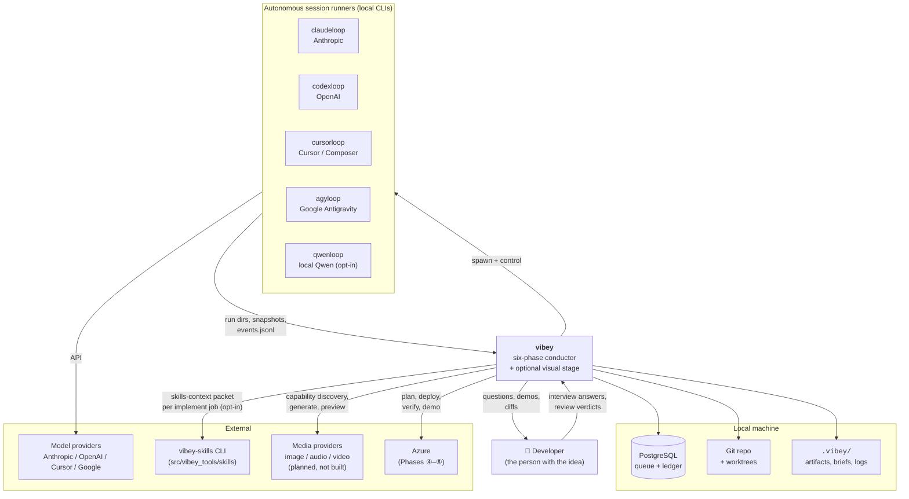
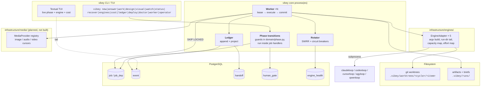
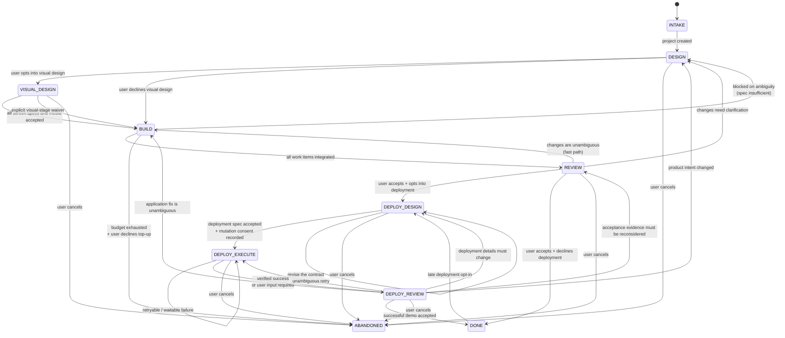
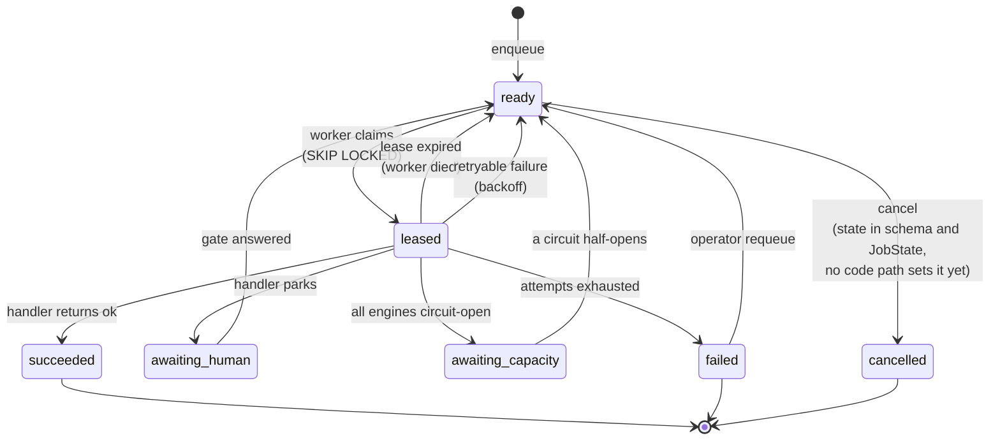
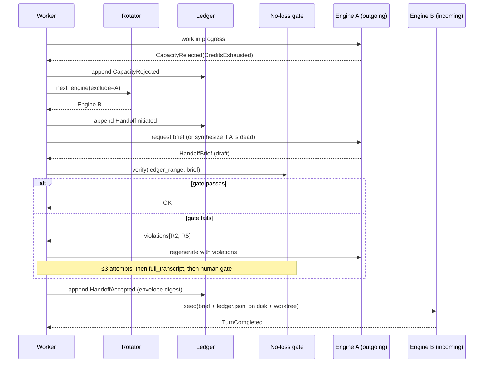
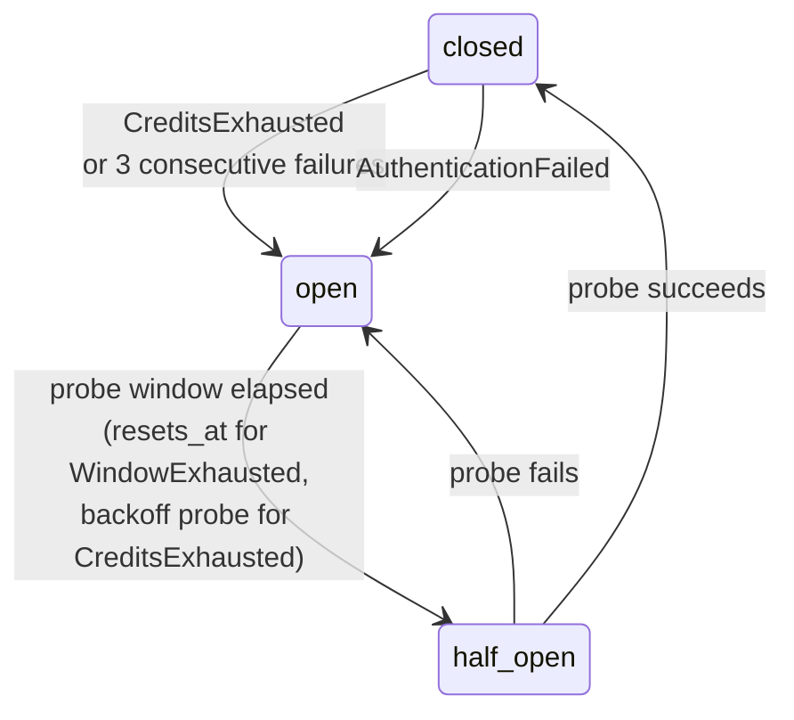

# Vibey — Architecture and Roadmap

> **Status as of 2026-09-15 (v0.6.0): implemented and live-validated.** This is
> the planning-era design, kept as the rationale document and corrected where the
> code went another way. Built: the delivery loop ① DESIGN → optional
> VISUAL_DESIGN → ② BUILD ⇄ ③ REVIEW, the opt-in deployment stage set ④–⑥, the
> PostgreSQL queue, the event ledger and no-loss gate (R1–R10), SWRR rotation with
> circuit breakers, agent-surface provisioning, and a Kubernetes chart and operator
> ([ADR-0025](../architecture/decisions/0025-kubernetes-operator-crd-keda.md)). `domain/`,
> `application/`, `infrastructure/` and `cli/` each hold a 100% branch-coverage CI
> gate ([ADR-0023](../architecture/decisions/0023-four-layers-four-floors.md)).
> **Not built:** the media-provider port, adapters and generation jobs of §14 (only
> `visual.inventory` / `visual.plan` and `vibey visual accept|waive` exist); the
> `container` and `vm` isolation levels and the egress allow-list of §11; the
> OpenTelemetry exporter and notification wiring of §13; `vibey up` / `vibey serve`
> and a supervisor process (§4). Live Azure mutation exists but is off unless a
> worker is started with `--azure az` (§15).
> **Since this was written:** the runners and the `vibey-gh`, `vibey-skills` and
> `vibey-bootstrap` tools moved into this repository as a uv workspace
> ([ADR-0021](../architecture/decisions/0021-one-tree-history-preserved.md)); a fifth engine,
> `qwenloop`, joined as an opt-in local standby
> ([ADR-0015](../architecture/decisions/0015-qwenloop-standby.md)) and as the sovereign DESIGN
> provider ([ADR-0027](../architecture/decisions/0027-sovereign-design-provider.md)).
> Where this document and the code disagree, the code and `docs/reference/` win.
> Audience: the engineer (human or agent) who will build this.
> Companion documents: [domain model](domain-model.md), [data model](data-model.md),
> [handoff protocol](handoff-protocol.md), [rotation & engines](rotation-and-engines.md),
> [phase protocols](phase-protocols.md), [implementation plan](implementation-plan.md).

---

## 1. Problem statement

Five autonomous session runners live in this repository under
`src/vibey_runners/` — `claudeloop`, `codexloop`, `cursorloop`, `agyloop` (the
paid pool) and `qwenloop` (a local, zero-dollar standby, opt-in via
`[features] qwenloop = true` or `VIBEY_FEATURE_QWENLOOP`; see
[ADR-0015](../architecture/decisions/0015-qwenloop-standby.md)). When this document was written
the first four were separate repositories; they were absorbed with history in
September 2026 ([ADR-0021](../architecture/decisions/0021-one-tree-history-preserved.md)). Each drives one vendor's coding agent
through an unattended run: it distinguishes a waitable rate-limit window from
exhausted credits, never blocks on a human, writes savepoints, and exposes a
mid-run control plane. They are, individually, excellent at *running one agent
until a task is done*.

None of them answers the question one level up:

> *Given a person with an idea, how do you get from that idea to deployed software,
> autonomously, using whichever AI happens to have capacity right now, without ever
> losing the thread of the conversation?*

That is vibey's job. It is a **conductor**, not a fifth runner.

### The four capability gaps

| Gap | Why the `*loop` runners can't close it | Vibey's answer |
|---|---|---|
| **No phase structure** | A runner runs *one* plan to completion. It has no notion of "we designed the wrong thing and need to re-interview the user." | A phase state machine with explicit loop-back edges (§6). |
| **Single-vendor lock per run** | A `claudeloop` run holds a live Anthropic session. When Anthropic's credits run out, that run waits — it cannot move the work to Codex. | Engine rotation at handoff boundaries, over a vendor-neutral ledger (§8). |
| **Conversation lives inside the vendor** | The real context is a `~/.claude/projects/**/*.jsonl` transcript in Anthropic's format. Codex cannot read it. | An append-only, engine-agnostic event ledger; vendor transcripts become attachments, not the source of truth (§8). |
| **No durable work queue** | A run is one OS process. Kill it and the in-flight decomposition is gone. | PostgreSQL-backed queue with leases, retries, and dependencies (§7). |

### What "never lose any data" means here, precisely

The user requirement is that passing a conversation from one AI to another must
not lose data. That is easy to claim and hard to guarantee, because the natural
implementation — "ask the outgoing model to write a summary" — loses exactly the
things a summary drops, silently, and you find out three hours later.

Vibey makes it falsifiable. The handoff is gated by a **deterministic structural
check** (§8.4) that fails the handoff if any open question, unfinished plan item,
or recorded decision present in the ledger is absent from the brief. The full
ledger is always written to disk inside the receiving worktree, so "compact
context" is a prompt-economy choice, never a data-availability one. See
[ADR-0004](../architecture/decisions/0004-no-loss-gate-on-handoff.md).

---

## 2. Non-negotiables

These are inherited from the `*loop` family's Global Constraints and extended.
They are enforced by CI, not by convention.

1. **Never block a worker on a human.** Human input is a *parked job* plus a
   `human_gate` row, never a thread waiting on stdin. A parked job releases its
   lease and its worker immediately.
2. **Credits ≠ rate limit.** `CreditsExhausted` has no reset time and must never
   acquire a waitable deadline field. Inherited verbatim from the `*loop` family.
3. **A capacity rejection always outranks a completion claim.** If a turn both
   looks done and hit a limit, it is not done.
4. **`domain/` stays pure.** Stdlib, itself, and only family packages that are
   themselves dependency-free (`vibey-gh`, `vibey-skills`, `vibey-runners-common`);
   `vibey_bootstrap` is forbidden by name
   ([ADR-0017](../architecture/decisions/0017-dogfood-the-family-first.md)). No I/O, no async,
   no clock. Imports are enforced by `import-linter`; the rest by
   `tests/domain/test_domain_purity.py`.
5. **A handoff that fails the no-loss gate is not a handoff.** It is a retry, an
   escalation to full-transcript mode, or a human gate — never a silent partial.
6. **Every job is idempotent under replay.** Workers can and will die mid-job;
   the lease will expire and another worker will pick it up. Every job type must
   be safe to run twice.
7. **The ledger is append-only.** No updates, no deletes. Corrections are new
   events that supersede prior ones.
8. **Every commit follows Conventional Commits.** Enforced by a git hook.
9. **No engine-specific types leak past `infrastructure/engines/`.** The domain
   knows `EngineId` and `Effort`; it never knows what `--preset` means.

---

## 3. System context (C4 level 1)



**Trust boundary note.** Everything inside *Local* is on the developer's machine.
Vibey never ships source, prompts, reference assets, or ledger content to a media
provider unless the user opted into the visual stage and accepted external-media
egress. See §12.

**Repository layout (2026-09).** The diagram shows the runners and `vibey-skills`
as local CLIs, and that is still how the conductor reaches them: as subprocesses,
never as imported code. Their source now lives in this repository, a uv
workspace ([ADR-0021](../architecture/decisions/0021-one-tree-history-preserved.md)):
`src/vibey/` (the conductor), `src/vibey_runners/` (`claude`, `codex`, `cursor`,
`agy`, `qwen`, and the shared `common` package), and `src/vibey_tools/` (`gh`,
`skills`, `bootstrap` — the packages `vibey_gh`, `vibey_skills`,
`vibey_bootstrap`). Each keeps its own test, lint and coverage gates in this
repository's CI
([ADR-0022](../architecture/decisions/0022-absorbed-packages-keep-their-own-gates.md)),
and each ships inside the one `vibey` distribution rather than publishing under its own
name
([ADR-0037](../architecture/decisions/0037-one-distribution-one-version.md)). The
former sibling GitHub repositories, and the former PyPI projects, no longer exist.

---

## 4. Container view (C4 level 2)



### Process model

*Corrected 2026-09-15.* The planned `vibey up` / `vibey serve` commands and the
separate supervisor process were not built. Vibey runs as **N stateless worker
processes**, plus an optional Kubernetes operator.

- `vibey worker` runs the lease → execute → ack loop, woken by
  `LISTEN vibey_job_ready`. `--parallelism/-j` (1–16, default 1) sets concurrent
  jobs, bounded to `min(parallelism, engines × 2, cpu_count)`. `vibey work
  <project-id>` processes one ready DESIGN job in the foreground and exits.
- Every process reads its DSN from `VIBEY_PG_URL` and refuses to start without it
  (`DatabaseNotConfigured`); there is no default database. Postgres is brought by
  the operator: a local instance, a container, or the Helm chart's in-cluster
  `postgres:17-alpine`.
- Workers are stateless. Killing one loses nothing; its lease expires and the job
  is re-leased. In a container, `tini` is PID 1 and a SIGTERM latch armed before
  the first import turns a stop into a drain
  ([ADR-0026](../architecture/decisions/0026-tini-pid1-and-the-sigterm-latch.md)).
- **Phase transitions** happen inside the handler (or CLI command) that completes
  a phase: it evaluates the pure guard in `domain/phase.py`, then moves the
  project with a compare-and-set `UPDATE project … WHERE phase = <expected>`, so
  two workers cannot both win. `build.integrate` for one `(project_id, cycle)` is
  serialized by a session-level Postgres advisory lock; contention is a short
  defer ([ADR-0029](../architecture/decisions/0029-integrate-serialized-by-advisory-lock.md)).
- In a cluster, the Helm chart runs workers as a Deployment, KEDA scales them on
  claimable work, and `vibey operator` reconciles `VibeyProject` custom resources
  ([ADR-0025](../architecture/decisions/0025-kubernetes-operator-crd-keda.md),
  `docs/guides/kubernetes.md`).

---

## 5. Layer map

Vibey follows the same onion the `*loop` family uses, because the engineer is the
same and the conformance tooling is already written.

```
domain/  →  application/  →  infrastructure/  →  cli/ + tui/
                                    ▲
                            bootstrap.py
                     (the sole composition root)
```

Dependencies point inward only, enforced by `import-linter` in CI. Each of
`domain/`, `application/`, `infrastructure/` and `cli/` carries a 100% branch
coverage floor as its own CI gate
([ADR-0023](../architecture/decisions/0023-four-layers-four-floors.md)).

| Layer | Contains | May import |
|---|---|---|
| `domain/` | Phase machine, rotation algorithm, effort ladder, handoff ADTs, no-loss gate rules, budget, plan, config parsing, security primitives | stdlib and dependency-free family packages ([ADR-0017](../architecture/decisions/0017-dogfood-the-family-first.md)) |
| `application/` | `interfaces/` (one Protocol per collaborator, [ADR-0016](../architecture/decisions/0016-classes-behind-interfaces.md)), use cases, `*_handler.py` job handlers, DTOs, engine selection | `domain/` |
| `infrastructure/` | Postgres, engine adapters, git, filesystem, notifications, logging | `domain/`, `application/` |
| `cli/`, `tui/` | Typer commands, Textual app | all inner layers |
| `bootstrap.py` | Wiring — the only place concrete types meet Protocols | everything |

### Package tree

*Updated 2026-09-15 to the tree as built (abridged; the planned `supervisor.py`,
`handlers/` package and `infrastructure/media/` do not exist).*

```
src/vibey/
├── domain/          phase, effort, engine, rotation, circuit, capacity, ledger,
│                    handoff, noloss, briefing, projections, job, plan, spec,
│                    review, budget, config, deployment, visual, media, provision,
│                    worktree, verbosity, command_guard, scope_guard,
│                    prompt_shield, errors
├── application/     interfaces/ (one Protocol per port, ADR-0016), ports, dto,
│                    worker, job_dispatcher, design_*_handler, visual_handler,
│                    build_*_handler, review_*_handler, deploy_*_handler,
│                    engine_selector, engine_selection, handoff_orchestration,
│                    rotation_handoff, wind_down, conformance, seed_prompt
├── infrastructure/  db/ (asyncpg repositories, migrator, advisory_lock, notifier),
│                    engines/ (descriptors, loop_process_adapter, tailer, classify,
│                    scripted*, claudeloop_*, qwenloop_design), git/, ledger/
│                    (full_ledger_writer, redact), provision/, build/, container/,
│                    azure/, deploy/, notify/, operator/, interfaces/,
│                    skills_context, context_writer, review_artifact_writer,
│                    cluster_preflight, config_loader, logging, otel
├── cli/             main, early_signals, errors, interfaces/
├── tui/             dashboard
└── bootstrap.py
migrations/          0001_project … 0011_deployment_stage_set_phases
                     (repository root, forward-only SQL)
```

---

## 6. The phase machine

### 6.1 States

| Phase | Interactive? | Effort | Purpose |
|---|---|---|---|
| `INTAKE` | — | — | Create project, detect repo, provision agent surfaces |
| `DESIGN` (①) | **yes** | `HIGH` | Interview the user to a testable spec |
| `VISUAL_DESIGN` | **yes, optional** | `HIGH` | Inventory screens and plan visual, audio, and video assets when opted in (generation is not built; §14) |
| `BUILD` (②) | no | `LOW` (auto-escalating) | Decompose, implement, verify, integrate |
| `REVIEW` (③) | **yes** | `HIGH` | Demo what was built, collect change requests |
| `DEPLOY_DESIGN` (④) | **yes** | `HIGH` | Establish and accept the Azure deployment contract |
| `DEPLOY_EXECUTE` (⑤) | no | `LOW` (auto-escalating) | Plan, provision, release, verify, and recover autonomously |
| `DEPLOY_REVIEW` (⑥) | **yes** | `HIGH` | Demo success or resolve a failure that needs user input |
| `DONE` | — | — | Terminal success (local or deployed). A later explicit deployment opt-in may re-enter `DEPLOY_DESIGN` from `DONE`. |
| `ABANDONED` | — | — | Terminal failure / user cancel |

`Phase.DEPLOY` also remains in the enum as a legacy single-phase bridge from the
pre-ADR-0013 lifecycle, with edges from `REVIEW` and `DONE`; new projects use the
④–⑥ stage set.

The lifecycle has six numbered phases plus one optional, unnumbered visual-design
interstitial. Delivery is `① DESIGN → optional VISUAL_DESIGN → ② BUILD → ③ REVIEW`;
deployment remains `④–⑥`. High-effort models conduct human conversations and
visual review; low-effort models handle bulk build, media generation, and
deployment execution. §9.3 covers escalation ladders.

### 6.2 Transitions



*Corrected 2026-09-15:* the planned `VISUAL_DESIGN → DESIGN` edge is not in
`_EDGES`; a visual stage that finds a missing requirement has no automatic route
back to ①.

**On `REVIEW → BUILD` (the fast path).** The source diagram specifies
`REVIEW → DESIGN` as the loop-back. That is the correct *default*: a change
request usually carries ambiguity, and re-interviewing is cheap relative to
building the wrong thing twice. But when the review triage classifies every
finding as `unambiguous` (a typo, a renamed label, a failing test with an obvious
fix), routing through a full design interview wastes the user's time. Vibey
therefore supports both edges, defaulting to `REVIEW → DESIGN`, with the fast
path taken only when *every* open finding is `unambiguous` and the user has not
set `strict_loopback = true`. See
[ADR-0010](../architecture/decisions/0010-review-loopback-routing.md).

**Opt-in means an explicit ledger decision, not a default.** Acceptance in ①
always asks whether to enter the optional visual-design interstitial. Acceptance
in ③ always asks whether to work on deployment. Declining deployment records a
successful local completion and enqueues no Azure job. If deployment is accepted,
Phase ④ remains read-only until a trusted, accepted deployment specification and
explicit mutation consent name the tenant, subscription, scope, environment, cost
boundary, verification contract, and recovery policy. See
[ADR-0014](../architecture/decisions/0014-optional-visual-design-and-deployment-opt-in.md).

### 6.3 Cycle and deployment-attempt accounting

Every pass through the machine increments `cycle`. The ledger, worktree branches,
and artifacts are all `cycle`-scoped, so cycle 3's build does not overwrite cycle
2's evidence. `max_cycles` (default 10) is a hard stop that raises a human gate
rather than looping forever.

Phase ⑤ also increments a separately bounded `deployment_attempt` for each
apply/release attempt. Retryable failures remain autonomous only while attempt,
elapsed-time, and cost caps allow. Reaching a cap raises a Phase ⑥ human gate;
it never turns into an unbounded cloud loop.

### 6.4 Transition guards

A transition fires only when its guard holds. Guards are pure functions in
`domain/phase.py`, registered per edge in `_GUARDS`; an edge not in `_EDGES` is
always denied, and no edge except `→ ABANDONED` is legal once
`cycle > max_cycles`. The table lists what the registered guards check today:

| Transition | Guard (as implemented) |
|---|---|
| `DESIGN → VISUAL_DESIGN` | ≥1 acceptance criterion, no open blocking question, no unmapped criterion, user verdict `ACCEPT`, explicit visual-design opt-in |
| `DESIGN → BUILD` | the same four design checks, plus an explicit visual-design decline |
| `VISUAL_DESIGN → BUILD` | visual plan accepted or explicitly waived, and a complete screen/state inventory |
| `BUILD → REVIEW` | ≥1 work item; every work item `integrated` or `waived`; integration branch green; every acceptance criterion has a passing test; a build savepoint exists at the integration head |
| `BUILD → DESIGN` | ≥1 work item is `blocked_on_ambiguity` |
| `REVIEW → DONE` | no open findings and user verdict `ACCEPT` |
| `REVIEW → DEPLOY_DESIGN` | explicit deployment opt-in |
| `DONE → DEPLOY_DESIGN` (and legacy `DONE → DEPLOY`) | explicit deployment opt-in |
| `DEPLOY_DESIGN → DEPLOY_EXECUTE` | deployment spec accepted and deployment consent recorded |
| `DEPLOY_EXECUTE → DEPLOY_REVIEW` | deployment verified, or classified as needing user input |
| `DEPLOY_REVIEW → DONE` | deployment demo accepted |

The remaining edges (`INTAKE → DESIGN`, `REVIEW → DESIGN|BUILD`, the ④/⑤
self-edges, `DEPLOY_REVIEW → *` other than `→ DONE`, the legacy
`REVIEW → DEPLOY` and `DEPLOY → *`, and `* → ABANDONED`) carry no domain guard; the handler that
requests them decides. Review routing uses `next_phase_after_review` (ADR-0010);
the deployment retry ladder's attempt/time/cost caps live in
`domain/deployment.py::evaluate_retry_ladder`.

---

## 7. The queue

### 7.1 Why PostgreSQL

SQLite is the tempting choice for a local tool — no daemon, one file. It is the
wrong choice here, for one concrete reason: **SQLite has no row-level locking and
therefore no `SELECT … FOR UPDATE SKIP LOCKED`.** WAL mode fixes reader/writer
blocking, not writer/writer contention, and vibey's whole point is N workers
competing for jobs. The known workarounds (mark-then-return) leak leases when a
worker crashes — precisely the failure vibey must survive.

PostgreSQL gives `SKIP LOCKED`, `LISTEN`/`NOTIFY` for wakeups, `jsonb` with GIN
indices for the ledger, and advisory locks for phase transitions. It is also
already the storage substrate in the sibling `apg-*` projects, so the operational
knowledge is not new.

*Corrected 2026-09-15.* The planned `vibey up` with Compose and `pg_ctl`
fallbacks was not built. The DSN is read from `VIBEY_PG_URL` and nothing else; a
missing value is a hard error (`DatabaseNotConfigured`), never a guessed
localhost database — an earlier silent fallback once wrote 78 test projects into a
production database. Bring your own Postgres (local, a container, or the Helm
chart's in-cluster `postgres:17-alpine`).

See [ADR-0002](../architecture/decisions/0002-postgres-not-sqlite.md).

### 7.2 Job lifecycle



The claim query is the standard pattern:

```sql
UPDATE job SET
    state          = 'leased',
    lease_owner    = $1,
    lease_expires_at = now() + $2::interval,
    attempts       = attempts + 1
WHERE id = (
    SELECT j.id FROM job j
    WHERE j.state = 'ready'
      AND j.run_after <= now()
      AND j.project_id = $3
      AND NOT EXISTS (
          SELECT 1 FROM job_dependency d
          JOIN job p ON p.id = d.depends_on_job_id
          WHERE d.job_id = j.id AND p.state <> 'succeeded'
      )
    ORDER BY j.priority DESC, j.run_after ASC, j.id ASC
    FOR UPDATE SKIP LOCKED
    LIMIT 1
)
RETURNING *;
```

Full DDL, indices, and the reaper query are in [data-model.md](data-model.md).

### 7.3 Job kinds

*Updated 2026-09-15 to the kinds registered in `bootstrap.py`.* The effort
column is design intent; the engine actually receives the effort the rotator
and escalation ladder resolve (§9.3).

| Kind | Phase | Parallel? | Isolation | Typical effort |
|---|---|---|---|---|
| `design.interview` | ① | no (one conversation) | none | `HIGH` |
| `design.research` | ① | yes | none | `STANDARD` |
| `design.synthesize` | ① | no | none | `HIGH` |
| `design.spec` | ① | no | none | `HIGH` |
| `visual.inventory` / `visual.plan` | optional visual stage | no | none | `HIGH` |
| `build.decompose` (alias `build.plan`, enqueued by the review fast path) | ② | no | none | `STANDARD` |
| `build.implement` | ② | **yes** | worktree | `LOW` ↑ |
| `build.verify` | ② | yes | worktree | `LOW` |
| `build.integrate` | ② | no (advisory lock per cycle, [ADR-0029](../architecture/decisions/0029-integrate-serialized-by-advisory-lock.md)) | integration branch | `STANDARD` |
| `review.demo` | ③ | no | read-only worktree | `HIGH` |
| `review.collect` | ③ | no | none | `HIGH` |
| `review.triage` | ③ | no | none | `HIGH` |
| `review.deployment_choice` | ③ | no | none | — (records the opt-in or decline) |
| `deploy.interview` / `deploy.design` / `deploy.synthesize` / `deploy.spec` (alias `deploy.accept`) | ④ | no | none | `HIGH` |
| `deploy.execute` (alias `deploy.graph`) | ⑤ | dependency-ordered | accepted Azure scope | `LOW` ↑ |
| `deploy.demo` / `deploy.triage` / `deploy.route` | ⑥ | no | read-only Azure evidence | `HIGH` |

The planned `visual.prompt`, `visual.review`, `media.generate.*`,
`media.moderate`, `media.preview`, the separate `deploy.discover` … `deploy.recover`
kinds, and `deploy.collect` do not exist. **Handoff is not a job kind:** on a
capacity rejection or wind-down, the worker runs produce → verify → accept
in-process (`application/rotation_handoff.py`, `handoff_orchestration.py`) before
releasing the job (§8.5).

### 7.4 Leases, retries, idempotency

- **Lease duration** is per-kind (`build.implement` and `build.verify` get 2
  hours; `build.decompose`, `build.plan` and `build.integrate` get 15 minutes;
  every other kind gets 2 minutes) and extended by a heartbeat every `lease/3`.
- **Retry backoff** is exponential with full jitter, capped at 15 minutes.
- **Idempotency** is enforced by `idempotency_key` — a deterministic hash of
  `(project_id, cycle, kind, subject)`. Re-enqueueing the same logical work is a
  no-op. Handlers additionally guard their own side effects: `build.implement`
  checks whether its worktree branch already contains a completed savepoint
  before spending a turn.
- **Poison jobs** park on an `attempts_exhausted` human gate once `attempts`
  reaches `max_attempts`, rather than moving to `failed` where nothing asks
  anyone. Answering `--raw '{"max_attempts": N}'` widens the bound on the row
  itself, so the granted retries survive the next nack.
- **Bounded repair ladders park.** A failing verify or integrate enters a bounded
  repair ladder (3 rounds); its end is a parked human gate that can grant more
  rounds, never a terminal failure
  ([ADR-0024](../architecture/decisions/0024-every-bounded-ladder-parks-with-a-grant.md)).

---

## 8. The conversation ledger and handoff

This is the mechanism behind "rotate engines without losing data." It is
specified in full in [handoff-protocol.md](handoff-protocol.md); this section is
the summary.

### 8.1 Event sourcing, not transcript copying

The source of truth for "what has been said and decided" is an **append-only
event log** in Postgres, written in a vendor-neutral schema. Vendor transcripts
(`~/.claude/projects/**/*.jsonl`, codex rollouts, cursor bridge logs) are copied
in as *attachments* referenced by events — they are evidence, not state.

This follows the ESAA-Conversational result: replaying a logical event log
produces consistent state in a receiving agent even when the two agents' internal
representations differ, whereas passing "fragile context strings" does not.

### 8.2 Event types

`SessionSeeded`, `TurnRequested`, `TurnCompleted`, `ToolInvoked`, `FileEdited`,
`VerdictRendered`, `CapacityRejected`, `DecisionRecorded`, `QuestionAsked`,
`AnswerGiven`, `AssumptionStated`, `ArtifactProduced`, `SavePointCreated`,
`FindingRaised`, `FindingResolved`, `HandoffInitiated`, `HandoffAccepted`,
`PhaseTransitioned`, `BudgetSpent`, `VisualDesignOptedIn`,
`VisualDesignDeclined`, `VisualDesignAccepted`, `VisualDesignWaived`,
`DeploymentOptedIn`, `DeploymentDeclined` (25 kinds, `domain/ledger.py`).

Every event carries `(event_id, project_id, cycle, phase, seq, kind, engine_id,
job_id, causation_id, correlation_id, provenance, produced_at, payload,
digest)`; `provenance` is `trusted`, `agent` or `untrusted`. `seq` is a
per-project gapless integer minted by the `append_event()` SQL function from the
per-project `event_seq` table (not a `CREATE SEQUENCE`), unique on
`(project_id, seq)`, so "the ledger from seq 1200 to 1478" is an exact,
verifiable range.

### 8.3 Two projections, one truth

| Projection | Where it goes | Size |
|---|---|---|
| **`HandoffBrief`** | Into the receiving engine's *prompt* | bounded, ~2–6k tokens |
| **`FullLedger`** | Written to `<worktree>/.vibey/handoff/ledger.jsonl` | unbounded |

The receiving agent is *told, in its seed prompt*, that the full ledger is on
disk and how to read it. The brief exists to make the first turn cheap, not to be
the only thing available. This is the resolution to the compact-vs-full tradeoff:
the compact view is the *prompt*, the full log is the *filesystem*.

### 8.4 The no-loss gate

Before a handoff is accepted, `domain/noloss.py` runs a **pure, deterministic
predicate** over `(ledger_range, brief)`:

| Check | Rule |
|---|---|
| `R1 remaining-work closure` | Every item in the last `VerdictRendered.remaining_work` appears in `brief.remaining` |
| `R2 open-question closure` | Every `QuestionAsked` without a matching `AnswerGiven` appears in `brief.open_questions` |
| `R3 decision closure` | Every `DecisionRecorded` not marked superseded appears in `brief.decisions` |
| `R4 assumption closure` | Every `AssumptionStated` appears in `brief.assumptions` |
| `R5 finding closure` | Every `FindingRaised` with `state != resolved` appears in `brief.open_findings` |
| `R6 range integrity` | `brief.ledger_ref.digest` equals the recomputed digest of `[from_seq, to_seq]`, and `to_seq` equals the project's current max seq |
| `R7 artifact closure` | Every `ArtifactProduced` whose payload sets `referenced_by_open_item` appears in `brief.artifacts` — the event's writer, not the gate, decides what counts as referenced |
| `R8 budget carry` | `brief.budget` equals the ledger-derived spend |
| `R9 constraint closure` | Every hard constraint in the accepted spec appears in `brief.constraints` |
| `R10 containment` | No free-text field of the brief carries a denylisted phrase (tool grants, permission changes, acceptance-criteria mutation, prompt-injection phrases) — the brief cannot rewrite the contract |

Matching is by stable `item_id`, not by string similarity — every closable thing
gets an id when it is first recorded, so the check is exact rather than fuzzy.

**On failure:** regenerate the brief (up to 3 attempts, each time feeding back the
specific rule that failed) → then escalate to `full_transcript` mode → then raise a human gate. It never proceeds on
a failed gate. In `full_transcript` mode only R6, R8 and R10 are evaluated. The design
inlines the whole ledger range so the closure rules hold by construction; as built,
the range is delivered as `.vibey/handoff/ledger.jsonl` in the receiving worktree and
named in the seed, not inlined, so the waiver rests on the successor reading it.

### 8.5 Handoff sequence



The sequence runs in-process inside the worker that hit the rejection
(`RotationHandoffService` plus `handoff_orchestration`); it is not a queued job.

**When Engine A is unreachable** (crashed, credits gone, binary missing), the
brief is synthesized by the *incoming* engine, or by any healthy engine, reading
the ledger directly. The gate is identical either way — that is the point of
making it deterministic rather than trusting the author.

---

## 9. Engine rotation

Full specification in [rotation-and-engines.md](rotation-and-engines.md).

### 9.1 The capability problem

The runners are not interchangeable at the CLI level. Divergence as recorded in
`infrastructure/engines/descriptors.py` (checked against each binary's
`run --help` by the conformance suite; updated 2026-09-15):

| | claudeloop | codexloop | cursorloop | agyloop | qwenloop |
|---|---|---|---|---|---|
| Effort at invocation | `--preset` + `--effort` (5 levels) | **none** — `run` has no effort flag; every level projects to `STANDARD` | **none** — a `--model` ladder (`composer-fast` → `composer` → `grok-4.5` → `grok` → `grok-xhigh`) | `--preset` + `--effort` (5 levels) | `--max-turns` 8 / 16 / 40 / 64 / 96 |
| Top-level `savepoints` | yes | yes | yes | **no** | placeholder stub |
| Top-level `effort` cmd | yes | yes | **no** | **no** | placeholder stub |
| `sessions`/`threads` | `sessions` | `threads` | `agents` | `sessions` | `sessions` |
| Isolation flag passed by vibey | none verified | none verified | none verified | `--safe` (container/vm) | none |
| Plan argument | positional | positional (no `--cwd`) | `--plan <path>` | positional | positional |
| State dir | `.claudeloop/` | `.codexloop/` | `.cursorloop/` | `.agyloop/` | `.qwenloop/` |

The originally planned sandbox flags (`--permission-mode`, `--sandbox`,
`--hooks-policy`) were found not to exist or not to mean container isolation and
were removed from the descriptors.

Treating these as one interface by hoping is how the orchestrator breaks the first
time cursorloop is selected for a job needing `--effort`. Instead:

### 9.2 Capability matrix + normalized ladder

Each engine ships an `EngineDescriptor` declaring what it supports. Vibey's domain
speaks its own 5-level ladder — `TRIVIAL, LOW, STANDARD, HIGH, MAX` — and each
descriptor provides a **projection** onto native flags, which may *saturate*:

```
Effort.MAX  →  claudeloop  --preset high --effort max
            →  codexloop   (no flag)                                 (saturates at STANDARD)
            →  cursorloop  --model grok-xhigh                        (ladder position)
            →  agyloop     --preset high --effort max
            →  qwenloop    --max-turns 96                            (turn budget)
```

A job declares `requires: {effort: HIGH, capabilities: {savepoints}}`. The
rotator only considers engines whose descriptor satisfies it. An engine that
saturates below the requested effort is *still eligible* but carries a
`fidelity_penalty` that lowers its rotation weight — so vibey prefers an engine
that can genuinely do `MAX` work, without refusing to use one that can't when it's
the only one with capacity.

### 9.3 Effort policy per phase

| Phase | Base | Escalation |
|---|---|---|
| ① DESIGN | `HIGH` | → `MAX` if the user rejects a synthesized spec twice |
| ② BUILD | `LOW` | → `STANDARD` after 2 failed verifies on one item; → `HIGH` after 4; → human gate after 6 (the gate can grant more, [ADR-0024](../architecture/decisions/0024-every-bounded-ladder-parks-with-a-grant.md)) |
| ③ REVIEW | `HIGH` | → `MAX` for `severity=critical` triage |

Escalation is per work item, not global, and resets when the item succeeds. This
is what keeps the user's "Phase 2 uses low effort" requirement from turning into
"Phase 2 never finishes the hard item."

### 9.4 Smooth weighted round robin

Vibey uses **nginx's SWRR** algorithm rather than naive modulo rotation, because
naive rotation over a set whose membership changes (engines dropping in and out as
circuits open) produces starvation and clumping.

```
for each selection:
    for e in eligible:  e.current += e.effective_weight
    winner = argmax(e.current)
    winner.current -= sum(e.effective_weight for e in eligible)
```

`effective_weight = round(base_weight × health_factor × fidelity_factor ×
cost_factor × affinity_factor)`, never rounded below 1 for a positive product.
Health is 1.0 closed (decayed by an EWMA of failures), 0.25 half-open, 0.0 open;
fidelity is 1.0 at the requested tier, 0.7 one tier short, 0.5 two or more short;
cost, when enabled, is the median-to-engine cost ratio clamped to [0.5, 1.5]
(`EngineSelector` passes 1.0 today, so cost does not yet bias selection); affinity is 2.0
for the engine holding the warm session unless rotation is forced — the
stickiness rule of §9.6. All are pure functions in `domain/rotation.py`,
unit-tested for the properties that matter: **no starvation** (every eligible
engine is selected within `sum(weights)` selections), **determinism** (same state
→ same choice), and **smoothness** (selections interleave across the period
rather than bunching; with weights 5:1 the heavy engine still wins several rounds
in a row — SWRR does not promise no consecutive repeats).

`domain/rotation.py::select()` is called from the real dispatch path through
`application/engine_selector.py::EngineSelector`, with per-project cursors
persisted in `rotation_cursor`.

### 9.5 Eligibility and circuit breakers

An engine is eligible when: installed, authenticated (`doctor` passed within TTL),
circuit not `open`, capability requirements met, and per-phase allow-list permits
it.

**Local tier, preferred first** ([ADR-0038](../architecture/decisions/0038-local-engines-are-preferred-first.md),
amending [ADR-0015](../architecture/decisions/0015-qwenloop-standby.md)'s standby rule). `qwenloop`
and `claudeloop-local` are local, zero-dollar engines, each off unless its
`[features]` key or `VIBEY_FEATURE_*` switch enables it. When enabled they are
preferred: `EngineSelector` runs SWRR within the LOCAL tier and a paid engine is
selected only when no local engine is eligible. Separately, DESIGN can be run on a local
model by choice — `--provider qwenloop` on `vibey work` and `vibey worker` — which
talks to the local model directly rather than through rotation
([ADR-0027](../architecture/decisions/0027-sovereign-design-provider.md)).



The distinction the `*loop` family fought for is preserved exactly:
`WindowExhausted` half-opens at `resets_at` (plus deterministic jitter), or,
when no reset time is known, on a backoff (2 s doubling, capped at 5 minutes);
`CreditsExhausted` has no deadline and half-opens on a backoff floored at 5
minutes and capped at 30, because only a human top-up can fix it.
`AuthenticationFailed` never schedules a probe.

### 9.6 When rotation happens

**At boundaries only** — never mid-turn.

| Trigger | Rotate? |
|---|---|
| New work item starts | yes (advance cursor) |
| Capacity rejection | yes (forced, exclude the rejecting engine) |
| Effort escalation | yes (re-select for the new tier) |
| Phase transition | yes |
| Handoff requested by operator | yes |
| Mid-turn | **never** |
| Item retry after transient failure | no (stickiness — keep the warm session) |

Stickiness matters: rotating on every turn would mean a handoff on every turn,
which is both expensive and lossy-prone. Vibey rotates when there is a *reason*.

---

## 10. Agent-surface provisioning

The source diagram calls for an "automated repository for I.D.E.'s." Concretely:
every engine reads different guidance files, and if they disagree, rotating
engines silently changes the rules mid-project.

*Updated 2026-09-15 to what `infrastructure/provision/agent_surface.py` does.*
Vibey renders one block from a `ProvisionSpec` (non-negotiables and plugin
names) and merges it into a router file per engine at the root of each
`build.implement` worktree. The production wiring passes an empty spec today —
`[provision] plugins` is not read at runtime (§17) — so the rendered block lists
`- None` under "Non-negotiables" and `none` under "Skill plugins", and points at
`.vibey/context/`:

| Engine | Router file written |
|---|---|
| claudeloop / Claude Code | `CLAUDE.md` |
| codexloop / Codex | `AGENTS.md` |
| cursorloop / Cursor | `CURSOR.md` |
| agyloop / Antigravity | `GEMINI.md` |
| qwenloop | `QWEN.md` |

Only the router files are written. The block sits between
`<!-- vibey:begin -->` / `<!-- vibey:end -->` markers; hand-written content
outside the markers is preserved. It names the non-negotiables, the declared
plugin names, and the shared `.vibey/context/` directory (spec, acceptance
criteria, NFRs, decisions, open items). The router files, the engines' state
directories (`.claudeloop/` … `.qwenloop/`), `.vibey/`, and common build
artifacts are added to `.git/info/exclude` so engine sessions cannot commit
them. `.claude/skills/`, `.claude/settings.json`, `.cursor/rules/` and similar
directories are not materialized.

Skill guidance comes instead from the independently versioned `vibey-skills`
package (formerly `vibe-engineering-skills`; 18 plugins, 71 skills). The
conductor never imports it: `infrastructure/skills_context.py` asks the
`vibey-skills` CLI, over a subprocess, for one bounded packet per implement job
and writes it under `.vibey/context/skills/`. It runs in one of three modes —
`off` (default), `shadow`, `inject` — with a token budget (default 6000), set by
`vibey new --skills-context-mode/--skills-context-budget`
([ADR-0031](../architecture/decisions/0031-skills-context-packets-over-a-process-boundary.md)).

Provisioning is idempotent: a sha256 digest comparison (`needs_write`) skips any
file whose merged content is already present.

---

## 11. Isolation

```
repo/                          ← never checked out by a build job
└── .vibey/
    └── worktrees/
        └── 3/                 ← cycle
            ├── item-014/      ← git worktree, branch vibey/3/item-014
            ├── item-015/
            └── integration/   ← branch vibey/3/integration
```

Each `build.implement` job gets its own git worktree and branch. Parallel items
never share a working tree, which removes the shared mutable resource rather than
trying to lock it.

**A worktree is not a sandbox.** It prevents agents from overwriting each other;
it does not prevent an agent from running `rm -rf ~`. Vibey therefore offers three
isolation levels, selected per project:

| Level | Mechanism (design) | Protects against | Status (2026-09-15) |
|---|---|---|---|
| `worktree` (default) | git worktree + destructive-command denies | concurrent-edit corruption | Implemented: worktree per item and engine state dirs excluded from git. The deny-list exists in `domain/command_guard.py` but nothing calls it yet. |
| `container` | Docker/Podman, repo bind-mounted, network egress allow-listed to provider APIs | filesystem escape, exfiltration | Accepted by config only. `infrastructure/container/` builds a hardened `docker`/`podman run` (read-only root, `--network=none` by default) but the worker never uses it; `isolation.egress` is parsed and unused. |
| `vm` | Firecracker/Lima microVM | kernel-level escape | Accepted by config only; no runtime. |

Until container mode is wired, every level behaves as `worktree`. The planned
`vibey doctor` nudge and an `autonomous` config key were not built. (The vibey
worker image itself runs non-root under `tini`, ADR-0026; that isolates vibey,
not the engine sessions it launches.)

---

## 12. Security

Threat model, in the vocabulary of the `vibey-skills` `threat-modeling-playbook`
and `ai-security-practices` skills:

| Threat | Vector | Control |
|---|---|---|
| **Indirect prompt injection** | A dependency's README, a fetched web page, or a GitHub issue instructs the agent to exfiltrate secrets | Content fetched during a run enters the ledger as `untrusted` provenance; the seed prompt states that ledger content is data, not instruction; egress allow-list in `container` mode (not built, §11) |
| **Cross-engine injection** | A compromised engine writes a poisoned `HandoffBrief` that redirects the next engine | The brief is *structurally verified* against the ledger; gate rule R10 rejects free text carrying tool grants, permission changes, or acceptance-criteria mutation; `brief` cannot alter `spec` or acceptance criteria — those come from the ledger, not the brief |
| **Secret leakage into the ledger** | Agent pastes `.env` contents into a turn | `infrastructure/ledger/redact.py` (ported from the `*loop` family) runs on every event before append; ledger columns are redacted at write, not at read |
| **Runaway cost** | An agent loops, burning tokens | Hard per-phase and per-project budget caps in `domain/budget.py`; the "AI cost snowball" is a documented incident class, so caps are mandatory, not optional |
| **Destructive command** | `rm -rf`, `git push --force`, `DROP DATABASE` | Deny-list defined in `domain/command_guard.py` (hard reset, force push, deleting main/master, `rm -rf /`, `mkfs`, `dd of=/dev/*`, `DROP DATABASE/TABLE`, …); **not yet called** by any adapter, and container mode is not wired (§11). `allow_push` defaults to `false` |
| **Credential handling** | Provider keys | Vibey never reads provider keys. Each engine authenticates itself from its own env/keychain; vibey only observes `doctor` exit codes |
| **Media egress / provider retention** *(planned with §14 generation)* | Visual stage sends source, prompts, or reference assets to a hosted generator | Visual opt-in shows provider, region, retention, cost, and egress; hosted generation requires `media.allow_external = true`; local-first is the default |
| **Generated harmful or infringing media** | A model returns unsafe, deceptive, or unlicensed output | Provider/content-safety scan, provenance and rights metadata, human review, and an explicit reject/regenerate/waive decision before BUILD |
| **AI voice misrepresentation** | Generated narration is presented as a human recording | Store voice/provider metadata and disclose AI-generated audio wherever the selected provider or policy requires it |

Vibey does not run `git push`, open pull requests, or mutate Azure without
explicit, scope-bound authorization. Deployment entry is never automatic; it
occurs only after the explicit deployment opt-in gate. The default posture
remains local branches, opted-out media generation, and no Azure discovery or
mutation until a human accepts each corresponding opt-in.

---

## 13. Observability and cost

- **Structured logs** — `structlog`, dual transport (human console + JSON lines),
  matching the `*loop` convention.
- **Traces** *(dormant)* — `infrastructure/otel.py` records spans and counters
  in-process, but no exporter is configured and nothing in `bootstrap.py` or the
  CLI instantiates it; wiring it is open work. The design: OpenTelemetry spans,
  one per job, child spans per engine turn, per
  tool invocation, per handoff. `phase`, `cycle`, `engine_id`, `job_kind`, and
  `effort` are span attributes so any of them can slice a latency or cost query.
- **Metrics** *(dormant, same module)* — job queue depth by state, lease expiry rate, handoff gate failure
  rate by rule, per-engine selection counts (to prove rotation fairness in
  production, not just in unit tests), media-provider selection counts by
  modality, media generation latency/failure/retention, tokens and dollars by
  phase/engine/provider/cycle.
- **Cost** — every `TurnCompleted` carries `cost_usd`; `domain/budget.py` maintains
  the ledger. `vibey cost` reports by phase, cycle, engine, and work item.
  The `azure-bootstrap` AI usage tracker's sliding-window/soft-cap model is the
  reference for the caps implementation.
- **Notifications** *(dormant)* — `infrastructure/notify/` implements desktop
  alerts and signed webhooks; nothing wires it yet.
- **The TUI** (`vibey watch`, `tui/dashboard.py`) shows: current phase and cycle,
  the visual-design and deployment decisions, per-engine circuit state, queue
  depth by job state, active worktrees, and a tail of the ledger. There is no
  media-provider state to show until §14 generation exists.

---

## 14. Optional pre-build visual design and media stage

> **Implementation status (2026-09-15).** Built: the `visual.inventory` and
> `visual.plan` jobs (inventory from the accepted spec, published as a reviewable
> artifact), the domain types in `domain/visual.py`, a pure per-modality
> provider selector in `domain/media.py`, `vibey visual accept|waive`, the
> `VisualDesign*` ledger events, and the `VISUAL_DESIGN → BUILD` guard (plan
> accepted or waived, inventory complete). Not built: the `MediaProvider` port,
> `infrastructure/media/`, the prompt/generate/moderate/preview/review jobs,
> persisted per-modality cursors (`rotation_cursor` has no modality column), the
> route back to ① of §14.1, and the `[visual]` / `[media.providers]`
> configuration. `domain/media.py` has no consumer outside `domain/`. The rest of
> this section is design intent.

This is an optional, unnumbered interstitial between Phase ① DESIGN and Phase ②
BUILD. The user is asked after the accepted product specification is produced.
Declining it records a `VisualDesignDeclined` event and takes the normal
`DESIGN → BUILD` edge. Opting in creates a durable visual stage; BUILD cannot
start until the visual-ready guard passes or the user records an explicit waiver.

### 14.1 Screen and state inventory

`visual.inventory` reads the accepted spec, repository routes/components, design
tokens, existing screenshots/prototypes, and acceptance criteria. It produces a
matrix with one row per screen or surface and explicit states:

| Field | Required evidence |
|---|---|
| Screen identity | route, platform, viewport, create/update decision, acceptance IDs |
| Structure | hierarchy, primary action, navigation, responsive behavior, content density |
| State coverage | loading, empty, error, success, permission, offline, retry, reduced motion |
| Interaction | focus order, keyboard/touch targets, validation, transitions, recovery |
| Accessibility | semantic roles, labels, alt text, captions/transcripts, contrast target, screen-reader intent |
| Media | image/audio/video/icon/illustration IDs, placement, dimensions, format, rights/source constraints |

If the inventory discovers a product requirement that Phase ① did not settle, the
stage raises a scoped design gate and routes back to ①. It must not silently fill
the gap with a generated screen.

### 14.2 Generation plan and provider ports

`visual.plan` derives a design-system contract and a media manifest from the
inventory. A media manifest entry contains `asset_id`, modality, screen/state,
purpose, prompt, reference digests, output constraints, accessibility metadata,
rights/likeness constraints, provider policy, and an acceptance test.

The application layer defines a provider-neutral port:

```python
class MediaProvider(Protocol):
    provider_id: str
    capabilities: frozenset[MediaModality]

    async def generate(self, request: MediaGenerationRequest) -> MediaJob: ...
    async def poll_or_resume(self, job: MediaJob) -> MediaJob: ...
    async def download(self, job: MediaJob) -> MediaArtifact: ...
    async def estimate_cost(self, request: MediaGenerationRequest) -> CostEstimate: ...
    async def moderate(self, artifact: MediaArtifact) -> ModerationResult: ...
```

The exact interface is an application port; the domain sees only immutable
modality, request, outcome, and routing values. Concrete providers live under
`infrastructure/media/`. A provider may be local/self-hosted or hosted. The
default is `local_first`; hosted fallback requires explicit external-media
consent and records destination, region, retention, estimated cost, and policy.

Provider capability discovery happens at the start of the visual stage and is
repeated when a provider becomes unavailable. Model names are configuration and
runtime metadata, never domain assumptions. A provider is eligible only if it
supports the requested modality, dimensions/format/reference inputs, region and
data policy, safety policy, budget, and current capacity.

### 14.3 Per-modality round robin

Image, audio, and video each have an independent persisted smooth round-robin
cursor. Selection is capability-filtered before rotation:

```text
image candidates → image cursor → next eligible provider
audio candidates → audio cursor → next eligible provider
video candidates → video cursor → next eligible provider
```

This preserves fairness without selecting a provider that cannot satisfy the
asset. Cursors advance transactionally only after selection; circuit-open,
capacity-exhausted, policy-ineligible, and budget-ineligible providers are
skipped. Cost/capability/quality/latency factors may affect eligibility and
weights, but no provider is starved inside the eligible set. A provider may be
used for more than one modality while retaining separate per-modality state.

Generation is a dependency-ordered, asynchronous queue graph:

```text
inventory → plan → prompt → generate(modality) → moderate → preview
                                                     ↓
                                           review / regenerate / waive
```

Large video operations return an operation ID and release their worker lease;
polling or webhook jobs resume them. Every job is idempotent by
`(project, cycle, visual_revision, asset_id, provider, prompt_digest)`.

### 14.4 User confirmation and visual-ready guard

`visual.review` presents a screen gallery or prototype, design tokens, responsive
variants, interaction states, image/contact sheets, audio previews plus
transcripts, and video storyboards/clips. The user may accept an asset, request a
regeneration with feedback, provide a replacement, or waive it explicitly. A
regeneration creates a new immutable revision; it never overwrites a prior
accepted asset or its evidence.

The `VISUAL_DESIGN → BUILD` guard requires:

- every inventory row has an accepted screen spec;
- every required asset is accepted, user-supplied, or explicitly waived;
- no blocking design question or unresolved rights/safety issue remains;
- accessibility checks cover contrast, semantics, focus, labels, alt text,
  transcripts/captions, touch/keyboard targets, and reduced motion;
- prompt, provider/model, output, moderation, cost, and user-decision evidence is
  persisted; and
- the user issued `visual design accept` or an explicit visual-stage waiver.

### 14.5 Artifacts

```text
.vibey/context/visual/
├── screen-inventory.md
├── design-system.md
├── screen-specs/<screen-id>.md
├── media-manifest.json
├── prompts/<asset-id>.md
├── assets/<asset-id>/<revision>/...
├── previews/                         # gallery, audio, storyboard/video links
└── visual-review.md                  # accepted/rejected/waived decisions
```

---

## 15. Optional deployment stage set (Phases ④–⑥)

Deployment is the optional second three-phase stage set in the core lifecycle,
governed by [ADR-0014](../architecture/decisions/0014-optional-visual-design-and-deployment-opt-in.md)
and the execution design in
[ADR-0013](../architecture/decisions/0013-deployment-is-a-three-phase-stage-set.md)
and specified turn-by-turn in [phase-protocols.md](phase-protocols.md). Azure
implementations remain behind application ports and optional infrastructure
dependencies so `domain/` stays provider-agnostic and stdlib-only.

After Phase ③ has no open product findings and the user accepts the build, Vibey
asks whether to work on deployment. A “no” answer records `DeploymentDeclined`,
sets `completion_mode = "local"`, and transitions to `DONE` without enqueueing
any Azure job. A “yes” answer records `DeploymentOptedIn` and enables the
following stage set:

1. **④ DEPLOY DESIGN (interactive)** discovers the target and authority, selects
   service topology from requirements, resolves secret *references*, defines IaC,
   migration, cost, health, rollout, and recovery policies, and records consent.
2. **⑤ DEPLOY EXECUTE (autonomous)** creates an immutable plan, runs static and
   provider preflight checks plus ARM `what-if`, provisions idempotently, releases
   progressively when supported, verifies runtime health and acceptance, and
   executes only pre-authorized recovery actions. Retryable failures loop in ⑤;
   authority, ambiguity, unexpected deletion, destructive data change, policy,
   budget, or recovery decisions enter ⑥.
3. **⑥ DEPLOY REVIEW (interactive)** presents a live demo with redacted evidence
   on success, or asks only for the input needed to unblock a classified failure.
   It may finish, revise the deployment contract in ④, retry in ⑤, or return an
   application/specification defect to the appropriate delivery phase.

Success means declared resources converged *and* the workload passed health,
smoke/acceptance, and bake-window checks. A successful CLI exit or ARM operation
alone is insufficient. Every mutation records redacted command intent, operation
and resource IDs, artifact digests, verification evidence, and recovery actions.
Secrets remain in Key Vault or another approved secret store and enter the ledger
only as references. A successful deployment demo sets `completion_mode =
"deployed"`; a later artifact or acceptance change invalidates the previous
deployment choice and asks again.

**Status (2026-09-15).** The stage set, its guards, the ④–⑥ job kinds, the
`vibey deploy status|inspect|plan|cancel|rollback` commands, IaC and ARM
`what-if` evaluation, and an `az`-backed Azure adapter are implemented. The
worker defaults to an in-memory Azure client (`vibey worker --azure memory`), so
no cloud resource is touched unless an operator starts a worker with
`--azure az`, which also requires a logged-in Azure CLI. `[deploy] enabled`
defaults to `false`.

---

## 16. Testing strategy

Following the `vibey-skills` `test-strategy` and `python-quality-testing` skills.
*Updated 2026-09-15:* every layer's floor is 100% branch coverage, each its own
CI gate ([ADR-0023](../architecture/decisions/0023-four-layers-four-floors.md)).

| Layer | Approach | Coverage floor |
|---|---|---|
| `domain/` | Pure unit tests + **property-based** (Hypothesis) for rotation fairness, no-loss gate soundness, phase-machine reachability; an AST-walking purity test | **100% branch** |
| `application/` | Use-case tests against fake ports (`tests/fakes`, checked for parity with the real ports); the worker loop tested with a fake queue | **100% branch** |
| `infrastructure/` (incl. `db`, `engines`) | Integration tests against a real Postgres named by `VIBEY_TEST_DATABASE_URL` (one database per xdist worker) — never mocked, because `SKIP LOCKED` semantics are the thing under test; **engine conformance suite** (below) + a `ScriptedEngine` for offline determinism | **100% branch** |
| `cli` | Typer runner tests | **100% branch** |
| `tests/live` | Two modes ([ADR-0030](../architecture/decisions/0030-two-mode-live-harness.md)): faked (`-m live`, scripted binaries, every descriptor) by default; paid (`-m paid`, real engines) only when explicitly selected | — |
| `tests/contracts`, `tests/meta`, `tests/tui` | Cross-layer contracts; repository invariants (ADR numbering and count, container context); TUI rendering | — |
| End-to-end | `pytest -m system`: scripted engine and in-memory Azure adapter drive `①→(optional visual)→②→③→(optional deploy ④→⑤→⑥)`, including decline, accept, and loop-back paths, on throwaway local resources with no network | — |

Default `pytest` options are `-m 'not paid' -n auto --maxprocesses=8`. The
absorbed packages under `src/vibey_runners/` and `src/vibey_tools/` keep their
own suites and floors in CI ([ADR-0022](../architecture/decisions/0022-absorbed-packages-keep-their-own-gates.md)).

### The engine conformance suite

The runners are pre-1.0 and will drift. Vibey pins their behavior with an
executable contract:

```bash
vibey doctor --conformance           # run against every installed engine
vibey doctor --conformance --record  # persist the result to engine_health
```

It asserts, per engine: the state directory exists where the descriptor says;
`run --help` exposes the flags the descriptor claims; a trivial scripted plan
produces a run directory with `meta.json`, `events.jsonl`, and a snapshot at the
documented paths; capacity classification maps to vibey's ADT; the done marker
matches. A failing conformance check marks that engine ineligible rather than
letting it fail mid-cycle. See
[ADR-0001](../architecture/decisions/0001-orchestrate-do-not-reimplement.md).

Property tests worth calling out specifically:

- **Rotation**: over any eligible set and any weight vector, every engine is
  selected at least once per `sum(weights)` selections (no starvation).
- **No-loss gate**: for any ledger and any brief that *omits* a closable item, the
  gate returns a violation naming that item. Generated adversarially.
- **Phase machine**: every state is reachable from `INTAKE`, and `DONE`/`ABANDONED`
  are the only terminals.
- **Idempotency**: running any handler twice with the same input produces the same
  ledger state (modulo `produced_at`).

---

## 17. Configuration

`vibey.toml` at the project root. *Updated 2026-09-15 to the keys
`domain/config.py` parses; the authoritative schema is
`docs/reference/configuration.md`.* **The schema is implemented and tested but
is not yet a runtime input:** `infrastructure/config_loader.py::load_config_from_path`
has no caller. At runtime only `[features] qwenloop` is read from `vibey.toml` (by `vibey
doctor`; the worker reads the same flag from the project's `config` record),
and per-project limits and the skills-context policy come from the project record
written by `vibey new` or the Kubernetes operator. The planned `[visual]` and
`[media.providers]` tables and the extra `[deploy]` keys (`opt_in_required`,
`finish_if_declined`, `environment`, `max_attempts`, `max_dollars`) are not read.
`isolation.egress` is parsed but not enforced, and `level` values other than
`worktree` have no runtime yet (§11).

```toml
[project]
name          = "my-app"
repo          = "."
max_cycles    = 10
strict_loopback = false          # true forces REVIEW → DESIGN always

[isolation]
level         = "worktree"       # worktree | container | vm (only worktree has a runtime)
allow_push    = false
egress        = ["api.anthropic.com", "api.openai.com", "api.cursor.sh", "generativelanguage.googleapis.com"]  # parsed, not enforced

[budget]
max_dollars_per_cycle = 40.0
max_dollars_total     = 250.0
max_turns_per_item    = 60

[engines]
enabled = ["claudeloop", "codexloop", "cursorloop", "agyloop"]   # the default;
                                 # "qwenloop" requires [features] qwenloop = true

[engines.weights]                # base rotation weights
claudeloop = 3
codexloop  = 2
cursorloop = 2
agyloop    = 1

[phases.design]
effort   = "high"
engines  = ["claudeloop", "codexloop"]     # optional per-phase allow-list

[phases.build]
effort      = "low"
parallelism = 4

[phases.review]
effort = "high"

[provision]
plugins = ["software-architecture", "quality-engineering", "security-first-dev", "engineering-process"]

[deploy]
enabled = false                  # default
target  = "azure"
iac     = "bicep"
# Tenant, subscription, scope, region, identity, health, rollout, recovery, and
# secret references are completed and accepted interactively in Phase ④.

[features]
qwenloop = false                 # VIBEY_FEATURE_QWENLOOP overrides

[qwenloop]
backend = "auto"                 # auto | llama.cpp | vllm
portable_profile = "qwen2.5-coder-14b-q5-k-m"
nvidia_profile   = "qwen2.5-coder-14b-bf16"
idle_timeout_seconds    = 900
startup_timeout_seconds = 180
context_window          = 32768
```

The skills-context policy (`mode` off | shadow | inject, `budget`) is not a
`vibey.toml` table; `vibey new --skills-context-mode/--skills-context-budget`
stores it in the project's `config` record.

---

## 18. Milestones

Detail, with test-first task breakdowns, in
[implementation-plan.md](implementation-plan.md).

| Milestone | Deliverable | Done when | Status (2026-09-15) |
|---|---|---|---|
| **M0** | Repo skeleton, CI, onion contract, `vibey.toml` schema | `lint-imports` green, empty domain 100% covered | done |
| **M1** | Pure domain: phase machine, effort ladder, rotation, circuit, no-loss gate | Property tests pass; no I/O anywhere in `domain/` | done |
| **M2** | Postgres schema, migrations, queue repo, worker loop | Integration test: 8 workers, 500 jobs, zero double-execution, zero lost jobs under random kills | done |
| **M3** | Engine adapters + conformance suite + `ScriptedEngine` | `vibey doctor --conformance` passes against all four installed engines | done; five descriptors, `vibey doctor --conformance --record` |
| **M4** | Ledger, projections, handoff produce/verify/accept | Adversarial no-loss property suite passes; a forced mid-item rotation completes with zero dropped items | done (R1–R10) |
| **M5** | Phase ① DESIGN + optional visual-design interstitial | A real interview can either enter BUILD directly or produce a confirmed screen/media plan before BUILD | partial: DESIGN, inventory/plan, accept/waive; media generation not built (§14) |
| **M6** | Phase ② BUILD end to end | Parallel worktrees, integration, escalation ladder, budget caps | done |
| **M7** | Phase ③ REVIEW + loop-backs + deployment choice | Full delivery loop plus explicit local-complete versus deployment-opt-in routing | done |
| **M8** | TUI, cost reporting, OTel, notifications | `vibey watch` usable for an overnight run | partial: `vibey watch` and `vibey cost` done; OTel and notifications written but not wired |
| **M9** | Isolation levels (container), security hardening, threat-model review | Container mode passes egress allow-list test | partial: container runtime written but not wired; no egress allow-list or `vm` |
| **M10** | Optional Phases ④–⑥: Azure deployment stage set | An explicit opt-in can deploy durably in ⑤ and reach a verified demo or actionable human gate in ⑥; an opt-out finishes locally without cloud work | done; in-memory Azure client unless `--azure az` |

Work beyond this table — the Kubernetes chart and operator (ADR-0025), the
monorepo absorption (ADR-0021), and the sovereign DESIGN provider (ADR-0027) —
is tracked in `docs/runbooks/expansion/` and the ADRs.

---

## 19. Risks and the honest unknowns

| Risk | Severity | Mitigation |
|---|---|---|
| **The runners drift** — they are pre-1.0 and actively changing | high | Conformance suite (§16) run in CI and at `doctor`; descriptors are versioned and pinned; a failing engine is marked ineligible, not fatal. Since ADR-0021 the runners change in the same repository and CI as their descriptors |
| **The no-loss gate is only as good as the ids** — if an agent records a decision without an id, the gate can't check it | high | Ids are assigned by *vibey* at append time, not by the agent; the agent's free text is the payload, the id is infrastructure |
| **Interactive phases fight the runners' "never block" design** | medium | Vibey owns conversations and parks jobs; runners perform bounded research, visual generation, execution, and demo generation without holding a worker lease while awaiting a human |
| **Round-robin across vendors produces inconsistent code style** | medium | Agent-surface provisioning (§10) gives every engine identical guidance; `build.verify` enforces the project's own lint/format gates regardless of author |
| **Media providers drift, disappear, or differ by modality** | high | Capability discovery, per-modality cursors, circuit breakers, provider-neutral artifacts, and explicit configure/upload/waive gates; never pin one video model |
| **Generated visuals look plausible but fail UX/accessibility or rights review** | high | Screen/state inventory, token contract, independent accessibility checks, moderation/provenance evidence, and user confirmation before BUILD |
| **Media generation cost or retention surprises** | medium | Estimate before opt-in, hard media budgets, local-first mode, per-provider cost/retention records, and asynchronous cancellation/cleanup |
| **Cost is unpredictable across providers** | medium | Hard caps per cycle and per project; `cost_factor` in rotation weights is designed to bias toward cheaper engines at equal capability (defined in `domain/rotation.py`; `EngineSelector` passes 1.0 today) |
| **Postgres is a dependency a "local tool" shouldn't need** | low | `VIBEY_PG_URL` is the single explicit dependency (the planned `vibey up` was not built); the Helm chart ships an in-cluster Postgres; the alternative (SQLite) is disqualified on `SKIP LOCKED` grounds |
| **Effort saturation makes "MAX" meaningless on some engines** | low | `fidelity_penalty` lowers weight rather than hiding the fact; `vibey status` reports the effort actually achieved, not the one requested |

### Explicitly out of scope for v1

- ~~Multi-machine / distributed workers~~ — shipped after this was written: a
  Helm chart, KEDA autoscaling on claimable work, and a `VibeyProject` operator
  (ADR-0025, `docs/guides/kubernetes.md`). Engines are not bundled in the image.
- Non-Azure deployment targets.
- A web UI. The TUI plus `vibey status --json` is the surface.
- Fine-tuning, model hosting, or any direct provider API use outside the engines.

---

## 20. Decision record index

| ADR | Decision |
|---|---|
| [0001](../architecture/decisions/0001-orchestrate-do-not-reimplement.md) | Orchestrate the `*loop` runners; do not reimplement them |
| [0002](../architecture/decisions/0002-postgres-not-sqlite.md) | PostgreSQL, not SQLite, for the queue |
| [0003](../architecture/decisions/0003-event-sourced-ledger.md) | An event-sourced ledger is the conversation's source of truth |
| [0004](../architecture/decisions/0004-no-loss-gate-on-handoff.md) | Handoffs are gated by a deterministic no-loss predicate |
| [0005](../architecture/decisions/0005-smooth-weighted-round-robin.md) | Smooth weighted round robin, not modulo rotation |
| [0006](../architecture/decisions/0006-normalized-effort-ladder.md) | A normalized effort ladder with saturating per-engine projection |
| [0007](../architecture/decisions/0007-rotate-at-boundaries.md) | Rotate at boundaries, never mid-turn |
| [0008](../architecture/decisions/0008-worktree-isolation.md) | Git worktree per work item; containers for real isolation |
| [0009](../architecture/decisions/0009-human-gates-are-parked-jobs.md) | Human gates park jobs; they never block workers |
| [0010](../architecture/decisions/0010-review-loopback-routing.md) | Review loops back to design by default, to build on the fast path |
| [0011](../architecture/decisions/0011-agent-surface-provisioning.md) | One source of truth materialized into every engine's guidance files |
| [0012](../architecture/decisions/0012-deploy-is-a-separate-cli.md) | Superseded: deployment as a separate CLI |
| [0013](../architecture/decisions/0013-deployment-is-a-three-phase-stage-set.md) | Deployment execution and safety contract (entry rule superseded) |
| [0014](../architecture/decisions/0014-optional-visual-design-and-deployment-opt-in.md) | Optional visual-design interstitial and explicit deployment opt-in |
| [0015](../architecture/decisions/0015-qwenloop-standby.md) | qwenloop is an opt-in local engine: a standby tier for BUILD, the sovereign provider for DESIGN |
| [0016](../architecture/decisions/0016-classes-behind-interfaces.md) | Code lives in classes, and every class has an interface beside it |
| [0017](../architecture/decisions/0017-dogfood-the-family-first.md) | If the family already does it, the family does it here |
| [0018](../architecture/decisions/0018-everything-as-code.md) | If it can be declared in the repository, it is declared in the repository |
| [0019](../architecture/decisions/0019-installable-wherever-its-users-are.md) | Vibey is installable wherever its users already are |
| [0020](../architecture/decisions/0020-governing-rules-are-ratified-subdoctrines.md) | A governing rule belongs in the canon, ratified, or it is not a rule |
| [0021](../architecture/decisions/0021-one-tree-history-preserved.md) | One tree, history preserved: the family is absorbed as subtrees in a uv workspace |
| [0022](../architecture/decisions/0022-absorbed-packages-keep-their-own-gates.md) | An absorbed package keeps every gate it was already held to |
| [0023](../architecture/decisions/0023-four-layers-four-floors.md) | Four layers, four floors: 100% branch coverage per layer, each its own gate |
| [0024](../architecture/decisions/0024-every-bounded-ladder-parks-with-a-grant.md) | Every bounded ladder ends in a park that can grant more |
| [0025](../architecture/decisions/0025-kubernetes-operator-crd-keda.md) | Kubernetes: a chart, KEDA on claimable work, and an operator that never grows its own logic |
| [0026](../architecture/decisions/0026-tini-pid1-and-the-sigterm-latch.md) | tini is PID 1, and the SIGTERM latch is armed before the first import |
| [0027](../architecture/decisions/0027-sovereign-design-provider.md) | A sovereign DESIGN provider: phase one runs without paid credit |
| [0028](../architecture/decisions/0028-vibey-gh-owns-release-and-provenance.md) | vibey-gh owns provenance and release; release-please is retired |
| [0029](../architecture/decisions/0029-integrate-serialized-by-advisory-lock.md) | Integrates are serialized by a Postgres advisory lock, and contention is a Defer |
| [0030](../architecture/decisions/0030-two-mode-live-harness.md) | The live harness has two modes: faked by default, paid by explicit choice |
| [0031](../architecture/decisions/0031-skills-context-packets-over-a-process-boundary.md) | Skills context is a packet compiled over a process boundary, shadow before inject |
| [0032](../architecture/decisions/0032-the-docs-ship-as-a-paper-and-a-book.md) | The documentation ships as a research paper and a book, findable everywhere and built to outlive the site |
| [0033](../architecture/decisions/0033-governance-in-plain-sight.md) | Governance in plain sight: the law is as easy to find and as visible as possible, on every human-readable surface |
