# Implementation Plan

> **Status as of 2026-09-15.** This plan was written 2026-08-14 and is kept as
> the record of intent. The task text is the original except where a stale fact
> is struck through, and each table carries a **Status** column added on
> 2026-09-15 (**done**, **partial**, or **not started**, with evidence). Summary:
>
> - **Done:** M0, M3, M6, M7, M8; M1, M2 and M4 except 1.7 (property example count
>   below plan), 2.3 (`vibey up`, dropped) and 4.6 (`vibey ledger rebuild`, never
>   built); M10 tasks 10.1–10.7 and 10.9–10.11, exercised offline by
>   `tests/system/test_delivery_stage_set.py`.
> - **Partial:** M5 (media-provider tasks 5.9–5.10 exist only as pure `domain/media.py`;
>   5.11–5.12 are not built), M9 (9.1–9.4 are implemented and
>   unit-tested but are not active runtime paths — see `SECURITY.md`; 9.5 has no
>   recorded playbook review), M10
>   (10.8 rollback, 10.12 CLI, and the real-Azure half of 10.13).
> - **Drift since writing:** five engines, not four (qwenloop is opt-in,
>   ADR-0015, and the sovereign DESIGN provider, ADR-0027); 25 argv golden files;
>   eleven migrations in the root `migrations/` directory; no `vibey up` and no
>   `vibey ledger rebuild`; every layer — `domain/`, `application/`,
>   `infrastructure/`, `cli/` — is gated at 100% branch coverage (ADR-0023);
>   release-please is retired and `vibey-gh` owns release (ADR-0028); the docs
>   site is built with properdocs, not mkdocs; the `*loop` runners and the
>   `vibey-gh`/`vibey-skills`/`vibey-bootstrap` tools live in this repository as a
>   uv workspace (ADR-0021).
> - **Live sources of truth:** [`docs/reference/cli.md`](../reference/cli.md),
>   [`docs/reference/configuration.md`](../reference/configuration.md),
>   `docs/project.mmd`, `.github/workflows/ci.yml`, and `SECURITY.md`.

> Milestone-by-milestone, test-first. Each task states its **test**, its
> **deliverable**, and its **done condition**. Tasks inside a milestone are ordered
> by dependency; milestones ship in sequence.
>
> The whole plan is designed to be executed *by vibey itself* once M0–M4 are done.
> M5 onward is the bootstrap: the tool builds its own remaining phases.

---

## Ground rules

1. **Test first.** No production file is written before a failing test names it.
2. **Every layer — `domain/`, `application/`, `infrastructure/`, `cli/` —
   carries a 100% branch-coverage floor**, enforced as four separate CI gates
   (ADR-0023; `.github/workflows/ci.yml` Gates 4a–4d). Not "aim for" — the build
   fails below it. *(The 2026-08-14 text named only `domain/` and `application/`.)*
3. **Every PR runs the full gate**: `ruff check`, `ruff format --check`,
   `mypy --strict`, `pytest`, `lint-imports`, `bandit`, `pip-audit`.
4. **Conventional Commits**, enforced by a commit-msg hook.
5. **No milestone is done until its ADR is written**, if it made a hard call.

---

## M0 — Skeleton and contracts

*Goal: an empty project that already enforces every rule.*

| # | Task | Test | Done when | Status |
|---|---|---|---|---|
| 0.1 | `pyproject.toml`, `uv.lock`, Python 3.12+, Typer + asyncpg + structlog + Textual | `pip install -e ".[dev]"` succeeds | `vibey --version` prints | **done** — `pyproject.toml`, `uv.lock` (now a uv workspace, ADR-0021) |
| 0.2 | Onion contract in `.importlinter` | `lint-imports` | Adding `import asyncpg` to `domain/` fails CI | **done** — `.importlinter`; CI Gate 5 |
| 0.3 | `domain/` purity test — AST walk asserting no I/O, no async, no `datetime.now()` | `test_domain_purity.py` | Test fails when a violation is planted | **done** — `tests/domain/test_domain_purity.py` |
| 0.4 | CI: the 7-gate workflow + coverage floors | GitHub Actions green | A 99%-covered `domain/` fails the build | **done** — `ci.yml` `gates` job; four per-layer 100% floors (ADR-0023) |
| 0.5 | `vibey.toml` schema + loader + validation errors | round-trip + rejection tests | Every field in the architecture doc §16 parses | **done** — `domain/config.py`, `infrastructure/config_loader.py` |
| 0.6 | `pre-commit`, commit-msg hook, ~~`release-please` config~~ release automation (see Status) | hook rejects `fix stuff` | — | **done**, changed — `.pre-commit-config.yaml`; `.githooks/commit-msg` is installed by `vibey-gh install`; release-please is retired and release runs through `vibey-gh` (`.vibey-gh.toml`, `.github/workflows/release.yml`; ADR-0028) |

**Exit:** an empty repo that cannot be built wrong.

---

## M1 — The pure domain

*Goal: every hard decision is a tested pure function, before any I/O exists.*

| # | Task | Test | Done when | Status |
|---|---|---|---|---|
| 1.1 | `domain/errors.py` | — | — | **done** — `domain/errors.py` |
| 1.2 | `domain/phase.py` — `Phase`, `PhaseState`, `evaluate_transition`, `next_phase_after_review` | property: every phase reachable from `INTAKE`; terminals have no exits; guards total | 100% branch coverage | **done** — `domain/phase.py` |
| 1.3 | `domain/effort.py` — ladder, `effort_for_attempt`, `forces_rotation` | table test over attempts 1..8; `EscalationExhausted` at 7 | — | **done** — `domain/effort.py` |
| 1.4 | `domain/capacity.py` — the 4-member ADT | type test: `CreditsExhausted` has no `resets_at` attribute | `hasattr` assertion passes | **done** — `domain/capacity.py` |
| 1.5 | `domain/circuit.py` — `schedule_probe`, transitions | **property: `CreditsExhausted` never yields `DeadlineProbe`** | property suite green | **done** — `domain/circuit.py` |
| 1.6 | `domain/engine.py` — descriptor, capability, `JobRequirement` | `saturates_at` truth table across all 4 projections | — | **done** — `domain/engine.py` |
| 1.7 | `domain/rotation.py` — SWRR, factors, `eligible` | **properties: no starvation, weight fidelity, smoothness, determinism, exclusion honored** | all 6 properties green over 1000 examples | **partial** — `domain/rotation.py` and its property tests land; the explicit Hypothesis setting in `tests/domain/test_rotation.py` is `max_examples=50`, not 1000. Production caller: `application/engine_selector.py`, wired in `bootstrap.py` |
| 1.8 | `domain/ledger.py` — kinds, `digest_range`, `open_items` | property: `digest_range` is order-sensitive and collision-free over shuffles | — | **done** — `domain/ledger.py` |
| 1.9 | `domain/handoff.py` — envelope + brief ADTs | serialization round-trip | — | **done** — `domain/handoff.py` |
| 1.10 | **`domain/noloss.py` — all 10 rules** | **adversarial property: dropping any closable item is always caught and named** | property suite green; adversarial corpus fixture in place | **done** — `domain/noloss.py`, `tests/domain/test_noloss.py`; graded by an independent reference model (`tests/domain/test_noloss_reference.py`) over arbitrary-id, interleaved ledgers, and run at 10,000 examples per property by CI's required `No-loss property suite (10,000 examples)` job (#213) |
| 1.11 | `domain/spec.py`, `review.py`, `budget.py`, `job.py`, `plan.py` | `is_buildable` violation table; `would_exceed` boundary tests | — | **done** — `domain/spec.py`, `review.py`, `budget.py`, `job.py`, `plan.py` |

**Exit:** `pytest tests/domain` passes at 100%, and `domain/` imports nothing but
stdlib. **Nothing in the repo can do I/O yet.**

---

## M2 — Queue and workers

*Goal: durable, concurrent, crash-safe work distribution.*

| # | Task | Test | Done when | Status |
|---|---|---|---|---|
| 2.1 | Migration runner + `schema_migration` checksum guard | applying an edited migration fails | — | **done** — `infrastructure/db/migrator.py` |
| 2.2 | Migrations ~~001–008~~ `0001`–`0011`: every table in [data-model.md](data-model.md) | apply to fresh + apply over seeded fixture | — | **done** — eleven migrations in the root `migrations/` (`0009_event_produced_at`, `0010_visual_design_phase`, `0011_deployment_stage_set_phases` added later), resolved by `bootstrap.migrations_dir()` |
| 2.3 | Local PostgreSQL install and doctor check | installer unit tests plus a live service check | `vibey install --postgres` installs/starts PostgreSQL and `vibey doctor` reports readiness | **done** — `infrastructure/postgres.py` supports Homebrew, apt, and dnf; `vibey doctor --install-postgres` is the explicit repair path; PostgreSQL 14–18 run the compatibility suite |
| 2.4 | `application/ports.py` — every Protocol | — | — | **done** — `application/ports.py`, `application/interfaces/` |
| 2.5 | `JobRepository`: enqueue (idempotent), claim (`SKIP LOCKED`), heartbeat, ack, nack, reap | **testcontainers Postgres, never mocked** | — | **done** — `infrastructure/db/`; tests run against a real Postgres (`VIBEY_TEST_DATABASE_URL`, `integration` marker), not testcontainers |
| 2.6 | `application/worker.py` — lease→execute→ack loop with `Park` | fake-port unit tests at 100% | — | **done** — `application/worker.py` |
| 2.7 | Dependency gating | a job with an unsatisfied dep is never claimed | — | **done** |
| 2.8 | **Chaos test**: 8 workers, 500 jobs, `SIGKILL` a random worker every 2s | zero double-execution, zero lost jobs, every job terminal within N seconds | the single most important test in M2 | **done**, scoped — `tests/infrastructure/db/test_chaos.py` (500 jobs, 8 workers); workers abandon claimed jobs in-process to simulate `SIGKILL` rather than killing OS processes |
| 2.9 | `LISTEN`/`NOTIFY` wakeup + 5s poll fallback | latency test; correctness with notifications dropped | — | **done** — `infrastructure/db/notifier.py` |
| 2.10 | `human_gate` park/answer round trip | a parked job releases its lease immediately | worker is free within one loop iteration | **done** |

**Exit:** the chaos test is green. The queue is trustworthy.

---

## M3 — Engine adapters

*Goal: drive all four runners through one interface, and know when they drift.*
*(Now five: the four paid runners plus opt-in qwenloop, ADR-0015.)*

| # | Task | Test | Done when | Status |
|---|---|---|---|---|
| 3.1 | `EngineAdapter` Protocol + `RunHandle` | — | — | **done** |
| 3.2 | `ScriptedEngine` — a fake runner that writes a real run-directory shape | used by every later test | offline, deterministic, no network | **done** — `infrastructure/engines/scripted.py` |
| 3.3 | Descriptors for all four (now five), with the verified effort projections | descriptor round-trip; `invoke()` covers all 5 efforts | — | **done** — five descriptors: `ALL_DESCRIPTORS = (*DEFAULT_DESCRIPTORS, QWENLOOP)` in `infrastructure/engines/descriptors.py`; qwenloop is opt-in via `[features] qwenloop` or `VIBEY_FEATURE_QWENLOOP` |
| 3.4 | argv builder: descriptor + effort + isolation → command line | golden-file tests per engine per effort | ~~20 golden files (4 engines × 5 efforts)~~ 25 golden files (5 engines × 5 efforts) | **done** — `tests/infrastructure/engines/test_argv.py::test_exactly_twenty_five_golden_files_exist` |
| 3.5 | Run-directory tailer: `events.jsonl` → vibey `LedgerEvent`s | replay a captured real run dir from each engine | — | **done** — `infrastructure/engines/tailer.py`, `loop_events.py` |
| 3.6 | Capacity classifier per engine: vendor error → `CapacityState` | fixture corpus of real error payloads | credits vs window never confused | **done** — `infrastructure/engines/classify.py` |
| 3.7 | `FailureClass` attribution (exit code + tail → capacity/engine/work/vibey) | fixture corpus | a failing `pytest` never opens a circuit | **done** |
| 3.8 | Control-plane writer (`inbox/`) for prompt/stop/model | integration against `ScriptedEngine` + one real engine | — | **done** — inbox writer in `loop_process_adapter.py` |
| 3.9 | **Conformance suite** — the 9 checks in [rotation-and-engines.md](rotation-and-engines.md#82-the-conformance-suite) | runs against `ScriptedEngine` in CI, real engines locally | `vibey doctor --conformance` reports per-engine pass/fail | **done** — `application/conformance.py`; `vibey doctor --conformance` |
| 3.10 | `engine_health` repository + circuit persistence | probe scheduling integration | — | **done** — `infrastructure/db/engine_health_repository.py`, `application/engine_health_service.py` |

**Exit:** `vibey doctor --conformance` passes against all four installed runners,
and a deliberately-broken descriptor is *detected*, not crashed on.

---

## M4 — Ledger and handoff

*Goal: rotate engines mid-work with a provable no-loss guarantee.*

| # | Task | Test | Done when | Status |
|---|---|---|---|---|
| 4.1 | `append_event` with gapless per-project seq | concurrency test: 100 parallel appends, no gaps, no dupes | — | **done** |
| 4.2 | Append-only enforcement (`RULE … DO INSTEAD NOTHING`) | `UPDATE event` is a silent no-op; `DELETE` likewise | — | **done** — `migrations/0002_event.sql` |
| 4.3 | Redaction on write (ported from the `*loop` family) | planted secrets never reach the column | — | **done** — `infrastructure/ledger/redact.py`, applied in `ledger_repository.py` |
| 4.4 | Structured-verdict extraction → closable events + id minting | per-engine fixtures; dedup on restatement via `normalized` | restating a question does not mint a second id | **done** — `application/verdict_extraction.py` |
| 4.5 | `TRIVIAL`-effort extraction fallback for engines without structured output | fixture turns → same schema | — | **done** — `application/text_verdict_fallback.py` |
| 4.6 | Projections: `OpenItems`, `DecisionLog`, `WorkLedger`, `CostReport` | rebuild-from-replay equals materialized | ~~`vibey ledger rebuild` is a no-op on a healthy DB~~ rebuild-from-replay equals materialized | **partial** — projections in `domain/projections.py`, tested by `tests/domain/test_projections.py`; `vibey ledger rebuild` was never built — `vibey ledger show` is the only ledger subcommand |
| 4.7 | `FullLedger` writer → `<worktree>/.vibey/handoff/ledger.jsonl` | digest matches `LedgerRef` | — | **done** |
| 4.8 | Brief producers: outgoing / incoming / neutral / **deterministic template** | the template brief **always** passes the gate, by property | the floor is provably lossless | **done** — `application/brief_producer.py`, `domain/briefing.py` |
| 4.9 | Gate integration: `STRICT` → regenerate ×3 → `FULL_TRANSCRIPT` → `HUMAN` | each escalation path exercised | — | **done** — `application/handoff_orchestration.py` |
| 4.10 | `handoff` persistence incl. every attempt's violations | — | gate quality is queryable | **done** |
| 4.11 | **End-to-end forced rotation**: mid-item `CapacityRejected`, engine A dead, work continues on B | assert all closable ids present in B's first prompt; zero dropped items | the requirement is demonstrated, not asserted | **done** — `tests/infrastructure/db/test_end_to_end_forced_rotation.py` |

**Exit:** task 4.11 is green with engine A hard-killed. This is the milestone the
whole design exists for.

---

## M5 — Phase ① DESIGN + optional visual-design interstitial

| # | Task | Test | Done when | Status |
|---|---|---|---|---|
| 5.1 | `design.interview` handler — the 7-stage protocol, batched questions | scripted-user integration | ≤4 questions per turn, each with a default | **done** — `design.interview` (`application/design_handler.py`) |
| 5.2 | Question/answer/assumption lifecycle into the ledger | — | non-blocking questions become recorded assumptions | **done** |
| 5.3 | `design.research` — parallel, `untrusted` provenance, web + docs MCP | — | research output never enters as instruction | **done** — `application/design_research_handler.py`; with `--provider qwenloop` research reads `$VIBEY_EVIDENCE_DIR` (ADR-0027) |
| 5.4 | `design.synthesize` with the **must-differ-from-interviewer** constraint | rotation exclusion test | — | **done** — `application/design_synthesis_handler.py` |
| 5.5 | `design.spec` → `spec.md` / `acceptance.md` / `nfr.md` | `DesignSpec.is_buildable()` returns empty | Planguage fields present on every NFR | **done** — `application/design_spec.py` |
| 5.6 | `DESIGN` opt-in gate | explicit `VisualDesignDeclined` routes directly to BUILD; opt-in enters the visual interstitial; no default is treated as yes |  | **done** |
| 5.7 | `visual.inventory` + `visual.plan` | screen/state matrix fixtures | every create/update surface, responsive state, accessibility requirement, and media manifest entry is represented | **done** — `visual.inventory`, `visual.plan` in `bootstrap.py` |
| 5.8 | Design-system and screen-spec artifacts | snapshot/contract tests | tokens, typography, spacing, interaction, content, and a11y constraints are content-addressed and reviewable | **done** — `application/visual_spec.py` |
| 5.9 | `MediaProvider` port and capability discovery | fake-provider contract tests | image/audio/video capabilities, region, retention, safety, async, and format constraints are explicit | **partial** — `domain/media.py` has `MediaProviderDescriptor` and eligibility only; no application port or adapter |
| 5.10 | Per-modality media-provider smooth round robin and persisted cursors | property tests for fairness, exclusion, circuit-open, and duplicate selection | image, audio, and video rotate independently over eligible providers | **partial** — pure `domain/media.py::select`; no persisted per-modality cursor |
| 5.11 | `media.generate.*`, `media.moderate`, and `media.preview` durable jobs | idempotent replay tests; async-operation fixture | local-first generation, explicitly authorized hosted fallback, redacted provenance, cost, retention, and moderation evidence | **not started** — no `media.generate.*`, `media.moderate`, or `media.preview` job kind exists |
| 5.12 | `visual.review` gallery/prototype and accept/regenerate/supply/waive decisions | scripted-user integration | no opted-in visual stage reaches BUILD without confirmation or an explicit waiver | **not started** — no `visual.review` job; acceptance is `vibey visual accept` / `vibey visual waive` |
| 5.13 | `VISUAL_DESIGN → BUILD` guard plus `visual design accept` CLI/TUI | rejection/waiver tests | build cannot consume an incomplete or unreviewed visual plan | **done** — `application/visual_acceptance.py`; `vibey visual accept` |
| 5.14 | `DESIGN → BUILD` guard wired to real evidence | guard rejection cases | a spec with a blocking question cannot advance, even when visual design is declined | **done** — `application/design_acceptance.py` |
| 5.15 | CLI: `vibey new`, `vibey design`, `vibey visual`, `vibey answer`, `vibey design accept` | Typer runner tests | — | **done**, changed — `vibey new`, `vibey design resume`, `vibey design accept`, `vibey visual accept\|waive`, `vibey answer`; see [cli.md](../reference/cli.md) |

**Exit:** a real interview on a real idea either declines visual planning and
enters BUILD, or produces a complete, user-confirmed screen/media plan before
BUILD. Both paths are tested and lossless.

---

## M6 — Phase ② BUILD

| # | Task | Test | Done when | Status |
|---|---|---|---|---|
| 6.1 | `build.decompose` + the two structural rules (every criterion mapped; skeleton has no deps) | rejection tests | an unmapped criterion fails the job | **done** — `application/build_decompose_handler.py` |
| 6.2 | Worktree manager: create, branch, clean up, reclaim orphans | integration on a scratch repo | `SIGKILL` mid-create leaves no orphan worktree | **done** — `infrastructure/git/worktree_manager.py` |
| 6.3 | Agent-surface provisioning into each worktree (all 4 guidance formats + `.vibey/context/`) | digest-idempotence test | re-provisioning is a no-op | **done** — `infrastructure/provision/agent_surface.py` |
| 6.4 | `build.implement` — engine selection, run, tail, savepoint | `ScriptedEngine` end-to-end | — | **done** — `application/build_implement_handler.py` |
| 6.5 | `build.verify` — gates → criteria → rotated diff review, **must differ from implementer** | exclusion test; a failing gate is `WORK` class | — | **done** — `application/build_verify_handler.py` |
| 6.6 | The escalation ladder (attempts 1–7 → tiers → human gate) | table test per attempt | escalation forces rotation | **done** — `domain/effort.py`; bounded ladders park with grants (ADR-0024) |
| 6.7 | Budget check **before** escalation | `would_exceed` boundary | an escalation that would blow the cap parks instead | **done** — `domain/budget.py`; ADR-0024 |
| 6.8 | `build.integrate` — ordered merge, gate after each, conflict → `FindingRaised` | conflict fixture | one bad item does not roll back the phase | **done** — `application/build_integrate_handler.py`; integrate advisory lock (ADR-0029) |
| 6.9 | Parallelism limiter (`min(config, eligible×2, cpu)`) | — | — | **done** — `domain/plan.py`; `vibey worker -j` computes `min(parallelism, engines×2, cpu)` |
| 6.10 | `BUILD → REVIEW` and `BUILD → DESIGN` guards | — | — | **done** |

**Exit:** an unattended overnight build on a real spec produces a green
integration branch, having survived at least one capacity rejection.

---

## M7 — Phase ③ REVIEW and the loop-backs

| # | Task | Test | Done when | Status |
|---|---|---|---|---|
| 7.1 | `review.demo` — `DEMO.md`, `run-it.sh`, walkthrough, evidence, **`deltas.md`** | `deltas.md` generated from projections | assumptions/findings cannot be omitted | **done** — `application/review_demo_handler.py` |
| 7.2 | `review.collect` — verdicts, free-text → `FindingRaised`, ledger-grounded Q&A | — | "why did you do X" answers from the ledger | **done** — `application/review_collect_handler.py` |
| 7.3 | Automated findings (code review, security review) pre-triaged | — | — | **done** — `infrastructure/build/automated_review_runner.py` |
| 7.4 | `review.triage` — severity × ambiguity, `MAX` effort on critical | classification fixtures | the 4 `clear` conditions are all checked | **done** — `application/review_triage_handler.py` |
| 7.5 | `next_phase_after_review` wired; cycle increment; cycle-scoped artifacts | — | cycle 2 never overwrites cycle 1's evidence | **done** |
| 7.6 | Re-entrant DESIGN scoped to findings (not a fresh elicitation) | — | ≤5 question batches on a typical re-design | **done** |
| 7.7 | Deployment-choice gate after accepted review | scripted-user integration | explicit opt-out reaches `DONE` with `completion_mode = "local"` and enqueues no Azure job | **done** — `application/review_deployment_choice_handler.py` |
| 7.8 | Explicit deployment opt-in and handoff to Phase ④ | guard tests | only `DeploymentOptedIn` can enqueue deployment design | **done** |
| 7.9 | **Delivery-stage-set system test**: `①→(visual opt-in/opt-out)→②→③→(deployment opt-in/opt-out)` | `pytest -m system` | no network, deterministic, and both optional branches are exercised | **done** — `tests/system/test_delivery_stage_set.py` |

**Exit:** task 7.9 green. The product's core promise and both opt-in decisions
work end to end.

---

## M8 — Operability

| # | Task | Done when | Status |
|---|---|---|---|
| 8.1 | Textual TUI: phase, cycle, circuits, queue depth, worktrees, ledger tail | usable for an overnight run | **done** — `tui/dashboard.py`; `vibey watch` |
| 8.2 | `vibey status --json`, `vibey engines`, `vibey cost`, `vibey ledger show` | — | **done** — `vibey status`, `vibey engines`, `vibey cost`, `vibey ledger show` |
| 8.3 | OpenTelemetry spans + the metric set from architecture §13 | rotation fairness is *measurable in production* | **done** — `bootstrap.build_app` constructs the in-process tracer/metrics recorder; workers record job, queue, phase, selection, turn, handoff, and spend telemetry. External export remains future work. |
| 8.4 | Notifications: desktop + webhook, on gate raised / phase change / budget | — | **done** — `build_app` wires `NotificationService`; `vibey new` copies `[notifications]` from `vibey.toml`, and workers/project transitions dispatch configured events. |
| 8.5 | `vibey watch --replay` over a finished run | — | **done** — `vibey watch --replay` |

---

## M9 — Isolation and security

| # | Task | Done when | Status |
|---|---|---|---|
| 9.1 | `container` isolation: Docker/Podman, bind mount, egress allow-list | an agent cannot reach a non-allow-listed host | **partial** — `infrastructure/container/` (`network_mode="none"`, read-only root, all capabilities dropped) is implemented and unit-tested but not an active runtime path: `[isolation] level = "container"` parses, and every job still runs in a plain worktree. `[isolation] egress` also parses, but nothing enforces it: `ContainerConfig` has only `network_mode`, with no allow-list. See `SECURITY.md` §1 |
| 9.2 | Destructive-command denies at adapter and mount level | `rm -rf /` and `git push --force` both blocked | **partial** — `domain/command_guard.py`, implemented and unit-tested, not an active runtime path (`SECURITY.md` §2) |
| 9.3 | Scope-bound mutation gate — no push, PR, or Azure mutation without explicit authority | deployment is never entered until the Phase ③ opt-in is recorded; no Azure job exists on “no” | **partial** — `domain/scope_guard.py`, not an active runtime path (`SECURITY.md` §3); the deployment opt-in guard itself is enforced by the phase machine (7.8) |
| 9.4 | Untrusted-provenance handling in seed prompts | injection corpus test: planted instructions in fetched content are not obeyed | **partial** — `domain/prompt_shield.py`, not an active runtime path (`SECURITY.md` §4) |
| 9.5 | Threat-model review against `threat-modeling-playbook` + `ai-security-practices` | documented, with residual risks accepted explicitly | **partial** — threat model and residual risks are in `SECURITY.md`; no separate playbook review is recorded |
| 9.6 | `bandit` + `pip-audit` clean; SECURITY.md | — | **done** — CI Gates 6 and 7; `SECURITY.md` |

---

## M10 — Optional deployment stage set (Phases ④–⑥)

| # | Task | Done when | Status |
|---|---|---|---|
| 10.1 | Test-first expansion of the pure phase machine to `DEPLOY_DESIGN`, `DEPLOY_EXECUTE`, and `DEPLOY_REVIEW` plus local/deployed completion modes | property tests cover every legal/illegal edge, terminal reachability, bounded deployment attempts, and explicit opt-out; `domain/` remains 100% | **done** — `domain/phase.py`, migration `0011_deployment_stage_set_phases` |
| 10.2 | Immutable `DeploymentSpec`, consent evidence, failure taxonomy, and routing policy | target/scope/identity/cost/health/recovery omissions block `④→⑤`; every classified outcome has one deterministic route | **done** — `domain/deployment.py` |
| 10.3 | Phase ③ deployment-choice gate and Phase ④ interactive interview, read-only Azure discovery, synthesis, and acceptance | “no” reaches local `DONE` with zero Azure jobs; “yes” reaches a complete `deployment-spec.md`, `deployment-runbook.md`, and consent record | **done** — `deploy.design`/`interview`/`synthesize`/`spec` handlers in `bootstrap.py` |
| 10.4 | Azure application port plus optional adapter using workload identity/OIDC or an approved CLI identity | domain/application tests use fakes; adapter contract tests redact credentials and reject scope expansion | **done** — `application/azure_port.py`; `InMemoryAzureClientAdapter` by default, `AzCliClientAdapter` (shells out to `az … -o json`) selected by `vibey worker` |
| 10.5 | Bicep default and Terraform port; static checks, provider preflight, and ARM `what-if` | unexpected deletion, policy denial, destructive data change, or cost expansion parks before mutation | **done** — `infrastructure/azure/iac.py` (Bicep/Terraform validation, ARM what-if normalization) |
| 10.6 | Durable Phase ⑤ graph: discover → plan → validate → apply → configure → migrate → release → verify | replay is idempotent; leases, operation IDs, resource IDs, and artifact digests survive worker death | **done** — `application/deploy_execute_handler.py`, `infrastructure/deploy/state_repository.py` |
| 10.7 | Deployment retry/escalation ladder with attempt, elapsed-time, and dollar caps | retryable/capacity failures loop in ⑤; cap/authority/ambiguity failures enter ⑥ without a blocked worker | **done** |
| 10.8 | Progressive exposure and policy-bound rollback/roll-forward/fallback | health degradation stops rollout; only pre-authorized recovery actions execute autonomously | **partial** — recovery policy (`auto_rollback_on_health_failure`, `max_rollback_attempts`) is modelled in `domain/deployment.py`; `vibey deploy rollback` and `vibey deploy cancel` print "not yet implemented" |
| 10.9 | Runtime verification contract: convergence, health, smoke/acceptance, and bake window | provider success alone cannot satisfy `⑤→⑥` as a successful outcome | **done** — `bake_window_seconds` and verification in `domain/deployment.py` |
| 10.10 | Phase ⑥ success demo and failure-remediation conversation | user sees live endpoint and redacted evidence, or is asked only for the missing input | **done** — `deploy.demo` handler |
| 10.11 | Phase ⑥ loop routing | success can reach `DONE`; deployment changes route to ④; unambiguous retry to ⑤; application/spec defects to ①/②/③ | **done** — `application/deploy_review_routing.py` |
| 10.12 | CLI/TUI surfaces for deployment opt-in, status, plan diff, consent, retry, evidence, and demo | “no” is visibly a successful local completion; “yes” is visible before any Azure job; no mutation occurs before accepted consent | **partial** — landed: `vibey deploy status\|inspect\|plan\|cancel\|rollback`; opt-in and consent are answered with `vibey answer GATE_ID --choice`; evidence is read with `deploy inspect`. Not built: dedicated retry/evidence/demo subcommands; `cancel` and `rollback` are stubs |
| 10.13 | Offline optional-path system test plus a tightly scoped real-Azure dev proof | visual opt-out and deployment opt-out pass offline; one explicit deployment opt-in reaches `①→②→③→④→⑤→⑥→DONE`; worker crash replay passes | **partial** — offline: `tests/system/test_delivery_stage_set.py` covers visual and deployment opt-in/opt-out and the ①→⑥→DONE path. Real-Azure dev proof: not yet run (needs an operator `az login`; the code path exists) |

M10 follows [ADR-0014](../architecture/decisions/0014-optional-visual-design-and-deployment-opt-in.md)
and the execution controls in [ADR-0013](../architecture/decisions/0013-deployment-is-a-three-phase-stage-set.md).
Azure resources are chosen from Phase ④ requirements rather than a fixed service.
Production promotion is not implied by a successful dev deployment; each
environment needs its own accepted scope and recovery contract.

---

## Critical path

```mermaid
gantt
    dateFormat X
    axisFormat %s
    section Foundation
    M0 skeleton          :m0, 0, 1
    M1 pure domain       :m1, after m0, 3
    section Substrate
    M2 queue + workers   :m2, after m1, 3
    M3 engine adapters   :m3, after m1, 3
    M4 ledger + handoff  :crit, m4, after m2, 3
    section Phases
    M5 DESIGN + VISUAL   :m5, after m4, 3
    M6 BUILD             :crit, m6, after m4, 3
    M7 REVIEW + choices  :m7, after m6, 2
    section Hardening
    M8 operability       :m8, after m7, 2
    M9 isolation/security:m9, after m7, 2
    M10 DEPLOY OPT-IN    :m10, after m8, 3
```

M2 and M3 are independent and can run in parallel once M1 lands. **M4 is the
critical path** — everything downstream depends on handoff being trustworthy.

---

## Bootstrapping: vibey builds vibey

Once M4 is green, vibey can execute its own remaining plan. The dogfooding
sequence:

1. Point vibey at its own repo with `docs/plans/implementation-plan.md` as the
   seed spec.
2. Run Phase ② against **M5** only, with `parallelism = 2` and
   `isolation = "container"`. *(As of 2026-09-15 the key is `[isolation] level =
   "container"`; it is accepted by the config parser but has no runtime effect — see 9.1.)*
3. Every finding from Phase ③ is a real defect in the design documents, not just
   the code — feed it back to `① DESIGN` and update the plan.
4. Repeat for M6–M10.

Two guardrails, because a tool that edits itself while running is a footgun:

- Vibey never modifies its own **running** checkout. It builds in a worktree and
  the human merges.
- The chaos test (2.8), the no-loss property suite (1.10), and the full-cycle
  system test (7.9) are **protected**: a build that touches them requires explicit
  human approval, so vibey cannot weaken the tests that prove it works.
  *(Enforced since #213 by `.github/CODEOWNERS` plus `require_code_owner_review` on
  both rulesets, and by `[merge_train] protected_paths`, which makes the merge train
  refuse such a pull request as "needs a human merge" before a run given
  `--admin-fallback` could bypass the review with `--admin`;
  `tests/meta/test_protected_paths_agree.py` keeps the two lists identical. The dormant `scripts/fleet/land.sh` check is superseded. The
  ruleset keys take effect when the operator runs `vibey-gh reconcile`.)*

---

## Definition of done for v1

Checkboxes reflect status as of 2026-09-15; an entry that names a later change reflects that change.

- [x] `pytest` green; `domain/`, `application/`, `infrastructure/`, `cli/` each at 100% branch coverage (CI Gates 4a–4d, ADR-0023)
- [ ] `pytest -m system` covers `①→(visual opt-in/opt-out)→②→③→(deployment opt-in/opt-out)→DONE`, media regeneration, and deployment loop-backs offline — *partial: `tests/system/test_delivery_stage_set.py` covers the stage set and loop-backs; media regeneration is not built (5.11)*
- [x] Chaos test green at 8 workers with random kills — *in-process abandonment, not OS-level `SIGKILL` (2.8)*
- [x] No-loss property suite green over 10,000 adversarial examples — *`pytest -m noloss --hypothesis-profile=noloss` runs each of the five properties to 10,000 passing examples (`--hypothesis-show-statistics` prints the count on every run); CI's `No-loss property suite (10,000 examples)` job is a required check on both branches (#213)*
- [ ] `vibey doctor --conformance` passes on all ~~four~~ five installed runners (four paid plus opt-in qwenloop) — *no recorded run*
- [ ] One real project takes the explicit deployment-opt-in path to a deployed Azure dev slot — *blocked on operator Azure login; the `AzCliClientAdapter` code path exists*
- [ ] One real project takes the visual-opt-out and deployment-opt-out paths to successful local `DONE`
- [ ] All ADRs in `docs/architecture/decisions/` written and accurate; superseded decisions are clearly marked *(the original text said "14"; the set has grown since)*
- [ ] Threat model reviewed; residual risks documented — *partial: `SECURITY.md`*
- [ ] ~~`mkdocs build --strict`~~ properdocs site build (`properdocs.yml`) clean
