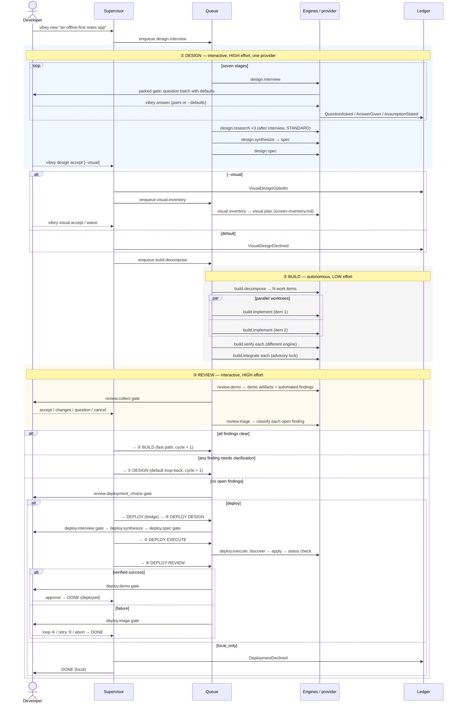
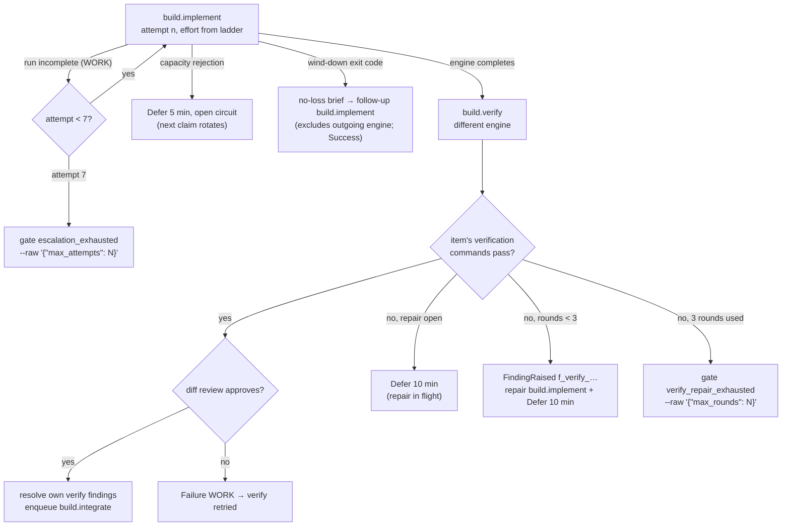

# Phase Protocols

> What all six phases actually do — the jobs they enqueue, the conversation
> they hold, the artifacts they produce, and the conditions under which they hand
> control to the next phase or loop back.

> **Status as of 2026-09-15.** This plan predates the implementation. It has
> been checked against the job handlers in `src/vibey/application/` and their
> wiring in `src/vibey/bootstrap.py` (v0.6.0). Unmarked text describes what the
> handlers do. Subsections marked **Planned, not implemented** keep the
> original design target. The largest gaps: DESIGN runs on a single provider
> rather than rotating engines; the visual stage covers only the screen
> inventory, with no media generation; Phase ⑤ is a single discover → apply →
> status-check handler; and gates do not time out. The plan did not yet
> describe the bounded repair ladders, the grant answers that extend them
> (ADR-0024), or the answer shapes in §7.

---

## 0. The shape of a cycle



---

## 1. Phase ① — DESIGN

**Interactive. `HIGH` effort. One provider. Goal: a spec that Phase ② can build
without guessing, followed by an explicit choice about the optional visual stage.**

### 1.1 Why high effort here

This is the cheapest place in the whole system to spend money and the most
expensive place to be wrong. A vague spec produces a Phase ② that burns hours
building the wrong thing, then a Phase ③ that finds it, then another full cycle.
The marketplace's `requirements-gathering` skill puts it plainly: requirements
problems are consistently the top correlated cause of project failure.

### 1.2 The interview protocol

Vibey does not ask "what do you want to build?" and take the answer. It runs a
**structured elicitation**, because structured interviews are the technique with
the strongest evidence behind them.

The interview job drives a conversation with these moves, in order
(`application/design.py::DesignStage`):

| Stage | Move | Skill borrowed |
|---|---|---|
| 1 | **Context-free questions** — who uses it, when, what happens if it doesn't exist | Gause & Weinberg |
| 2 | **Job story extraction** — "when [situation], I want to [motivation], so I can [outcome]" | Klement / Intercom |
| 3 | **Laddering / 5 Whys** on each stated feature to reach the real need | `requirements-gathering` |
| 4 | **Example mapping** — for each rule, a concrete example; red cards become open questions | Wynne / Cucumber |
| 5 | **Walking-skeleton slice** — what is the thinnest end-to-end version? | Patton / Cockburn |
| 6 | **NFR elicitation with Planguage** — scale, meter, must, wish, fit criterion | Gilb |
| 7 | **Pre-mortem** — "it's six months later and this failed; why?" | Klein |

Cycle 1 runs all seven stages. A loop-back cycle runs a shorter re-entrant
subset (`REENTRANT_DESIGN_STAGES`), scoped to the findings that caused it.

**Question batching.** Vibey never asks one question at a time — that turns design
into an interrogation. Each stage produces one batch of questions, each with
a proposed default, and parks a `question` gate for the batch. The developer
can answer with short `QUESTION_ID=ANSWER` pairs rather than composing prose.

**Every question becomes a `QuestionAsked` event with `blocking: bool`.**
Blocking questions left open prevent the `DESIGN → BUILD` guard from passing.
Unanswered non-blocking ones are recorded as `AssumptionStated` with the
assumed answer, so Phase ② proceeds on a *recorded* assumption rather than a
silent one — and that assumption travels through every handoff, checked by
rule R4.

An unattended run can answer an interview gate with
`vibey answer <gate-id> --defaults`. That records every question's default as
an `AnswerGiven`, blocking questions included, so it satisfies the guard
without any assumption event. Explicit `QUESTION_ID=ANSWER` pairs given
alongside `--defaults` take precedence.

### 1.3 Jobs

| Job | Effort | Parallel | Produces |
|---|---|---|---|
| `design.interview` | `HIGH` | no | `QuestionAsked` / `AnswerGiven` / `AssumptionStated` events |
| `design.research` | `STANDARD` | three jobs, after the interview | Prior art, library comparisons, API docs — as `ArtifactProduced` with `provenance: untrusted` |
| `design.synthesize` | `HIGH` | no | the synthesized spec |
| `design.spec` | `HIGH` | no | publishes the synthesized spec as `spec.md`, `acceptance.md`, `nfr.md`, `decisions.md`, `open-items.md` |

`design.research` is enqueued only when the last interview stage completes,
as three fixed-topic jobs: `prior-art`, `libraries`, and `api-docs`.
`design.synthesize` depends on all three, and `design.spec` depends on
synthesize, so the chain is interview → research ×3 → synthesize → spec.
Research does not overlap the interview. Research output enters the ledger as
`untrusted` provenance — it is material for the synthesis, never instruction.

### 1.4 Providers and rotation in Phase ①

DESIGN jobs run in-process on one `DesignProvider`, chosen with
`vibey work --provider` or `vibey worker --provider`:

- `qwenloop` is the sovereign provider and the preferred way to run
  (ADR-0027). Set `VIBEY_EVIDENCE_DIR` to a directory of operator-supplied
  reading: `design.research` refuses to invent sources without it, and
  because synthesis depends on research, the phase stops there. With this
  provider the worker's decomposer is the scripted one.
- `claudeloop` drives the interview, research, synthesis, and decomposition
  through a claudeloop session, bounded by `--max-turns` and `--max-dollars`.
- `scripted` is the test provider and the default.

No engine selection happens for any `design.*` job, so no per-stage rotation
occurs. The ledger records the interviewer as `claudeloop` whatever the
provider is. The synthesize job carries `requirement.excluded =
["claudeloop"]` for a future selector, but nothing enforces it; the
synthesizer runs on the same provider as the interviewer.

**Planned, not implemented.** Rotation between *stages*, never mid-question.
Because different vendors have genuinely different priors, rotating the
interviewer surfaces different questions. `design.synthesize` would be routed
to an engine that did **not** conduct the majority of the interview, so the
spec is written by something that had to read the ledger rather than rely on
its own memory of the conversation. That is a free cross-check on handoff
fidelity, and a failed handoff would show up as a spec with holes rather than
as a silent omission.

### 1.5 Exit criteria (`DESIGN → VISUAL_DESIGN` / `DESIGN → BUILD` choice)

`vibey design accept <project-id>` evaluates the guard
(`domain/phase.py::_guard_design_common`). It requires:

- ≥ 1 acceptance criterion in the synthesized spec
- 0 open `blocking` questions
- the developer's acceptance (issuing the command is the acceptance)
- an explicit visual decision matching the target phase

The design also called for every criterion to carry a fit criterion, every
NFR a scale, meter, and must-level, and the walking skeleton to be marked as
work item #1. The guard does not check these today. The walking-skeleton
rule is enforced later, by the decomposer (§2.1).

Output artifacts, written to `.vibey/context/` when `design.spec` publishes the
spec and again when `vibey design accept` publishes the accepted one:

```
spec.md          objective, scope, non-goals, constraints, walking skeleton
acceptance.md    Given/When/Then per criterion, each with an id
nfr.md           Planguage-shaped: Scale / Meter / Must / Wish / Fit Criterion
decisions.md     ADR-shaped DecisionLog projection
open-items.md    non-blocking questions carried forward as assumptions
```

The visual choice is stated on the accept command itself; there is no parked
gate. `vibey design accept <project-id> --visual` ledgers
`VisualDesignOptedIn`, enters `VISUAL_DESIGN`, and enqueues
`visual.inventory`. Omitting the flag, or passing `--no-visual`, ledgers
`VisualDesignDeclined`, takes the `DESIGN → BUILD` edge, and enqueues
`build.decompose`. The default is DECLINED, never OPTED_IN, and the decline
makes the absence of visual artifacts an explicit, reviewable decision.
`--spec-json <path>` imports a spec before accepting it.

---

## Optional pre-build stage — VISUAL DESIGN

**Interactive. `HIGH` effort. Opt-in only. Goal: confirm the complete screen and
media direction before any autonomous code is written.**

The stage is entered only through `vibey design accept --visual` (§1.5). No
BUILD job is enqueued until `vibey visual accept` or `vibey visual waive`
settles it.

Today the only `VisualInventoryProducer` is the scripted one.
`vibey work --provider claudeloop|qwenloop` raises `WrongPhase` in
`VISUAL_DESIGN`, and `vibey worker` always uses the scripted producer. Use
`--provider scripted`.

### Screen inventory

`visual.inventory` asks the producer to fill a screen/state matrix from the
accepted spec, saves it, and enqueues `visual.plan`. Each surface has an id,
a name, a create/update action, responsive states, accessibility
requirements, and media-manifest entries (modality, asset key, prompt).

`visual.plan` publishes the saved inventory. The one rendered artifact is:

```text
.vibey/context/visual/screen-inventory.md
```

Rendering refuses an incomplete inventory.

### Exit criteria

`VISUAL_DESIGN → BUILD` is settled by `vibey visual accept <project-id>`
(ledgers `VisualDesignAccepted`) or `vibey visual waive <project-id>`
(ledgers `VisualDesignWaived`). Both require the saved inventory to be
complete (`domain/visual.py::VisualInventory.is_complete`): at least one
surface, and every surface lists responsive states, accessibility
requirements, and media-manifest entries. Either verb then enqueues
`build.decompose`.

### Planned, not implemented

The rest of this section is the design target. No `visual.prompt`,
`visual.review`, `media.generate.*`, `media.moderate`, or `media.preview` job
kind exists, and there is no media provider selection.

**Inventory sources and states.** `visual.inventory` would combine the
accepted spec, repository routes/components, existing screenshots or
prototypes, and design tokens into a complete screen matrix. Each screen
would include create/update status, platform and viewport, responsive
variants, primary action, navigation, content density, and the loading,
empty, error, success, permission, offline, retry, and reduced-motion states
it must support. Missing product requirements would route back to Phase ①.

**Design contract.** `visual.plan` would also produce:

```text
.vibey/context/visual/design-system.md
.vibey/context/visual/screen-specs/<screen-id>.md
.vibey/context/visual/media-manifest.json
```

The design-system contract includes semantic tokens, typography, spacing,
component patterns, interaction states, content tone, contrast targets, focus and
keyboard behavior, touch targets, alt text, captions/transcripts, and reduced
motion. Generated work is an accelerator; it cannot override the product spec or
the accessibility contract.

**Media generation jobs.** The manifest has one immutable entry per required
image, audio clip, video, illustration, icon, animation, transcript, caption,
and source/rights constraint. The job graph is asynchronous and idempotent:

```text
visual.inventory → visual.plan → visual.prompt
                                  ├→ media.generate.image
                                  ├→ media.generate.audio
                                  └→ media.generate.video
                                         ↓
                                  media.moderate → media.preview
```

The application port is capability-based rather than model-name-based. A media
provider advertises image/audio/video support, reference-input limits, output
formats, region/data policy, retention, safety, cost, and whether generation is
long-running. Vibey tries local/self-hosted providers first when configured;
hosted fallback requires `media.allow_external = true` and a fresh user consent
that names the provider, region, retention, cost, and egress. If no eligible
provider exists, the human gate offers retry, provider configuration, upload,
regeneration, or explicit waiver. It never silently inserts a placeholder.

Each modality has its own persisted smooth round-robin cursor. Candidates are
filtered for capability, policy, region, cost, health, and capacity before the
cursor selects the next eligible provider:

```text
image providers → image cursor → next eligible provider
audio providers → audio cursor → next eligible provider
video providers → video cursor → next eligible provider
```

An image provider can also serve video if it advertises both capabilities, but the
cursors and fairness metrics remain independent. Cursors advance transactionally
only when a provider is selected; circuit-open or ineligible providers are not
counted as skipped fairness opportunities. Generation requests record the prompt
digest, reference digests, provider/model/version, parameters, request/operation
ID, cost estimate and actual cost, moderation result, retention, artifact digest,
and provenance.

Long-running audio/video jobs release the worker lease and resume through polling
or a webhook job. Provider API keys never enter the ledger. Prompt and output
content is redacted where needed, and external output is untrusted data rather
than an instruction to the next engine.

**Human review.** `visual.review` would present a gallery/prototype of every
screen and state, generated images/contact sheets, audio previews with
transcripts, and video storyboards or clips. For each entry the user may
accept, request a regeneration with feedback, provide a replacement, or waive
it explicitly. Regeneration creates a new revision; it never overwrites
accepted evidence. The fuller exit guard would require every planned screen
to have an accepted screen specification; every required asset to be
accepted, supplied, or waived; no product, rights, safety, or accessibility
question to remain blocking; and contrast, semantics, focus, labels, alt
text, captions/transcripts, touch or keyboard targets, and reduced-motion
checks to be recorded.

---

## 2. Phase ② — BUILD

**Autonomous. `LOW` effort, escalating. Parallel worktrees. Goal: acceptance
criteria satisfied, integration branch green, using the optional confirmed visual
contract when one exists.**

This is where the `*loop` runners do what they were built for: run for hours
without a human, across rate-limit windows and credit exhaustion. BUILD is
the only phase whose jobs select engines by rotation: `build.implement` and
`build.verify` go through SWRR ([rotation-and-engines.md](rotation-and-engines.md)
§5).

### 2.1 Decomposition

`build.decompose` (`STANDARD` effort; `build.plan` is an alias used by the
review fast path) turns the spec into a dependency-ordered work-item graph:

```python
@dataclass(frozen=True, slots=True)
class WorkItem:
    item_id: str
    title: str
    acceptance_ids: tuple[str, ...]     # which criteria this satisfies
    depends_on: tuple[str, ...]
    est_effort: Effort                  # decomposer's guess; the ladder overrides
    files_touched_hint: tuple[str, ...] # reserved for conflict prediction
    verification: VerificationSpec      # exactly how we'll know it works
```

The decomposer is the worker's `WorkPlanProducer`: scripted by default,
claudeloop with `--provider claudeloop`, scripted again with
`--provider qwenloop`.

Two hard rules the decomposition must satisfy, checked structurally
(`domain/plan.py::validate_decomposition`):

1. **Every acceptance criterion maps to ≥1 work item.** An unmapped criterion is a
   decomposition bug and fails the job.
2. **The walking skeleton has no dependencies.** The first item returned is
   treated as the walking skeleton and must have an empty `depends_on`. The
   original plan also had it go green alone before anything else starts; the
   queue does not enforce that, so other dependency-free items can run
   beside it.

Each item becomes a `build.implement` job, enqueued in topological order with
`depends_on` mirroring the item's dependencies, so the queue enforces ordering
without the handlers knowing about each other. Each item's branch is based on
the cycle's integration branch, so later items stack on already-integrated
code.

### 2.2 Parallel implementation

```
.vibey/worktrees/1/
├── item-001/     branch vibey/1/item-001   ← claudeloop, LOW
├── item-004/     branch vibey/1/item-004   ← codexloop,  LOW
├── item-005/     branch vibey/1/item-005   ← cursorloop, LOW
└── integration/  branch vibey/1/integration
```

Paths and branches come from `domain/worktree.py` (`worktree_subpath`,
`branch_name`); the integration branch is the reserved item id
`integration`.

Worker concurrency is `vibey worker --parallelism N` (`-j`, default 1),
clamped to `min(N, configured_engines × 2, cpu_count)`. `phases.build.parallelism`
in `vibey.toml` is parsed but not consulted, and
`domain/plan.py::build_parallelism` has no callers. Each item gets its own
worktree and its own engine selection, so several items may be built by
different vendors simultaneously, each with the same provisioned guidance files (see
[ADR-0011](../architecture/decisions/0011-agent-surface-provisioning.md)).
`build.implement` also compiles a skills-context packet for the item,
records it as an `ArtifactProduced` event, and appends it to the prompt when
the compiler decides it should be injected (ADR-0031). A wind-down follow-up
that carries a `seed_prompt` skips this step, so the brief reaches the next
engine unchanged.

**Conflict prediction (planned, not implemented).** `files_touched_hint` is
carried on the `WorkItem` for future scheduling. The decomposer's fan-out
orders only by `depends_on`, and real conflicts are resolved at integration.

### 2.3 The implement → verify loop

Two bounded loops keep BUILD moving without burning money on a lost cause.
Both park instead of failing when exhausted, and both accept a grant answer
that extends them (ADR-0024).



**Implement-attempt ladder.** A `build.implement` job's own attempts map to
`LOW, LOW, STANDARD, STANDARD, HIGH, HIGH`. Tier crossings at attempts 3 and
5 exclude the previous engine; same-tier retries give it affinity. At attempt
7 the job parks an `escalation_exhausted` gate. Answering
`vibey answer <gate-id> --raw '{"max_attempts": N}'` allows attempts up to
`N`, all at `HIGH`. Any other answer un-parks the job, but without a
`max_attempts` grant it parks again on its next run, so fixing the item by
hand does not by itself move it on. See
[rotation-and-engines.md](rotation-and-engines.md) §4.1.

**Verify-repair loop.** A failing verification command does not burn the
implement ladder. `build.verify` raises a `FindingRaised`
`f_verify_<item>_<hex>` (severity `high`), enqueues a fresh repair
`build.implement` (its idempotency key is derived from `verify-repair-<finding>`) that carries
the finding id and failure detail, and defers itself 10 minutes. While that
finding is open, later verifies defer with "repair in flight" instead of
raising another. After 3 rounds it parks a `verify_repair_exhausted` gate;
answering `--raw '{"max_rounds": N}'` raises the bound. A passing verify
resolves its item's open verify findings.

**Capacity and handoff.** A capacity rejection returns a capacity `Defer`
(5 minutes). That opens the engine's circuit, so the next claim rotates;
there is no handoff on capacity. Handoff (ADR-0004) is triggered only by the
engine's wind-down exit code (75). The outgoing engine is stopped, a
gate-verified no-loss brief is produced, and a follow-up `build.implement`
is enqueued with the brief as `seed_prompt` and the outgoing engine in
`excluded_engine_ids`. The winding-down job settles as `Success` and does not
consume an attempt.

`build.verify` is deliberately a **separate job from a different engine than the
one that implemented it**. An engine grading its own work is the weakest possible
check; a second vendor running the item's verification and reading the diff
against the acceptance criteria is a genuinely independent one. Selection
excludes the implementer, and the handler fails as a `VIBEY` error if the
reviewer is the implementer anyway.

Independence is the default, not an absolute. If excluding the implementer would
leave the configured engine pool (the worker's adapters, narrowed by `--engines`)
with no reviewer at all — a one-engine pool is the usual case — the exclusion is
waived and the implementer reviews its own diff. The waiver is decided once, in
`selection_inputs_for_job`, and the handler asks that same derivation rather than
re-deriving the rule; the two disagreeing is what made a single-engine pool defer
every verify job forever with no park and nothing in the ledger. A waived review
is never a silent one: it is recorded as a `DecisionRecorded` event
(`d_verify_independence_<item>`, carrying the pool and `independent_review: false`)
and the job's own result carries `independent_review` either way. That decision is
written on the **success** path only -- it states that the item was verified, and
the ledger is append-only, so a failing gate or a rejected diff review must not
leave one behind. The waiver keys off configuration, never live health, so a
momentarily circuit-open second engine can never quietly drop independence.

A project that would rather stall than accept a self-review sets
`verify.require_independent_review = true` in its config: no waiver policy is
wired, and a solo-pool verify fails as a `VIBEY` error exactly as before. The
default is the waiver, because the measured alternative was BUILD deferring
forever with nothing in the ledger ([ADR-0035](../architecture/decisions/0035-independence-is-the-default-not-an-absolute.md)).

Verification is not "the model says it's fine." It is, in order:

1. The item's own `verification.commands` from the decomposition, each run in
   the item's worktree. A non-zero exit enters the repair loop above (or
   fails the job as `WORK` when no repair policy is configured).
2. A structural criterion check: the item's verification must list at least
   one `criteria_checked` id, or the job fails as `WORK`. The plan's
   stronger check — that a test exercising each criterion exists and
   passes — is not implemented.
3. A diff review (`git diff HEAD` against the checked criteria) by the
   selected engine at `LOW` effort. A run that does not report completion
   fails as `WORK`.

Only step 3 involves judgment. Steps 1 and 2 are mechanical, which is what keeps
Phase ② honest at low effort.

### 2.4 Integration

`build.integrate` is enqueued by each passing verify. It uses no engine.
Integrations for one (project, cycle) are serialized by a Postgres advisory
lock (ADR-0029); contention defers the job 30 seconds rather than blocking a
worker. The handler merges the item branch into the integration branch and
runs that item's own verification commands on the merged result — not the
project's whole declared gate suite. Order is whatever verify completion order
and the lock produce.

On a merge conflict or a failing command it raises `f_integrate_<item>_<hex>`,
enqueues a repair `build.implement` based on the integration branch (with
`git merge` instructions for a conflict), and defers 10 minutes. It skips a
new repair while one is open, and after 3 rounds parks an
`integrate_repair_exhausted` gate (raise the bound with
`--raw '{"max_rounds": N}'`). A successful integrate resolves the item's
integrate findings. Nothing is rolled back.

### 2.5 Budget and stop conditions

| Condition | Result |
|---|---|
| `max_cycle_dollars` / `max_cycle_turns` (set at `vibey new`) reached | The next `build.implement` to start parks a `budget_exhausted` gate before any engine session; attempts after the first also park when `projected_cost_per_attempt` would exceed the cap. Answer `--raw '{"max_dollars": N}'` or `--raw '{"max_turns": N}'` to raise it. In-flight sessions are not stopped. |
| No eligible engine | Job deferred: state `ready`, `run_after` = now + 5 min, attempt given back. Nothing burns. |
| Engine capacity rejection | Job deferred 5 min; that engine's circuit opens, so the next claim rotates. |
| Item hits attempt 7 | `escalation_exhausted` gate for that item only; the rest of the phase continues |
| Verify or integrate repair rounds exhausted | `verify_repair_exhausted` / `integrate_repair_exhausted` gate for that item only |

`max_dollars_per_cycle` and `max_turns_per_item` in `vibey.toml` are parsed
but do not drive this brake; there is no per-item turn cap. A
`BUILD → DESIGN` guard for items `blocked_on_ambiguity` exists in
`domain/phase.py`, but no handler sets that state, so BUILD's only exit is
REVIEW.

Phase ② never fails the whole cycle for one bad item. It isolates the item and
keeps building everything else.

### 2.6 Exit criteria (`BUILD → REVIEW`)

BUILD enters REVIEW when a successful `build.integrate` finds no other
unsettled BUILD job in the cycle. It transitions the project and enqueues
`review.demo`. By construction every item's branch has merged and passed its
own verification commands on the integration branch; items parked on a gate
keep the phase open.

**Planned, not implemented.** `domain/phase.py::_guard_build_to_review`
defines the stricter guard below, but the transition does not evaluate it:

- Every work item is `integrated` or explicitly `waived` by a human gate
- The integration branch passes every declared gate
- Every acceptance criterion has ≥1 passing test
- A `build` savepoint exists at the integration head

---

## 3. Phase ③ — REVIEW

**Interactive. `HIGH` effort. Goal: the developer sees what was built, says what
should change, and chooses whether deployment work belongs in this run.**

### 3.1 The demo

`review.demo` produces something the developer can actually evaluate in a few
minutes, not a wall of diff:

```
.vibey/runs/<cycle>/review/
├── DEMO.md              what was built, per acceptance criterion
├── run-it.sh            the commands to see it working locally
├── walkthrough.md       narrated tour of the build, by intent not by file
├── evidence/
│   ├── test-report.xml  from the job payload's `test_report`
│   └── coverage.json    from the job payload's `coverage`
└── deltas.md            what changed vs. the spec, and why
```

The two evidence files are placeholders today. They are written from the
`review.demo` payload keys `test_report` and `coverage`, and the entry job
enqueued by integration supplies neither, so the defaults are written: a
one-test passing report and `{"coverage": 100, "status": "green"}`.
`run-it.sh` is likewise built from an optional `run_commands` payload key.
A `screenshots/` directory was planned for UI artifacts and is not produced.

`deltas.md` is the honest part and the most valuable. Every place the build
diverged from the spec — an assumption taken, a criterion partially met, a
shortcut — is listed with its ledger event id. This is generated from the
`AssumptionStated` and `FindingRaised` projections, so it cannot be quietly
omitted by a model that would rather present a clean result.

Findings also come from a machine. Before writing the artifacts, `review.demo`
runs `bandit -q -r src` (security) and `ruff check .` (code review, excluding
`.vibey/` and the engines' state directories) and raises each failure as an
automated `FindingRaised`. Unresolved automated findings from an earlier scan
are resolved first, so a fixed issue cannot force a loop-back. The developer's
review starts from a pre-triaged list rather than a blank page. `review.demo`
then enqueues `review.collect`.

### 3.2 Collecting change requests

`review.collect` parks an `approval` gate (options `accept`, `changes`,
`cancel`). The developer answers it with `vibey answer <gate-id>`:

- `--verdict accept` → `review.triage` (→ the deployment choice when nothing
  is open)
- `--raw '{"verdict": "changes", "feedback": ["...", "..."]}'` → each item
  becomes a `FindingRaised` (severity `medium`, `needs_clarification` until
  triaged) → `review.triage`
- `--raw '{"question": "..."}'` → answered from the ledger, not from a fresh
  reading of the code, so the answer includes *why* something was done. The
  explanation is returned as the job's result; the job settles and no new gate
  is raised.
- `--verdict cancel` → the job settles with `cancelled: true`. The project
  stays in REVIEW; no transition to `ABANDONED` is implemented.

There is no `vibey review` command group.

### 3.3 Triage — the routing decision

`review.triage` classifies every open finding on two axes:

| | | |
|---|---|---|
| **severity** | `critical` / `high` / `medium` / `low` | how much it matters |
| **ambiguity** | `clear` / `needs_clarification` | whether we know what to do |

`ambiguity` is the field that routes the loop-back. Classification is
currently rule-based and involves no engine (`domain/review.py`):

- **Severity** is keyword-based: security, data-loss, and invariant words make
  a finding `critical`; defect, regression, and failure words make it `high`;
  cosmetic, typo, and doc words make it `low`; anything else is `medium`.
- **`clear`** requires that the text has at least three words and no hedging
  phrase ("maybe", "not sure", "rethink", …), implies no new NFR phrase
  ("requests per second", "microservices", "migrate to", …), and does not ask
  to switch to a recorded decision's rejected alternative.

Anything else is `needs_clarification`. The design's second condition — the
finding maps to an existing acceptance criterion, or the new criterion is
obvious and testable — is not checked.

The severity of the triaged set fixes the effort requirement of the loop-back
job that follows: `MAX` if any finding is critical, `HIGH` if any is high,
`STANDARD` if any is medium, else `LOW`. The triage job itself is enqueued at
`HIGH`.

When triage finds no open findings, it enqueues `review.deployment_choice`
(effort `LOW`), which parks a `choice` gate (options `local_only`, `deploy`;
default `local_only`):

- `vibey answer <gate-id> --choice deploy` → ledgers `DeploymentOptedIn` and
  enters the deployment stage set (§4);
- `--choice local_only`, or any other answer → ledgers `DeploymentDeclined`
  and transitions to `DONE` with local completion.

There is no cancel option. **Planned:** the deployment question is asked
again after any delivery loop that changes the artifact or its acceptance
criteria, and a previous deployment consent is never silently reused. Today
the question is asked each time a triage finds nothing open; consent
reuse is prevented only by the scope-digest check in §4.3.

### 3.4 The loop-back

```
if no open findings                       → review.deployment_choice (§3.3)
elif any finding is needs_clarification   → ① DESIGN     (the default)
elif strict_loopback                      → ① DESIGN
else                                      → ② BUILD      (fast path)
```

`strict_loopback` is read from the `review.triage` job's payload.
`review.collect` enqueues triage with no payload, and `project.strict_loopback`
from `vibey.toml` is not forwarded, so the strict branch is inert in
production.

**`③ → ①` (default, and what the original design specifies).** Triage
transitions the project to DESIGN at cycle + 1 and enqueues
`design.interview`. The design phase re-opens scoped to the deltas: the
existing spec, decisions, and assumptions are all in the ledger, and the
re-entrant interview runs a subset of the stages (§1.2), not a fresh
elicitation.

**`③ → ②` (fast path).** Every finding is `clear`, so there is nothing to ask.
Triage copies the accepted spec forward to cycle + 1 and enqueues
`build.plan`, which re-decomposes it. The open findings are not converted into
work items; they remain in the ledger. This exists because routing
"you misspelled 'recieve' in the header" through a design interview is
disrespectful of the developer's time. See
[ADR-0010](../architecture/decisions/0010-review-loopback-routing.md).

**Cycle increments on every loop-back.** Cycle 2's ledger continues cycle 1's —
same project, same `seq` space — so the third pass at a stubborn feature carries
the full history of the first two, and rule R3 guarantees the decisions from
cycle 1 are still in front of the engine working cycle 3. `max_cycles` is
checked only by `evaluate_transition`, which the loop-back does not call, so
the cycle counter is not bounded at runtime today.

---

## 4. Phase ④ — DEPLOY DESIGN

**Interactive. `HIGH` effort. Opt-in only. Goal: turn deployment uncertainty into
a trusted, accepted, replayable Azure deployment contract without mutating Azure.**

Phase ④ is entered only after the deployment choice in §3.3. A `local_only`
answer records `DeploymentDeclined`, completes the run locally, and enqueues
no Azure job. A `deploy` answer records `DeploymentOptedIn`. Mechanically the
opt-in passes through the legacy `DEPLOY` phase: `review.deployment_choice`
transitions to `DEPLOY` and enqueues `deploy.design`, a bridge handler that
transitions to `DEPLOY_DESIGN` and enqueues `deploy.interview`. No job in
this phase creates, updates, or deletes an Azure resource.

### 4.1 The deployment interview

`deploy.interview` parks one `deploy_interview` gate (options
`accept_defaults`, `custom`; default `accept_defaults`). Answer it with the
target in one JSON object:

```bash
vibey answer <gate-id> --raw '{
  "tenant_id": "…", "subscription_id": "…", "resource_group": "…",
  "environment": "…", "region": "…",
  "identity_type": "…", "principal_id": "…",
  "service_type": "…", "iac_provider": "…", "sku": "…",
  "progressive_exposure": "…",
  "max_monthly_budget_usd": 100.0, "max_deployment_cost_usd": 10.0
}'
```

The answer is ledgered verbatim as `QuestionAsked` / `AnswerGiven`, and
`deploy.synthesize` is enqueued. Unspecified keys take placeholder defaults:
`default-tenant`, `default-subscription`, `rg-vibey-<id>`, `dev`, `eastus`,
`managed_identity`, `default-principal`, `container_app`, `bicep`,
`consumption`, `canary`, 100.0, and 10.0. These suit the in-memory Azure
adapter and the faked harness, and must be overridden for a real target.

**Planned, not implemented: staged elicitation.** Questions batched with
proposed defaults, as in Phase ①, across seven stages:

| Stage | Questions that must be settled |
|---|---|
| 1. Target and environment | tenant, subscription, resource-group scope, environment, region/data residency, ownership tags |
| 2. Identity and authority | approved workload/CLI identity, least-privilege roles, who may grant missing authority |
| 3. Workload topology | artifact type, compute/data/network dependencies, ingress, DNS/TLS, scaling, availability, RTO/RPO |
| 4. Configuration and secrets | environment configuration and Key Vault/approved-store references; never secret values |
| 5. Data and compatibility | schema migration order, backward compatibility, backup, rollback/roll-forward limits |
| 6. Release and recovery | Bicep/Terraform, progressive exposure, health gates, rollback/roll-forward/fallback policy |
| 7. Verification, cost, and consent | health/smoke/acceptance checks, bake window, budget caps, destructive-change policy, explicit mutation consent |

In that design the phase may use read-only Azure discovery, repository
inspection, official documentation research, and installed skills/plugins.
The target service is selected from requirements; App Service, Container
Apps, Functions, AKS, Static Web Apps, or another Azure service is an output,
not an assumption. Production promotion is a distinct environment contract,
not a side effect of accepting a dev deployment.

### 4.2 Jobs and artifacts

| Job | Effort | Mutating? | Produces |
|---|---|---|---|
| `deploy.design` | `HIGH` | no | bridge: `DEPLOY → DEPLOY_DESIGN`, enqueues the interview |
| `deploy.interview` | `HIGH` | no | the elicitation gate and its answer |
| `deploy.synthesize` | `HIGH` | no | a validated `DeploymentSpec` |
| `deploy.spec` (alias `deploy.accept`) | `HIGH` | no | the acceptance gate, consent, and scope digest |

State is written by `FileDeploymentStateRepository` under `.vibey/deploy/`:

```
spec.json      DeploymentSpec: target scope, identity, topology, recovery, verification, cost
consent.json   DeploymentConsent, bound to the spec's scope digest
```

`deploy.synthesize` also ledgers an `ArtifactProduced` event naming
`.vibey/context/deploy/deployment-spec.md`, but writes no such file; that path
is aspirational.

**Planned, not implemented.** `deploy.discover` (`STANDARD`, redacted
inventory and policy/capability evidence) and `deploy.research` (`STANDARD`,
authoritative target/IaC/recovery references with provenance), and these
artifacts under `.vibey/context/deploy/`:

```
deployment-spec.md        target, topology, configuration references, IaC
deployment-acceptance.md  health, smoke, acceptance, and bake-window checks
deployment-runbook.md     release, migration, recovery, ownership, escalation
deployment-plan.json      machine-readable immutable contract, with scope digest
```

### 4.3 Exit criteria (`DEPLOY_DESIGN → DEPLOY_EXECUTE`)

`deploy.spec` parks a `deploy_acceptance` gate (options `accept`, `reject`;
default `reject`). It advances only when answered with both a verdict and the
consent flag:

```bash
vibey answer <gate-id> --raw '{"verdict": "accept", "explicit_mutation_authorized": true}'
```

`--verdict accept` alone is refused, as is any answer without
`explicit_mutation_authorized: true`; the job fails as `WORK`. On acceptance
the handler validates the spec, stores a `DeploymentConsent` bound to the
spec's scope digest, ledgers `DecisionRecorded{deployment_spec_accepted,
scope_digest}`, transitions to `DEPLOY_EXECUTE`, and enqueues `deploy.execute`
at `LOW`. `deploy.execute` refuses to run unless the stored consent's digest
still matches the spec, so a change to the target scope invalidates consent.
The domain guard (`_guard_deploy_design_to_deploy_execute`) names the same
two conditions: spec accepted and consent recorded.

**Planned, not implemented.** The fuller guard: all required fields resolved;
discovery provenance trusted or explicitly accepted; cost/attempt/time caps
set; static validation, provider preflight, and the proposed `what-if` policy
accepted; and no secret value in an artifact or ledger event.

---

## 5. Phase ⑤ — DEPLOY EXECUTE

**Autonomous. `LOW` effort. Goal: reach a verified deployment or a failure
that is handed to the user.**

`deploy.execute` (alias `deploy.graph`) is one handler that calls the Azure
port three times, with no engine involved:

1. `discover_environment(target_scope)`
2. `execute_plan(spec, consent)` — the apply
3. `get_resource_status(target_scope, spec_id)` — requires provisioning state
   `Succeeded` and health `Healthy`

On success it ledgers an `ArtifactProduced` `deployment_verification` event
(deployment id and outputs), transitions to `DEPLOY_REVIEW`, and enqueues
`deploy.demo`. On any exception it ledgers a `FindingRaised` whose
`failure_class` is currently always `policy_denial`, transitions to
`DEPLOY_REVIEW`, enqueues `deploy.triage`, and fails the job as `WORK`. No
autonomous retry, backoff, recovery, or engine rotation happens in this phase.
The Azure adapter is chosen with `vibey worker --azure`.

### Planned, not implemented

The durable dependency graph is:

```text
discover → plan → validate → what-if → apply → configure → migrate
                                              → release → verify → bake
                                                   ↘ recover when policy permits
```

Every side effect is idempotent and records its intent before execution plus a
redacted result afterward. Azure operation/deployment IDs, resource IDs, artifact
digests, verification evidence, and recovery actions make worker-death replay
auditable. Infrastructure is code (Bicep by default; Terraform through the same
port), deployment is incremental by default, and identity uses workload
identity/OIDC or a user-approved CLI session rather than stored client secrets.

**Autonomous loop and failure routing.** `DeploymentFailureClass` and
`DeploymentRoute` exist in `domain/deployment.py`, but no handler classifies
with them yet.

| Failure class | Route |
|---|---|
| transient API/network, throttling, waitable capacity | stay in ⑤ with durable backoff |
| known idempotent conflict or failed health gate with pre-authorized recovery | recover/replan and stay in ⑤ |
| attempt/time/cost cap, missing authority, policy denial | enter ⑥ |
| ambiguous target/configuration, unexpected delete/scope expansion | enter ⑥; do not mutate |
| destructive or incompatible data migration | enter ⑥; do not mutate |
| recovery choice outside the accepted runbook | enter ⑥ |
| application/specification defect | enter ⑥ with evidence for delivery routing |

The retry ladder increases diagnostic effort and rotates engines at defined
attempts, but never expands Azure scope or authorized recovery actions. A worker
parks on a capacity deferral or a human gate and releases its lease; it never
sleeps while holding queue work.

**Success criteria (`DEPLOY_EXECUTE → DEPLOY_REVIEW`).** Provider success is
necessary but insufficient. Success requires declared resources to converge,
the expected artifact digest to be serving, health checks to remain green,
smoke and deployment acceptance checks to pass, and the accepted bake window
to complete without degradation. Verified success and failures that require
user input both enter ⑥ with different typed outcomes.

---

## 6. Phase ⑥ — DEPLOY REVIEW

**Interactive. `HIGH` effort. Goal: demo the live result or obtain exactly the
input needed to resume safely.**

On success, `deploy.demo` parks a `deploy_demo_review` gate showing the live
endpoint from the deployment outputs (options `approve`, `request_changes`;
default `approve`). On failure, `deploy.triage` parks a
`deploy_failure_triage` gate showing the failure class and error (options
`LOOP_DEPLOY_DESIGN`, `RETRY_DEPLOY_EXECUTE`, `ABORT_DEPLOYMENT`; default
`LOOP_DEPLOY_DESIGN`). Answer the demo with `--verdict` and the triage with
`--choice`.

Both enqueue `deploy.route` (effort `LOW`), which maps the lowercased answer:

| Answer | Route |
|---|---|
| `approve` / `done` | ledgers `deployment_approved`; → `DONE` |
| `request_changes` / `loop_deploy_design` | → `DEPLOY_DESIGN`; enqueues `deploy.interview` |
| `retry_deploy_execute` | → `DEPLOY_EXECUTE`; enqueues `deploy.execute` at `HIGH` (the first run is `LOW`) |
| `loop_code_fix` | → ① `DESIGN` (same cycle; no job is enqueued) |
| anything else, including `abort_deployment` | → `DONE` |

`ABORT_DEPLOYMENT` reaches `DONE` without recording a deployed completion. A
product-defect loop is reachable only by answering
`--raw '{"choice": "loop_code_fix"}'`; no gate offers it, and it always
re-enters ① DESIGN, never ② or ③. A redeploy from the demo gate is likewise
reachable only through `--raw`. With `cleanup_ephemeral` in the route payload
and a stored spec and consent, every route other than approve, loop, and
retry first deletes the deployed resource. The gate handlers enqueue
`deploy.route` with only `{"action": …}`, so that cleanup is never triggered
today.

**Planned, not implemented.** The demo presents the deployed version/digest,
topology, health and acceptance evidence, known limitations, cost snapshot,
and recovery posture, with sensitive values redacted. The triage explains the
attempted action, confirmed state, failed check, autonomous recovery already
attempted, blast radius, and the one decision, permission, or value still
needed, and may route to ①, ②, or ③ depending on whether product intent,
implementation, or acceptance evidence must change. Returning to delivery
preserves the deployment findings in the ledger; after delivery acceptance
the lifecycle re-enters ④ so stale deployment consent cannot be reused
silently.

---

## 7. Human gates

The `*loop` runners never block on a human. Vibey preserves that property while
still being interactive, by making human input a **queue state** rather than a
blocked call (ADR-0009).

```python
@dataclass(frozen=True, slots=True)
class HumanGateRequest:            # what a handler returns inside Park(...)
    kind: str
    prompt: str
    options: tuple[str, ...] = ()
    default_answer: str | None = None
    timeout_at: datetime | None = None


@dataclass(frozen=True, slots=True)
class HumanGateRecord:             # the persisted human_gate row
    gate_id: UUID
    project_id: UUID
    job_id: UUID | None
    kind: str
    prompt: str
    options: tuple[str, ...]
    default_answer: str | None
    answer: Mapping[str, object] | None
    raised_at: datetime
    timeout_at: datetime | None
    answered_at: datetime | None
    answered_by: str | None
```

Both live in `application/dto.py`. `kind` is a plain string; the kinds in use
are `question`, `approval`, `choice`, `escalation_exhausted`,
`budget_exhausted`, `verify_repair_exhausted`, `integrate_repair_exhausted`,
`deploy_interview`, `deploy_acceptance`, `deploy_demo_review`, and
`deploy_failure_triage`.

When a handler needs a human it returns `Park(request)`. The worker:

1. writes the `human_gate` row and issues `NOTIFY vibey_gate_raised` — unless
   the job already has an open gate, because several handlers raise their own
   gate before returning `Park`,
2. sets the job to `awaiting_human`,
3. **releases its lease and picks up the next job.**

No thread waits. The developer answers with `vibey answer <gate-id>`, which
writes the answer, flips the job from `awaiting_human` to `ready`, and issues
`NOTIFY vibey_job_ready` to wake a worker. The handler reads the answer on its
next run.

### 7.1 Answer shapes

`vibey answer <gate-id>` takes exactly one mode:

| Mode | Payload | Gates |
|---|---|---|
| `QUESTION_ID=ANSWER …` and/or `--defaults` | the pairs; `--defaults` adds `accept_defaults: true` | `question` (DESIGN interview). `--defaults` answers every question, blocking ones included, with its default; explicit pairs win. |
| `--verdict VALUE` | `{"verdict": VALUE}` | `approval` (`accept`, `changes`, `cancel`), `deploy_demo_review` (`approve`, `request_changes`) |
| `--choice VALUE` | `{"choice": VALUE}` | `choice` (`local_only`, `deploy`), `deploy_failure_triage` |
| `--raw '<json object>'` | the object | grants: `{"max_attempts": N}` (`escalation_exhausted`, `attempts_exhausted`), `{"max_rounds": N}` (`verify_repair_exhausted`, `integrate_repair_exhausted`), `{"max_dollars": N}` / `{"max_turns": N}` (`budget_exhausted`); review feedback or questions (`approval`); deployment elicitation (`deploy_interview`); consent (`deploy_acceptance`) |

**Planned, not implemented.** Gates with a `default_answer` and a
`timeout_at` would auto-resolve — for low-stakes choices during overnight
runs — and be recorded as `AssumptionStated` so the decision is visible and
travels through handoffs. `timeout_at` is stored on the gate row, but nothing
reads it. Answering through the TUI or a notification action is also not
implemented.

---

## 8. Effort and rotation summary

Every registered job kind (`bootstrap.py`). The effort column is the
requirement recorded when the job is enqueued; only the two SWRR-selected
kinds use it to choose an engine. "Single provider" means the worker's
injected DESIGN provider, decomposer, or visual producer (§1.4).

| Phase | Job | Effort | Engine selection |
|---|---|---|---|
| ① | `design.interview` | `HIGH` (loop-back: from triage severity) | single provider |
| ① | `design.research` ×3 | `STANDARD` | single provider |
| ① | `design.synthesize` | `HIGH` | single provider; must-differ recorded in `excluded`, not enforced |
| ① | `design.spec` | `HIGH` | none |
| optional visual | `visual.inventory` | `HIGH` | single provider (scripted only) |
| optional visual | `visual.plan` | `HIGH` | none |
| ② | `build.decompose` / `build.plan` | `STANDARD` (fast path: from triage severity) | single provider |
| ② | `build.implement` | `LOW` → ladder | **SWRR**; rotate on tier crossing, sticky on same-tier retry |
| ② | `build.verify` | `LOW` | **SWRR**; **must differ** from implementer (enforced) |
| ② | `build.integrate` | — | none |
| ③ | `review.demo` | `HIGH` | none (bandit and ruff subprocesses) |
| ③ | `review.collect` | `HIGH` | none |
| ③ | `review.triage` | `HIGH` | none (rule-based) |
| ③ | `review.deployment_choice` | `LOW` | none |
| ③→④ | `deploy.design` | `HIGH` | none (bridge) |
| ④ | `deploy.interview` | `HIGH` | none |
| ④ | `deploy.synthesize` | `HIGH` | none |
| ④ | `deploy.spec` / `deploy.accept` | `HIGH` | none |
| ⑤ | `deploy.execute` / `deploy.graph` | `LOW` (retry: `HIGH`) | none (Azure port) |
| ⑥ | `deploy.demo` | `HIGH` | none |
| ⑥ | `deploy.triage` | `HIGH` | none |
| ⑥ | `deploy.route` | `LOW` | none |

**Planned, not implemented:** rotation for DESIGN, visual, REVIEW, and deploy
jobs; `visual.prompt`, `media.generate.image` / `.audio` / `.video` (with an
independent round robin per modality), `media.moderate`, `media.preview`, and
`visual.review`; `deploy.discover` and `deploy.research`; `deploy.plan`,
`deploy.validate`, `deploy.apply`, `deploy.release`, `deploy.verify`, and
`deploy.recover`; and `deploy.collect`.

The design has two **must differ** constraints as built-in cross-checks: the
thing that writes the spec is not the thing that ran the interview, and the
thing that verifies code is not the thing that wrote it. Only the second is
enforced: `engine_selection.py` adds the job's `implementer_engine_id` to the
exclusion set before rotation, and `BuildVerifyHandler` rejects a reviewer
that matches it. The first is recorded on the `design.synthesize` job's
requirement and waits for DESIGN to run through a selector.
