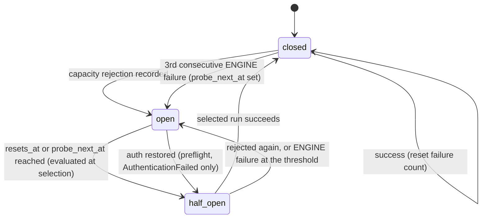

# Engine Rotation and the Capability Matrix

> How vibey picks which AI does the next piece of work, in every phase, without
> starving an engine, without pretending they are interchangeable, and without
> conflating "out of tokens for five minutes" with "out of money until you pay."

> **Status as of 2026-09-15.** This plan predates the implementation. It has
> been checked against the code in `src/vibey/` (v0.6.0) and the runners in
> `src/vibey_runners/` (the runner family now lives in this repository as a
> uv workspace, ADR-0021). Where the code does not yet do what the plan
> designed, the text says so and marks the design *not implemented* instead
> of deleting it. The main differences from the original plan:
>
> - There are **five** engines. `qwenloop` is an opt-in local standby
>   (ADR-0015) and the sovereign DESIGN provider (ADR-0027).
> - Engine selection (SWRR) runs only for `build.implement` and `build.verify`.
>   Every other job kind runs on a single injected provider or on no engine
>   (see [phase-protocols.md](phase-protocols.md) §8).
> - `[engines] weights` is parsed but not applied, and cost-aware weighting is
>   implemented but not wired. Circuit probes for `CreditsExhausted` and
>   `AuthenticationFailed` are recorded but never scheduled. The metric
>   exports and a `vibey rotate` command do not exist.

---

## 1. The verified divergence

The five runners look like siblings: the same `run` / `resume` / `doctor` /
`stop` / `prompt` verbs, a similar run-directory layout, and the same
capacity ADT. They are *not* interchangeable at the flag level. This table
comes from reading their sources under `src/vibey_runners/`, not their docs:

| Concern | `claudeloop` | `codexloop` | `cursorloop` | `agyloop` | `qwenloop` |
|---|---|---|---|---|---|
| Effort vocabulary | `Literal["low","medium","high","xhigh","max"]` | `StrEnum{LOW,MEDIUM,HIGH}`, no `run` flag | **none** (a model-id ladder) | `Literal["low","medium","high","xhigh","max"]` | none (a `--max-turns` budget; `--preset`/`--effort` are accepted and ignored) |
| Preset tiers | `low/medium/high` → model aliases | none | `_PRESET_LADDER` of model ids | `low/medium/high` → model aliases | none |
| Model ladder | sonnet → opus → fable | codex models | `composer-fast → composer → grok-4.5 → grok → grok-xhigh` | flash-lite → flash → pro | local qwen2.5-coder profiles (`[qwenloop] portable_profile` / `nvidia_profile`) |
| Router models | — | — | `router-cost / router-balanced / router-intelligence` | — | — |
| Top-level `effort` cmd | ✅ | ✅ | ❌ | ❌ | stub (prints a message) |
| Top-level `preset` cmd | ✅ | ❌ | ❌ | ✅ | stub |
| `savepoints` / `unwind` | ✅ | ✅ | ✅ | ✅ ¹ | stubs |
| Session listing verb | `sessions` | `threads` | `agents` | `sessions` | `sessions` (stub) |
| Sandbox / permission | `permission-mode` | `sandbox` + `approval` | `hooks` | `--safe` / `--yolo` | none (local process) |
| Structured verdict | ✅ (`finished` event) | ✅ (`run.verdict` event) | ❌ ² | ✅ (`finished` event) | `completed` / `failed` events |
| State dir | `.claudeloop/` | `.codexloop/` | `.cursorloop/` | `.agyloop/` | `.qwenloop/` |
| Done marker | `CLAUDELOOP_TASK_FULLY_COMPLETE` | `CODEXLOOP_…` | `CURSORLOOP_…` | `AGYLOOP_…` | `QWENLOOP_TASK_FULLY_COMPLETE` |
| Auth | `ANTHROPIC_*` | `OPENAI_API_KEY` / `CODEX_API_KEY` / login | `CURSOR_API_KEY` | `GOOGLE_API_KEY` / `GEMINI_API_KEY` / ADC | none (local llama.cpp or vLLM server) |

¹ `agyloop` registers both `unwind` and a `savepoints` group, but vibey's
`AGYLOOP` descriptor does not claim `Capability.SAVEPOINTS`. A job that
requires savepoints is never routed to agyloop until the descriptor changes.

² `cursorloop`'s `events.jsonl` carries only in-turn SDK types (`tool_call`,
`usage`, `status`), with no session, turn, or verdict boundary event. Its
descriptor does not claim `STRUCTURED_VERDICT`.

vibey's descriptors list only the primary auth variable for each engine
(`ANTHROPIC_API_KEY`, `OPENAI_API_KEY`, `CURSOR_API_KEY`, `GOOGLE_API_KEY`,
and none for qwenloop). The runners' own `doctor` commands also accept the
alternatives shown above. vibey passes empty `isolation_flags` for every
engine except `agyloop`, whose container and VM levels map to `--safe`. The
other isolation flags the original plan assumed do not exist on the runners'
`run` verbs.

`qwenloop` is opt-in. It exists only when `[features] qwenloop = true` is set
in `vibey.toml` or `VIBEY_FEATURE_QWENLOOP` is truthy. Its descriptor claims
every `Capability`, although most of its verbs other than `run` are stubs
that only print a message (§5.5).

**The consequence:** any design that assumes `--effort high` works everywhere
breaks the first time the rotator picks `cursorloop`. It also broke on
`codexloop`, whose `run` verb has no `--effort` flag at all. Vibey handles
this explicitly rather than defensively.

---

## 2. The engine descriptor

```python
@dataclass(frozen=True, slots=True)
class EngineDescriptor:
    engine_id: EngineId
    binary: str                          # "claudeloop"
    min_version: str                     # semver floor the conformance suite asserts
    state_dir: str                       # ".claudeloop"
    done_marker: str
    auth_env: tuple[str, ...]
    capabilities: frozenset[Capability]
    effort_projection: Mapping[Effort, EngineInvocation]
    session_verb: str                    # "sessions" | "threads" | "agents"
    isolation_flags: Mapping[IsolationLevel, tuple[str, ...]]
    cost_per_mtok_in: float
    cost_per_mtok_out: float
    context_window: int
    base_weight: int = 1
    supports_cwd_flag: bool = True       # False for codexloop: `run` has no --cwd
    plan_flag: str | None = None         # "--plan" for cursorloop; None = positional path

    def invoke(self, effort: Effort) -> EngineInvocation: ...
    def saturates_at(self, effort: Effort) -> bool: ...


@dataclass(frozen=True, slots=True)
class EngineInvocation:
    """Native flags that realize a requested vibey effort on this engine."""
    argv: tuple[str, ...]
    achieved: Effort          # may be < requested → saturation
    notes: str = ""


class Capability(StrEnum):
    SAVEPOINTS       = "savepoints"
    UNWIND           = "unwind"
    STRUCTURED_VERDICT = "structured_verdict"
    MID_RUN_PROMPT   = "mid_run_prompt"
    MID_RUN_MODEL    = "mid_run_model"
    MID_RUN_EFFORT   = "mid_run_effort"
    ATTACHMENTS      = "attachments"
    SLASH_COMMANDS   = "slash_commands"
    WEB_SEARCH       = "web_search"
    SNAPSHOT         = "snapshot"
    SANDBOX          = "sandbox"
```

`invoke(effort)` returns the projection for that level. If the level is
missing, it falls back to the highest projection at or below it.
`saturates_at(effort)` is `invoke(effort).achieved < effort`. The dataclasses
live in `domain/engine.py`.

All descriptors live in one module, `infrastructure/engines/descriptors.py`.
`DEFAULT_DESCRIPTORS` holds the four paid engines, `ALL_DESCRIPTORS` adds
`QWENLOOP`, and `BY_ENGINE_ID` indexes them. Descriptors are **data, not code
paths**. A new engine needs a new `EngineId`, a descriptor, a capacity
classifier, an event-type map entry (§8.3), and an adapter configuration.
`domain/rotation.py` does not change. The fifth engine, `qwenloop`, landed
this way. It also carries a standby rule in `application/engine_selector.py`
(§5.5).

---

## 3. The normalized effort ladder

Vibey's domain speaks five levels and nothing else:

```python
class Effort(IntEnum):
    TRIVIAL  = 0   # extraction, classification, formatting
    LOW      = 1   # bulk implementation — the Phase 2 default
    STANDARD = 2   # decomposition, integration, research
    HIGH     = 3   # design + review conversations — the Phase 1/3 default
    MAX      = 4   # hardest reasoning; contested specs, critical findings
```

Each descriptor projects those onto native flags. Saturation is explicit:

```python
# claudeloop — full 5-level range
{
  Effort.TRIVIAL:  EngineInvocation(("--preset","low","--effort","low"),      Effort.TRIVIAL),
  Effort.LOW:      EngineInvocation(("--preset","low","--effort","medium"),   Effort.LOW),
  Effort.STANDARD: EngineInvocation(("--preset","medium","--effort","high"),  Effort.STANDARD),
  Effort.HIGH:     EngineInvocation(("--preset","high","--effort","high"),    Effort.HIGH),
  Effort.MAX:      EngineInvocation(("--preset","high","--effort","max"),     Effort.MAX),
}

# codexloop — no CLI-level effort control; every level is served at STANDARD
{
  Effort.TRIVIAL:  EngineInvocation((), Effort.STANDARD),
  Effort.LOW:      EngineInvocation((), Effort.STANDARD),
  Effort.STANDARD: EngineInvocation((), Effort.STANDARD),
  Effort.HIGH:     EngineInvocation((), Effort.STANDARD),
  Effort.MAX:      EngineInvocation((), Effort.STANDARD,
                                    notes="codexloop has no CLI-level effort control"),
}

# cursorloop — no effort flag at all; position on the model ladder
{
  Effort.TRIVIAL:  EngineInvocation(("--model","composer-fast"), Effort.TRIVIAL),
  Effort.LOW:      EngineInvocation(("--model","composer"),      Effort.LOW),
  Effort.STANDARD: EngineInvocation(("--model","grok-4.5"),      Effort.STANDARD),
  Effort.HIGH:     EngineInvocation(("--model","grok"),          Effort.HIGH),
  Effort.MAX:      EngineInvocation(("--model","grok-xhigh"),    Effort.MAX),
}

# agyloop — identical argv to claudeloop; agyloop resolves the preset to its
# own gemini models (flash-lite → flash → pro)
{
  Effort.TRIVIAL:  EngineInvocation(("--preset","low","--effort","low"),      Effort.TRIVIAL),
  Effort.LOW:      EngineInvocation(("--preset","low","--effort","medium"),   Effort.LOW),
  Effort.STANDARD: EngineInvocation(("--preset","medium","--effort","high"),  Effort.STANDARD),
  Effort.HIGH:     EngineInvocation(("--preset","high","--effort","high"),    Effort.HIGH),
  Effort.MAX:      EngineInvocation(("--preset","high","--effort","max"),     Effort.MAX),
}

# qwenloop — effort is a turn budget
{
  Effort.TRIVIAL:  EngineInvocation(("--max-turns","8"),  Effort.TRIVIAL),
  Effort.LOW:      EngineInvocation(("--max-turns","16"), Effort.LOW),
  Effort.STANDARD: EngineInvocation(("--max-turns","40"), Effort.STANDARD),
  Effort.HIGH:     EngineInvocation(("--max-turns","64"), Effort.HIGH),
  Effort.MAX:      EngineInvocation(("--max-turns","96"), Effort.MAX),
}
```

`codexloop run` has no `--effort` flag. Its internal effort starts at `MEDIUM`
and changes only through a runtime `SetEffort` event. The earlier projection
(`--effort low|medium|high`) made every real invocation fail at argument
parsing, and the conformance `flags` check caught it. Because `achieved` is
`STANDARD` at every level, a `HIGH` request on codexloop carries a
`fidelity_factor` of 0.7 and a `MAX` request carries 0.5. A `TRIVIAL` or
`LOW` request is over-served and carries 1.0.

`achieved < requested` is not an error. It lowers that engine's rotation
weight through `fidelity_factor` (§5.3). Hiding saturation would be the real
bug. Showing requested-versus-achieved effort in `vibey status` or
`vibey engines` is *not implemented*. Today the only visible sign is the
engine's smaller share of selections.

---

## 4. Phase effort policy

The user's requirement, made concrete in `domain/effort.py::PHASE_BASE_EFFORT`:

| Phase | Base effort | Rationale |
|---|---|---|
| ① DESIGN | `HIGH` | The conversation that determines what gets built. Cheapest place to spend money; most expensive place to be wrong. |
| VISUAL_DESIGN (optional) | `HIGH` | Interactive; same reasoning as DESIGN. |
| ② BUILD | `LOW` | Bulk, well-specified, verifiable work. Volume phase — this is where cost lives. |
| ③ REVIEW | `HIGH` | Judging whether the thing is right, and classifying ambiguity for the loop-back. |
| ④ DEPLOY_DESIGN | `HIGH` | Interactive deployment design. |
| ⑤ DEPLOY_EXECUTE | `LOW` | Unattended execution of an accepted deployment contract. |
| ⑥ DEPLOY_REVIEW | `HIGH` | Interactive acceptance or triage of the deployment. |

The legacy single-phase `DEPLOY` (the bridge between REVIEW and
DEPLOY_DESIGN) also maps to `LOW`.

Only BUILD's base effort feeds engine selection today, through
`application/engine_selection.py::selection_inputs_for_job`. Other phases
record an effort string in each enqueued job's requirement, but no selector
reads it (see [phase-protocols.md](phase-protocols.md) §8).

### 4.1 The Phase 2 escalation ladder

A flat `LOW` would strand the one genuinely hard item. Escalation happens
**per `build.implement` job** and follows that job's attempt number
(`domain/effort.py::BUILD_LADDER`):

```
attempt 1–2 : LOW
attempt 3–4 : STANDARD    (+ rotate engine)
attempt 5–6 : HIGH        (+ rotate engine)
attempt 7   : human gate `escalation_exhausted`
```

A tier crossing (attempts 3 and 5) forces rotation. `selection_inputs_for_job`
puts the previous attempt's engine (the job's `assigned_engine`) into the
exclusion set. `BuildImplementHandler` has its own backstop, which fails the
attempt as a `VIBEY` error if the engine matches, but it reads
`previous_engine_id` from the job payload, and only a wind-down follow-up
sets that key. A retry in
the same tier instead gives the previous engine an `affinity_factor` of 2.0.
The ladder therefore tries *different engines at higher effort* instead of
the same engine trying harder.

At attempt 7 the job parks an `escalation_exhausted` gate (ADR-0024).
Answering `vibey answer <gate-id> --raw '{"max_attempts": N}'` extends the
ladder, and further attempts run at `HIGH` until attempt `N`. Any other
answer un-parks the job, but with no `max_attempts` grant the next run parks
again on a fresh gate. The gate prompt's "fix the item by hand and answer
anything" path therefore does not, by itself, get the item to verify.

The original plan also reset the worktree from the last savepoint at
attempts 5–6 and passed every failed attempt's findings through a handoff.
Neither is implemented. Attempts do not reset the worktree, and a handoff
happens only when an engine exits with the wind-down code (§7). A gate
failure in `build.verify` does not use up implement attempts at all. It
starts a separate bounded repair loop
([phase-protocols.md](phase-protocols.md) §2.3).

### 4.2 Escalation is bounded by budget

Runaway agent cost is a documented incident class, and the ladder is exactly
the mechanism that could cause it. The cap is therefore checked *before* an
engine session starts, not after.

The caps are the project's `max_cycle_dollars` and `max_cycle_turns`, set
with `vibey new --max-cycle-dollars/--max-cycle-turns`. When either is set,
`BuildImplementHandler` compares the cycle's ledger-recorded spend with the
cap before every attempt. It parks a `budget_exhausted` gate when the cap is
reached. On attempts after the first, it also parks when the payload's
`projected_cost_per_attempt` would exceed the cap. Answering
`--raw '{"max_dollars": N}'` or `--raw '{"max_turns": N}'` raises the cap for
that job only; the stored cap is unchanged. With neither setting, spend is
uncapped. The worker and `vibey cost` read both caps through one parser,
`LedgerBudgetSource.caps_from_config`, so the cap `vibey cost` prints is the
cap the brake enforces. The `vibey.toml` keys `max_dollars_per_cycle` and
`max_turns_per_item` are parsed into the config model, but nothing reads
them at runtime: not the brake, and not `vibey cost`.

---

## 5. The rotation algorithm

### 5.1 Why not modulo

`engines[i % len(engines)]` is the obvious implementation and is wrong here for
three reasons:

1. **The eligible set changes size** as circuits open and close. Modulo over a
   shrinking list re-maps every index, so the cursor jumps arbitrarily.
2. **It ignores weight.** A faster/cheaper/more capable engine should get more
   work, and weights are how a developer expresses that.
3. **It clumps under weight.** Naive weighted round-robin (`AAABBC`) sends three
   consecutive items to A, which is exactly the pattern that exhausts A's
   rate-limit window while B and C sit idle.

### 5.2 Smooth Weighted Round Robin

Vibey uses nginx's SWRR (ADR-0005), which produces `ABACAB` rather than
`AAABBC` for weights `{A:3, B:2, C:1}`:

```python
def select(candidates: Sequence[Candidate]) -> Selection:
    """Pure. Returns the winner and the updated candidate states."""
    if not candidates:
        raise NoEligibleEngine
    if len({c.engine_id for c in candidates}) != len(candidates):
        raise ValueError                      # engine ids must be unique
    if all(c.effective_weight == 0 for c in candidates):
        raise NoEligibleEngine
    total = sum(c.effective_weight for c in candidates)
    bumped = {c.engine_id: c.current + c.effective_weight for c in candidates}
    winner = max(candidates, key=lambda c: (bumped[c.engine_id], -c.order))  # order breaks ties
    bumped[winner.engine_id] -= total
    updated = tuple(replace(c, current=bumped[c.engine_id]) for c in candidates)
    return Selection(engine_id=winner.engine_id, candidates=updated)
```

`EngineSelector.select_engine` in `application/engine_selector.py` is the
production caller. `SelectingEngineProvider.select_for` invokes it when the
dispatcher builds a `build.implement` or `build.verify` handler.

State (`current` per engine) lives in the `rotation_cursor` table. The
selector writes it with `update_many` at dispatch time. By then the worker
has already claimed the job's lease, and the cursor write uses its own
transaction, not the lease's. A crash between selection and the engine run
can therefore advance the cursor without running anything. The lease then
expires, another worker claims the job, and selection runs again. The cost is
a small fairness skew, never a lost or duplicated job.

### 5.3 Effective weight

```
raw = base_weight × health_factor × fidelity_factor × cost_factor × affinity_factor
effective_weight = 0 if raw <= 0 else max(1, round(raw))
```

A positive raw weight never rounds down to zero. A half-open engine with a
`base_weight` of 1 (1 × 0.25) still has weight 1 and can win a probe round.
The earlier `max(0, round(raw))` rounded it to 0 and stalled forced rotation
during an unattended run.

| Factor | Range | Meaning |
|---|---|---|
| `base_weight` | ≥ 1 | Descriptor default: claudeloop 3, codexloop 2, cursorloop 2, agyloop 1, qwenloop 1. `[engines] weights` in `vibey.toml` is validated but not yet applied. |
| `health_factor` | 0.0–1.0 | `0.0` when open, `0.25` when half-open. When closed it is `1 − ewma_failure`: each recorded capacity rejection sets `ewma = min(1, 0.9·ewma + 0.1)`, and each success sets `ewma = 0.9·ewma`. |
| `fidelity_factor` | 0.5–1.0 | `1.0` if `achieved >= requested`; `0.7` if one tier below; `0.5` if two or more |
| `cost_factor` | 0.5–1.5 | The eligible set's median $/Mtok divided by this engine's, clamped. It is implemented as `domain/rotation.py::cost_factor` but not wired: `EngineSelector` fixes it at 1.0, and no `cost_aware` configuration key exists. |
| `affinity_factor` | 1.0 or 2.0 | `2.0` for the engine that ran this job's previous same-tier attempt, unless rotation is forced (stickiness) |

All five factors are pure functions in `domain/rotation.py` with their own
unit tests. `EngineSelector` computes health, fidelity, and affinity, and
passes cost as a constant.

### 5.4 Eligibility

```python
def eligible(
    runtimes: Sequence[EngineRuntime],
    *,
    requirement: JobRequirement,
    allow_list: frozenset[EngineId] | None = None,
) -> tuple[EngineRuntime, ...]:
    # keeps a runtime only if, in order:
    #   installed and conformance_ok and auth_valid
    #   circuit.state is not OPEN
    #   engine_id not in requirement.excluded
    #   allow_list is None or engine_id in allow_list
    #   requirement.capabilities <= descriptor.capabilities
```

`EngineSelector` precomputes `EngineRuntime.auth_valid` from the
`engine_health` row: `auth_ok_at` must be set and younger than `AUTH_TTL`
(24 hours). Before filtering, the selector also turns an `OPEN` circuit whose
`resets_at` has passed into `HALF_OPEN` (§6.2).

Note `requirement.capabilities <= descriptor.capabilities`: a job that needs
`SAVEPOINTS` is never routed to an engine whose descriptor omits it. This is
the concrete payoff of the capability matrix: the divergence in §1 becomes a
routing constraint instead of a runtime crash. No BUILD job sets a
capability requirement yet. Today the requirement carries only effort and
exclusions.

If the eligible set is empty, the job is deferred, not failed.
`SelectingEngineProvider` turns `NoEligibleEngine` into `CapacityDeferred`
with a 5-minute backoff, and the worker settles it as a capacity `Defer`.
`jobs.defer` returns the job to `ready` with `run_after = now + 5 min`,
records the reason in `last_error`, and gives back the attempt. The job
becomes claimable again once `run_after` passes. No `NOTIFY` is sent when a
circuit half-opens; half-open is evaluated lazily at the next selection.

### 5.5 The qwenloop standby tier

`qwenloop` (ADR-0015) is opt-in: set `[features] qwenloop = true` in
`vibey.toml` or `VIBEY_FEATURE_QWENLOOP=1`. The environment variable, when
set, overrides the `vibey.toml` flag in the worker and in `vibey doctor`.
Configuration parsing reads only the `vibey.toml` flag: without it,
`qwenloop` in `[engines] enabled` or in a per-phase engine list is rejected.

When the feature is on, `bootstrap.py` adds a qwenloop `LoopProcessAdapter`
and passes `standby_engine=QWENLOOP` to `SelectingEngineProvider`. Before each
selection, the provider preflights the standby and refreshes its health row
with `conformance_ok = installed and auth_ok`. qwenloop therefore does not
need a recorded `vibey doctor --conformance` run. After `eligible()` runs,
`EngineSelector` drops qwenloop from the candidates whenever any paid engine
is eligible, so a zero-dollar local model cannot crowd paid engines out of
SWRR. qwenloop is selected only when no paid engine is eligible.

Separately, qwenloop is the sovereign DESIGN provider (ADR-0027).
`vibey work --provider qwenloop` and `vibey worker --provider qwenloop` run
DESIGN jobs on qwenloop directly, outside rotation.

---

## 6. Circuit breakers

### 6.1 States and transitions



The circuit is the `circuit` column of each project's `engine_health` row.
`application/engine_health_service.py` maintains it:

- `record_capacity_rejection` opens the circuit on **every** recorded
  rejection (`CreditsExhausted`, `WindowExhausted`, or `AuthenticationFailed`)
  and increments `consecutive_fail`.
- `record_failure` records one `ENGINE`-class failure (§6.3): it increments
  `consecutive_fail` and the failure EWMA, and once `consecutive_fail`
  reaches the threshold it opens the circuit **and** sets `probe_next_at`.
  Both at once, never one without the other: an `OPEN` circuit is never
  selected, and the selector half-opens one only when a scheduled time has
  passed, so a circuit opened with no probe time could never close again. The
  same write clears `capacity_state` and `resets_at` -- the circuit is now open
  for a failure, and a stale `resets_at` would half-open it immediately.
- `record_success` closes the circuit and clears the capacity state,
  `resets_at`, `probe_next_at`, the probe attempt, and `consecutive_fail`.

The threshold and the probe backoff are `domain/circuit.py::EngineFailurePolicy`:
`ENGINE_FAILURE_THRESHOLD = 3` (the "opens after 3" `FailureClass.ENGINE` has
always promised), a first probe 5 minutes after the trip, doubling with every
further failure to a 30-minute cap -- the same 5-minute floor and 30-minute cap
as `CreditsExhausted`. Each is a field with a default; `EngineHealthService`
takes the policy as a constructor argument. `consecutive_fail` counts capacity
rejections as well as engine failures, and only a success resets it, so two
rejections followed by a crash also trip it.

`RotationRecordingHandler` wraps the `build.implement` and `build.verify`
handlers. A `Success` calls `record_success`. A capacity-classed `Defer`
calls `record_capacity_rejection` with
`WindowExhausted(resets_at=defer.retry_at)`. That is the only production
caller of `record_capacity_rejection`. A circuit opened by a `build.implement`
capacity rejection therefore half-opens once the handler's 5-minute capacity
backoff passes. Non-capacity `Defer`s, such as repair waits and lock
contention, never touch the circuit. A `Failure` whose class is `ENGINE`
calls `record_failure`; `WORK` and `VIBEY` failures record nothing.

A failure below the threshold moves only the counters. So a half-open probe
that fails with one `ENGINE` failure, on an engine whose count is still below
3, leaves the circuit `OPEN` with its old, already-passed probe time -- the
engine is probed again on the next claim rather than backed off. Re-opening
on any failed probe regardless of the count is not implemented.

### 6.2 Probe timing — where credits ≠ rate limit lives

This is the `*loop` family's hardest-won distinction, and vibey must not soften it:

| Capacity state | Designed probe | What the code does today |
|---|---|---|
| `WindowExhausted(resets_at)` | at `resets_at` (+ small jitter) | Stores `resets_at` and sets `probe_next_at` to it. The selector half-opens the circuit once that time has passed. |
| `WindowExhausted(resets_at=None)` | exponential backoff, cap 5 min | Opens the circuit with `resets_at` NULL. The selector never half-opens it automatically. |
| `CreditsExhausted` | exponential backoff from 5 min, **cap 30 min, no deadline** | Sets `probe_next_at` = now + min(5·2^attempt, 30) min and leaves `resets_at` NULL (a database CHECK enforces this). The selector half-opens on the earlier of `resets_at` and `probe_next_at`, so the engine is re-probed once the backoff elapses. |
| `AuthenticationFailed` | **never on a clock** | Opens the circuit with neither time set, because waiting cannot fix a credential. The engine stays out, visibly (`circuit=open, capacity_state=AuthenticationFailed` in `vibey status` and the dashboard), until a preflight reports `auth_ok`; `EngineHealthService` half-opens it then, so the human's re-authentication is the probe trigger. No human gate is raised. |

**Credits have no reset time.** Only a human top-up changes that, so vibey
never computes a "will be fixed at" timestamp for `CreditsExhausted`.

A circuit with no probe time at all can close only on a success, and an
`OPEN` circuit is never selected -- which is why every capacity state that a
clock or a human can clear now schedules one. The only state that schedules
neither is `AuthenticationFailed`, and its way back is a passing preflight
(worker startup or `vibey doctor --conformance --record`), which half-opens
the circuit rather than closing it. No state requires a hand-edited
`engine_health` row any more.

`domain/circuit.py::schedule_probe` encodes the intended schedule in types:
`ProbeSchedule = DeadlineProbe | BackoffProbe`, and `CreditsExhausted` can
produce only a `BackoffProbe` (5-minute floor, 30-minute cap).
`AuthenticationFailed` produces no probe, and `CreditsExhausted` itself has
no `resets_at` field. Making the rule a type error rather than a convention
is the point. `probe_next_at` is now read at selection; `schedule_probe`
itself is not yet the writer -- `EngineHealthService` still computes the same
5-minute floor / 30-minute cap inline, and folding the two together is the
remaining work.

### 6.3 Failure attribution

Not every failure is the engine's fault. A `build.implement` job that fails
because the *code* doesn't compile must not open the engine's circuit — that would
mark a healthy engine unhealthy because the project has a bug.

```
FailureClass (domain/job.py):
  CAPACITY     → circuit opens                 (provider said no)
  ENGINE       → circuit opens after 3, with a probe time (crash, kill, timeout)
  WORK         → circuit untouched             (tests failed, compile error)
  VIBEY        → circuit untouched, job retries (our bug)
```

`infrastructure/engines/classify.py::attribute_failure` implements the
classification. A WORK signal in the output tail wins over any incidental
traceback. A zero exit code is WORK. Engine markers, or exit codes 124, 137,
and -9, are ENGINE. The adapter exposes this as `attribute()`, because only
the adapter can tell a non-zero exit caused by `pytest` from one caused by
the runner dying.

Both BUILD handlers ask it. When a run ends without a completing verdict,
`build_engine_run.py::RunOutcome.incomplete_failure_class` returns `WORK` if
there is no exit code or a clean one -- what the handlers always returned --
and otherwise `engine.attribute(exit_code, "")`. So a runner killed or timed
out mid-session (137, -9, 124) is now an `ENGINE` failure against that engine,
and the failure detail names the exit code. An ordinary non-zero exit such as
1 stays `WORK`. The handlers hold no output tail, so the tail markers do not
come into it; only the exit code does. Before issue #209 both handlers
hard-coded `WORK`, and nothing in production could produce an `ENGINE`
failure at all.

---

## 7. When rotation fires

Rotation happens only when a BUILD job's handler is built, which is always at
a job boundary and never mid-turn (ADR-0007).

| Trigger | Rotates? | Forced? | Handoff? |
|---|---|---|---|
| New `build.implement` / `build.verify` job claimed | yes (SWRR) | no | no (fresh context) |
| `build.verify` for an item | yes | **yes**, excludes the implementer | no |
| Capacity rejection mid-item | yes, on the next claim | indirectly: the rejecting engine's circuit stays open until the backoff passes | no |
| Effort tier crossing (attempts 3 and 5) | yes | **yes**, excludes the previous engine | no |
| Engine exits with the wind-down code (75) | yes | **yes**, the follow-up excludes the outgoing engine | **yes** (a no-loss brief as `seed_prompt`, ADR-0004) |
| Same-tier retry (`WORK` or `ENGINE` failure) | usually **no** | — | no (affinity 2.0 favors the previous engine) |
| Phase transition | no (no selection outside BUILD) | — | no |
| Operator-forced rotation | *not implemented* (no CLI command) | — | — |
| Mid-turn | **never** | — | — |

Stickiness (the `affinity_factor` of 2.0) is why ordinary retries usually
stay on the same engine. Affinity biases SWRR but does not pin the engine,
so a retry can still move when the sticky engine's weight is low. Rotating
on every turn would mean a handoff on every turn: maximum cost, maximum
opportunity for the gate to have to work, and zero benefit. Vibey rotates
when something *changed*.

**Never mid-turn** is a hard rule. A turn is the atomic unit against a live vendor
session; interrupting one leaves the vendor's session state and vibey's ledger
disagreeing, which is the one inconsistency the whole design is built to avoid.

---

## 8. The adapter

```python
class EngineAdapter(Protocol):
    """infrastructure/engines/ — the only place vendor CLI shapes exist."""

    @property
    def descriptor(self) -> EngineDescriptor: ...

    async def preflight(self) -> PreflightResult:
        """Run `<engine> doctor`; classify auth + availability."""

    async def start(self, spec: RunSpec) -> RunHandle:
        """Build argv from descriptor.effort_projection + isolation flags,
        spawn the runner, return a handle over its run directory."""

    def tail(self, handle: RunHandle) -> AsyncIterator[EngineEvent]:
        """Stream the runner's events.jsonl, translated into vibey events."""

    async def send_prompt(self, handle: RunHandle, text: str, *, now: bool) -> None:
        """Write the runner's control-plane inbox (`prompt --now` / `--at-break`)."""

    async def stop(self, handle: RunHandle) -> StopSummary:
        """Soft-stop; collect stop-summary.md and the final snapshot."""

    async def snapshot(self, handle: RunHandle) -> SnapshotRef | None: ...

    def classify(self, raw: Mapping[str, object]) -> CapacityState:
        """Vendor error shape → vibey's capacity ADT."""

    def attribute(self, exit_code: int, tail: str) -> FailureClass: ...
```

The protocol is `application/interfaces/engines.py::EngineAdapter`. Its one
production implementation is
`infrastructure/engines/loop_process_adapter.py::LoopProcessAdapter`, which
each engine's descriptor configures. `tail` is a plain method that returns an
async iterator.

### 8.1 What the adapter actually reads

The files vibey depends on are common to all five runners; the rest vary:

```
.<engine>loop/runs/<run_id>/
├── meta.json          # required (conformance run_dir_shape): run_id, pid, cwd,
│                      # session_id, status, phase, attempt, waiting_until, model,
│                      # effort, preset, capacity
├── events.jsonl       # required: the runner's own event stream  ← vibey tails this
├── audit.jsonl        # claudeloop, cursorloop only
├── bus.jsonl          # claudeloop, cursorloop, agyloop
├── status.json        # claudeloop, cursorloop, agyloop
├── savepoints.jsonl   # all but qwenloop
├── stop-summary.md    # claudeloop, codexloop, cursorloop
├── inbox/             # ← vibey writes control commands here (qwenloop reads control/inbox/)
└── snapshots/
    ├── latest.json    # required: the handoff snapshot (schema_version 1)
    └── <ts>-<reason>.json
```

The per-runner notes for the optional files come from which file names each
runner's sources reference. qwenloop writes only `meta.json`, `events.jsonl`,
and `snapshots/latest.json`, and it reads control messages from
`control/inbox/`. `LoopProcessAdapter` writes prompts and stop signals to
`<run>/inbox/`, so mid-run prompts and soft stops do not reach qwenloop
today.

Vibey translates `events.jsonl` into ledger events and reads `snapshots/latest.json`
for the runner's own handoff payload — which is a strict subset of what vibey's
envelope needs, and is used as *input* to brief production, not as the brief.

### 8.2 The conformance suite

The runners are pre-1.0, so each descriptor is a claim that has to be
checked. `vibey doctor --conformance` (`application/conformance.py`) asserts,
per engine:

| Check | Assertion |
|---|---|
| `binary` | installed, `--version` ≥ `min_version` |
| `flags` | every flag *name* in `effort_projection`, `isolation_flags`, and `plan_flag` appears in `run --help` (values are not checked) |
| `state_dir` | a scripted trivial run's run directory lies under `<state_dir>` |
| `run_dir_shape` | `meta.json`, `events.jsonl`, and `snapshots/latest.json` all present (polled for up to 30 s) |
| `snapshot_schema` | `latest.json.schema_version == 1` |
| `capacity_map` | each supplied fixture maps to the expected `CapacityState` (`doctor` supplies one `CreditsExhausted` fixture per engine; with no fixtures the check passes trivially) |
| `done_marker` | the descriptor's marker appears in a `VerdictRendered` payload, or `meta.json` has status `finished` |
| `control_plane` | after `send_prompt`, `<run>/inbox/` exists and is non-empty |
| `structured_verdict` | if claimed, the scripted run produced at least one `VerdictRendered` event with a mapping payload |

When the result is recorded, a failing check sets `conformance_ok = false`,
which makes the engine ineligible (§5.4): degraded, not broken.
`vibey doctor` prints exactly which claim failed, so a descriptor can be
corrected when a runner changes. By default the suite checks the four paid
engines, plus qwenloop when its feature flag is on. `--engine` checks one
engine.

This suite is what lets vibey depend on moving targets without becoming
brittle. It runs in CI against `ScriptedEngine` fakes
(`tests/application/test_conformance.py`, `tests/live/test_faked_conformance.py`).
Locally, `vibey doctor --conformance --record` runs it and saves the result
to `engine_health`. At startup, `vibey worker` warns about engines with no
recorded conformance and does not select them. There is no `vibey up`
command.

### 8.3 Event-type maps

Translation uses a per-engine string map, `LOOP_EVENT_MAP` in
`infrastructure/engines/loop_events.py`. Unmapped types are logged and
skipped, so a new runner event cannot crash vibey.

| Engine | Runner event → ledger `EventKind` |
|---|---|
| `claudeloop` | `run.started`, `preflight` → `SESSION_SEEDED`; `chatter.prompt`, `turn.starting` → `TURN_REQUESTED`; `chatter.assistant`, `turn.completed` → `TURN_COMPLETED`; `chatter.tool` → `TOOL_INVOKED`; `savepoint` → `SAVEPOINT_CREATED`; `capacity.forecast` → `BUDGET_SPENT`; `finished` → `VERDICT_RENDERED` |
| `codexloop` | `thread.started` → `SESSION_SEEDED`; `turn.started` → `TURN_REQUESTED`; `turn.completed`, `turn.failed` → `TURN_COMPLETED`; `item.started`, `item.completed` → `TOOL_INVOKED`; `rate_limits.updated` → `BUDGET_SPENT`; `run.verdict` → `VERDICT_RENDERED` |
| `cursorloop` | `tool_call` → `TOOL_INVOKED`; `usage` → `BUDGET_SPENT` (no session, turn, or verdict boundary events) |
| `agyloop` | as claudeloop, except `sdk.event` (not `chatter.tool`) → `TOOL_INVOKED`, and `savepoint`, `savepoint.created`, `savepoint.skipped` → `SAVEPOINT_CREATED` |
| `qwenloop` | `run.started` → `SESSION_SEEDED`; `text_delta` → `TURN_COMPLETED`; `tool_result` → `TOOL_INVOKED`; `completed`, `failed` → `VERDICT_RENDERED` |

`capacity.forecast` and `rate_limits.updated` are headroom telemetry, emitted
while capacity is still available. They map to `BUDGET_SPENT`, never to a
capacity rejection.

---

## 9. Observability of rotation

Fairness claims are worthless if unmeasured. What exists today is the
`engine_health` table, which `vibey engines [PROJECT_ID]` renders
(illustrative values):

```
ENGINE       VERSION    CIRCUIT    FAILS  SELECTED   COST
------------------------------------------------------------
claudeloop   0.4.1      closed     0      142        $18.40
codexloop    0.3.0      open       1      61         $6.12
```

The columns are `engine_id`, `version`, `circuit`, `consecutive_fail`,
`selected_count`, and `cost_usd_cycle`. Base weight, effective weight,
saturation, and the last capacity state are stored or computable but not yet
shown.

**`COST` is the engine's BUILD-session spend, and it accumulates across
cycles.** The composition root builds a `SpendMeteringLedger` for every
`build.implement` and `build.verify` job, around the BUILD ledger that job's
handler writes through. It forwards every event unchanged and sums the spend
by `domain/phase_timing.py::LedgerSpendRule` -- the same rule the budget brake
applies -- and `RotationRecordingHandler` charges the total to the selected
engine with `EngineHealthService.record_spend` when the job settles, whatever
the outcome, and even when the handler raises. Nothing resets the column,
despite its name, and DESIGN's spend is not in it. The cycle's own total,
DESIGN included, is the ledger's: `vibey cost` prints it. Until issue #209 the
column was fed only by `record_selection`'s `cost_usd` argument, which its one
caller never passed, so it read `$0.00` everywhere.

**Planned exports (not implemented).** `infrastructure/otel.py` holds an
in-memory `TelemetryMetrics` recorder (selections, queue latency, phase
duration, handoff-gate failures, cost) and a `calculate_rotation_fairness`
helper (Jain's index over selections divided by weights), but no production
code calls them and nothing exports a metric. The design calls for:

- `vibey_engine_selected_total{engine,phase,cycle}` — the empirical distribution;
  divide by weights and it should approach uniform.
- `vibey_engine_circuit_state{engine}` — 0 closed / 1 half-open / 2 open.
- `vibey_engine_saturation_total{engine,requested,achieved}` — how often `MAX` was
  served as `HIGH`.
- `vibey_handoff_gate_attempts` histogram, and
  `vibey_handoff_gate_violation_total{rule}` — which rules actually fire in
  practice, per engine pair.
- `vibey_engine_cost_usd{engine,phase}`.

The design also calls for a wider `vibey engines` table:

```
ENGINE       WEIGHT  EFF  CIRCUIT    SELECTED  SAT   $/CYCLE  LAST CAPACITY
claudeloop        3  3.0  closed          142   0%     18.40  Available
codexloop         2  1.4  half_open        61   9%      6.12  WindowExhausted → 14:22
cursorloop        2  2.0  closed           74   0%      7.80  Available
agyloop           1  0.0  open              9   —       1.05  CreditsExhausted (probe 12m)
```
