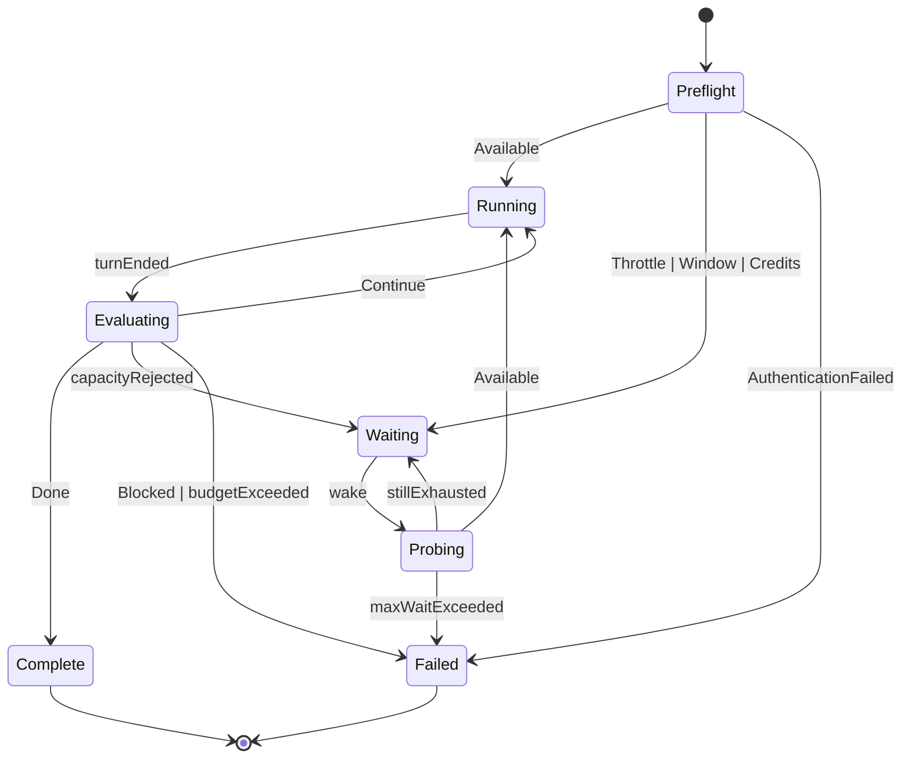

# Plan: agyloop — autonomous Google Antigravity / Gemini session runner

> **Status.** Design plan for a full fork of the **claudeloop 0.5.4** blueprint
> onto **Google Antigravity** (the `google-antigravity` Python SDK, with the
> `agy` CLI as a secondary adapter) and the **Gemini** capacity model. Nothing
> here is implemented yet; `src/agyloop/` does not exist. Shared fork rules:
> [`_shared-transplant-outline.md`](_shared-transplant-outline.md). Every
> non-obvious call below traces to a numbered finding in
> [`research-notes.md`](research-notes.md), cited inline as **F1**–**F14**.
> Build sequencing: [`../superpowers/plans/2026-08-13-agyloop-implementation.md`](../superpowers/plans/2026-08-13-agyloop-implementation.md).

## Contents

1. [Context](#1-context)
2. [Global Constraints](#2-global-constraints)
3. [Architecture](#3-architecture)
4. [The autonomous run loop](#4-the-autonomous-run-loop)
5. [Capacity: the five-state ADT](#5-capacity-the-five-state-adt)
6. [Classification: an inference module, not a field read](#6-classification-an-inference-module-not-a-field-read)
7. [Waiting, probing, and the RPD probe hazard](#7-waiting-probing-and-the-rpd-probe-hazard)
8. [Never blocking on a human](#8-never-blocking-on-a-human)
9. [Completion detection](#9-completion-detection)
10. [Transplant map](#10-transplant-map)
11. [Application ports](#11-application-ports)
12. [CLI keep / remap / drop matrix](#12-cli-keep--remap--drop-matrix)
13. [Packaging and naming](#13-packaging-and-naming)
14. [The REST surface question (M4)](#14-the-rest-surface-question-m4)
15. [Logging, security, quality gates](#15-logging-security-quality-gates)
16. [Testing strategy](#16-testing-strategy)
17. [Milestones M1–M5](#17-milestones-m1m5)
18. [Verification](#18-verification)
19. [ADRs this plan commits to](#19-adrs-this-plan-commits-to)
20. [Open risks](#20-open-risks)

---

## 1. Context

`agyloop` drives a **Google Antigravity** agent session to completion
unattended. It is a full fork of the claudeloop 0.5.4 *design* — the onion
layering, the pure state machine, the capacity ADT, the adaptive wait policy,
the operator control plane — retargeted at a vendor stack whose capacity
semantics are materially different and materially harder.

Four findings reshape the design relative to the blueprint, and each of them
either removes something claudeloop got for free or adds something claudeloop
never had:

1. **There is no typed rate-limit event (F7).** claudeloop's entire
   waitable-vs-not decision was a field comparison on a `RateLimitEvent`
   carrying `status`, `resets_at`, `rate_limit_type`, and
   `can_user_purchase_credits`. The Antigravity SDK's public error taxonomy is
   four exception classes — `AntigravityConnectionError`,
   `AntigravityCancelledError`, `AntigravityExecutionError`,
   `AntigravityValidationError` — and a quota rejection most plausibly arrives
   as an `AntigravityExecutionError` whose message embeds an HTTP `429`.
   **Classification becomes an inference problem**, which is why `domain/classify.py`
   is the highest-risk module in this codebase and gets golden fixtures,
   property tests, and a documented ambiguity default.

2. **Gemini has four independent quota dimensions, not two (F8).** RPM, TPM,
   and RPD are evaluated independently — exceeding *any* of them rejects the
   request — and spend-based limits sit on top with their own ~10-minute
   rolling window. claudeloop's two-state model would either make the runner
   wait minutes for something that clears in seconds, or wait forever for
   something that never clears. Hence a **five-member `CapacityState`**.

3. **`RESOURCE_EXHAUSTED` spans both sides of the waitable line (F9).** The
   vendor's own troubleshooting page says a `429` may mean RPM, TPM, RPD *or*
   spend. A bare `429 RESOURCE_EXHAUSTED` must therefore never be classified
   directly; it goes through a discriminator ladder that terminates in a
   *bounded* probe rather than a guess.

4. **Probing is not free here (F12).** claudeloop could probe cheaply because a
   rejected probe was not billed and the limit was a time window. Gemini's RPD
   is a *request count* — so an aggressive probe cadence can consume the very
   quota it is waiting for. The wait policy has to be quota-aware in a way
   claudeloop's never needed to be.

Two things are strictly *better* than the blueprint and the design should
exploit both: `conversation_id` is handed to us by the runtime (F6), so session
resume needs no filesystem archaeology of a vendor directory; and the harness
exposes nine lifecycle hooks (F3), so the audit log, chatter log, usage ledger,
and compaction events are all sourced from typed callbacks rather than from
scraping a text stream.

---

## 2. Global Constraints

Verbatim from [`_shared-transplant-outline.md`](_shared-transplant-outline.md);
no product plan may weaken these.

1. **Never block on a human.**
2. **Credits/billing ≠ rate-limit window** — `CreditsExhausted` has no waitable
   deadline.
3. **A capacity rejection always outranks a completion claim.**
4. **`domain/` stays pure**: stdlib only, no I/O, no async, no third-party
   imports (enforced by `import-linter`).
5. **Every commit follows Conventional Commits.**
6. **Quality gates match claudeloop**: `ruff check`, `ruff format --check`,
   `mypy --strict`, `pytest` (domain + application 100% coverage floors),
   `lint-imports`, `bandit`, `pip-audit`.
7. **No `anthropic` / `claude_agent_sdk` runtime dependencies** — claudeloop is
   cited as a historical blueprint only.

Two agyloop-specific constraints are added on top, both grounded in research:

8. **Never treat a bare `429 RESOURCE_EXHAUSTED` as classified** (F9). It must
   pass through the discriminator ladder and, failing that, land in the
   ambiguous branch with a bounded probe.
9. **Prefer SDK policies over CLI flag combinations** (F11). The CLI's
   `--dangerously-skip-permissions` demonstrably defeats `--sandbox`; agyloop
   never emits that combination.

---

## 3. Architecture

Onion, four layers, dependencies strictly inward. The point is not ceremony: it
is that every hard decision — *is this waitable? how long do we wait? is the
work done?* — becomes a pure function over value objects, which is what makes a
100% domain coverage floor honest rather than a mocking exercise.

```
src/agyloop/
├── domain/                   # pure. no I/O, no third-party imports, no async
│   ├── errors.py             # AgyloopError hierarchy
│   ├── plan.py               # WorkPlan, PlanItem (parsed from the md handoff)
│   ├── session.py            # SessionRef, SessionSelector = PlanFile | MostRecent | Explicit
│   ├── capacity.py           # CapacityState ADT (5 members), QuotaWindow, CreditState
│   ├── classify.py           # TurnSignals -> CapacityState  ← highest-risk module (F7)
│   ├── quota.py              # next_pt_midnight(), quota-id vocabulary, RetryInfo parsing (F8/F9)
│   ├── completion.py         # CompletionVerdict ADT, CompletionEvaluator
│   ├── waiting.py            # AdaptiveWaitPolicy -> next probe instant (quota-aware)
│   ├── budget.py             # Budget, BudgetLedger (turns, tokens, optional est. dollars)
│   ├── control.py            # operator control intents (stop / prompt / savepoint)
│   ├── savepoint.py          # savepoint model + selectors
│   ├── chatter.py            # narration record model
│   ├── model_policy.py       # model alias resolution + fallback ladder
│   └── loop.py               # RunLoopStateMachine: (RunState, TurnOutcome, now) -> Decision
├── application/              # ports + use cases; depends only on domain
│   ├── ports.py              # Protocols (see §11)
│   ├── dto.py                # TurnOutcome, TurnSignals bundle, ProbeResult, ApiInvocation
│   ├── runner.py             # AutonomousRunner — drives the state machine over the ports
│   └── usecases/             # RunFromPlanFile, ResumeConversation, Preflight,
│                             #   ListRuns, Doctor, InvokeApiMethod, control-plane ops
├── infrastructure/           # adapters; the only layer importing google.antigravity
│   ├── agent/
│   │   ├── gateway_sdk.py    # google.antigravity Agent + LocalAgentConfig (default)
│   │   ├── gateway_cli.py    # `agy -p` adapter (secondary, sandbox-hardened)
│   │   ├── options.py        # LocalAgentConfig / CapabilitiesConfig builder
│   │   ├── autonomy.py       # policy.allow_all() + scoping + deny-with-guidance
│   │   ├── hooks.py          # nine lifecycle hooks -> audit / chatter / usage / compaction
│   │   ├── translate.py      # exceptions + chunks -> TurnSignals / TurnOutcome
│   │   ├── catalog.py        # our own run registry (not a vendor directory)
│   │   └── probe.py          # read-only, no-conversation-id capacity probe
│   ├── api/                  # Gemini REST surface (M4) or documented deferral
│   ├── clock.py  logging.py  audit.py  state.py  lock.py  notify.py  config.py
│   ├── control.py  rundir.py  resources.py  stream_ui.py  git_savepoints.py
│   └── doctor_env.py         # auth-lane resolution, agy version check, hook assertions
├── cli/                      # Typer; hand-written core + operator ops + optional `api`
└── bootstrap.py              # composition root — the one module that knows every layer
```

The dependency rule is enforced in CI by `import-linter` (layered contract:
`cli` → `bootstrap` → `application` → `domain`, with `infrastructure`
importable only by `bootstrap`), not by convention. A supplementary
`forbidden` contract asserts that **no module anywhere imports `anthropic` or
`claude_agent_sdk`**, backed by a grep-based test so a copy-paste from the
blueprint cannot smuggle one in (Constraint 7).

**Async bridge.** The Antigravity SDK is `asyncio`-based and an async context
manager (F1); Typer is sync. One `@async_command` decorator in
`cli/asyncio.py` calls `asyncio.run()`, installs SIGINT/SIGTERM handlers that
request a graceful drain (finish the in-flight turn, persist
`conversation_id` and run state, close the `Agent`), and translates the four
`Antigravity*Error` classes into Typer exit codes. One bridge point, not one
per command.

**Two gateways, one port.** The SDK and the `agy` binary are documented as two
front doors onto the same runtime (F1), so `AgentGateway` gets two
implementations. The SDK adapter is the default and the recommended path; the
CLI adapter exists as a hedge while the SDK is in preview and for environments
that already have `agy` but not the Python package. A contract test suite runs
against both.

---

## 4. The autonomous run loop

`domain/loop.py` is a pure state machine; `application/runner.py` executes its
decisions against the ports. No I/O, no clock reads, no randomness inside the
machine — `now` is a parameter.

| State | Entered when | Decision produced |
|---|---|---|
| `Preflight` | run starts | probe capacity + assert autonomy invariants before spending a real turn |
| `Running` | capacity available | send plan text (first turn) or continuation prompt |
| `Evaluating` | a turn ended | classify signals, then evaluate completion |
| `Waiting` | capacity exhausted | compute next probe instant (quota-aware) |
| `Probing` | wake from wait | read-only throwaway turn; re-classify |
| `Complete` / `Failed` | terminal | exit 0 / non-zero |



**Evaluation order inside `Evaluating` is fixed and is the single most
important ordering rule in the product** (Constraint 3):

```
1. auth failure?            -> Failed (terminal, notify, never retry)
2. capacity rejection?      -> Waiting          ← outranks everything below
3. completion verdict Done? -> Complete
4. blocked_on set?          -> Failed (or Waiting if the block is capacity-shaped)
5. budget exhausted?        -> Failed
6. otherwise                -> Running (continuation)
```

Step 2 preceding step 3 is not stylistic. A turn that was truncated by a quota
rejection can still contain text that looks like a completion marker; reading
that as `Done` ends a run with work unfinished and no error. claudeloop learned
this the hard way and the ordering is transplanted verbatim.

---

## 5. Capacity: the five-state ADT

claudeloop's `CapacityState` had four members. agyloop needs five, because
Gemini's dimensions do not collapse (F8).

```python
# domain/capacity.py — sketch, pure stdlib
@dataclass(frozen=True) class Available:            utilization: float | None = None
@dataclass(frozen=True) class TransientThrottle:    retry_after: timedelta | None; quota_id: str | None
@dataclass(frozen=True) class WindowExhausted:      resets_at: datetime | None; quota_id: str
@dataclass(frozen=True) class CreditsExhausted:     can_purchase: bool | None; detail: str
@dataclass(frozen=True) class AuthenticationFailed: reason: str

CapacityState = Available | TransientThrottle | WindowExhausted | CreditsExhausted | AuthenticationFailed
```

The mapping from vendor signal to state:

| Vendor signal | Dimension | Time to recovery | `CapacityState` | Waitable? |
|---|---|---|---|---|
| success | — | — | `Available(utilization)` | n/a |
| `429` + `rate_limit_exceeded`, or `QuotaFailure.quotaId` naming a per-minute metric | RPM / TPM / IPM | seconds to ~1 min, continuous drain | `TransientThrottle(retry_after)` | yes — backoff + jitter |
| `429` + `quota_exceeded`, or `quotaId` naming a per-day metric | RPD | up to 24 h, **known boundary** | `WindowExhausted(next_pt_midnight(), "rpd")` | yes — to boundary, still probing |
| `429` + spend-limit language | spend (10-min rolling) | ~10 min, approximate | `WindowExhausted(now+10m, "spend_10m")` | yes — soft estimate |
| billing cap / no balance / hard exhaustion | billing | **never, without a human** | `CreditsExhausted(can_purchase)` | **no** |
| bare `429 RESOURCE_EXHAUSTED`, nothing discriminating | unknown | unknown | `WindowExhausted(None, "unknown")` | yes, **bounded** under `--max-wait` |
| `401` / `403` | auth | n/a | `AuthenticationFailed` | **no** — terminal |
| `503 UNAVAILABLE` (model overloaded) | none | seconds | `TransientThrottle` (not a quota signal) | yes |
| Provisioned-Throughput `5XX` under quota (Enterprise lane) | capacity | seconds | `TransientThrottle` | yes |

Three notes that are load-bearing:

- **`TransientThrottle` vs `WindowExhausted` is a real distinction, not a
  refinement.** Collapsing RPM into `WindowExhausted` would make the runner
  idle for minutes on something that clears in seconds; that is a throughput
  bug, not a correctness bug, but on a multi-hour unattended run it compounds
  into hours.
- **`CreditsExhausted` never carries a `resets_at`.** The type does not have
  the field. This is deliberate: the invariant is enforced by the type system
  first and by a property test second, so no future refactor can quietly
  attach a fabricated deadline to a billing wall.
- **`503` is never `CreditsExhausted`** (F9.3). Vendor guidance is explicit
  that `UNAVAILABLE` means overloaded, not out of quota, and community reports
  show people mis-handling exactly this.

---

## 6. Classification: an inference module, not a field read

`domain/classify.py` consumes a `TurnSignals` bundle assembled by the adapter
and returns a `CapacityState`. It is pure, exhaustively tested, and it is the
module most likely to be wrong, so it is written to be wrong *safely*.

**The `TurnSignals` bundle** (assembled in `infrastructure/agent/translate.py`,
never in the domain):

```python
@dataclass(frozen=True)
class TurnSignals:
    exception_type: str | None  # "AntigravityExecutionError", ...
    exception_message: str | None  # raw text, redacted before logging
    http_status: int | None  # recovered when the envelope survives
    google_status: str | None  # "RESOURCE_EXHAUSTED", "UNAUTHENTICATED", ...
    error_code: str | None  # "rate_limit_exceeded" | "quota_exceeded" | ...
    retry_info_delay: timedelta | None  # google.rpc.RetryInfo.retryDelay
    quota_violations: tuple[QuotaViolation, ...]  # google.rpc.QuotaFailure.violations
    tool_error_messages: tuple[str, ...]  # from OnToolErrorHook (F3)
    finish_reason: str | None
```

**The discriminator ladder**, in strict order. Each rung is tried only if every
rung above it produced nothing:

1. **Auth first.** `UNAUTHENTICATED` / `PERMISSION_DENIED` / `401` / `403` →
   `AuthenticationFailed`. Terminal. Never retried, because the remedy
   (`gcloud auth application-default login`) is interactive and therefore
   forbidden mid-run (F13).
2. **Structured `error_code`.** `quota_exceeded` → daily window;
   `rate_limit_exceeded` → transient throttle. This is the strongest single
   signal when present (F9).
3. **`QuotaFailure.violations[].quotaId`.** Match the quota-id vocabulary in
   `domain/quota.py` for `PerMinute` / `PerDay` / spend markers. The quota id
   is where "per minute" vs "per day" is actually spelled out.
4. **`RetryInfo.retryDelay`.** Its *presence* is itself evidence of
   transience — a service that tells you when to come back believes you should
   come back. Use the supplied delay in preference to any locally computed
   backoff.
5. **Billing / spend markers in the message.** Versioned substring patterns,
   each backed by a captured golden fixture with a provenance comment. A
   pattern that stops matching fails a test rather than silently reclassifying
   a billing wall as a waitable blip.
6. **Daily-quota markers in the message.** Same discipline.
7. **`503` / `UNAVAILABLE` / overloaded** → `TransientThrottle`.
8. **Ambiguous `429`** → `WindowExhausted(None, "unknown")`, which the wait
   policy turns into a bounded probe cadence under `--max-wait`.
9. **Anything else** → not a capacity signal; the turn failed for another
   reason and the loop handles it as a turn failure.

**Two invariants, asserted as Hypothesis property tests:**

- *No input containing a billing/spend marker can ever produce a state carrying
  a `resets_at`.* (This is Constraint 2, made mechanical.)
- *No input can produce `Available` unless the turn actually succeeded.*
  Absence of evidence is never evidence of capacity.

**String matching is a fallback and is treated as a liability.** Every pattern
lives in one table, is versioned, is fixture-backed, and is counted: a
`doctor --explain-classify` mode prints which rung classified the last
rejection, so an operator can see whether the system is running on structured
signals or on text matching.

---

## 7. Waiting, probing, and the RPD probe hazard

`domain/waiting.py::AdaptiveWaitPolicy` returns *the next instant to probe*,
never a single long sleep. Per state:

| State | Cadence | Ceiling | Notify? |
|---|---|---|---|
| `TransientThrottle(retry_after)` | `retry_after` if supplied, else exponential 1s→2s→4s→8s **with jitter** | 60 s | no |
| `WindowExhausted(resets_at="rpd")` | wake at `min(resets_at + grace, now + rpd_probe_interval)`; default interval **15 min**, backing off | `--max-wait` | on entry |
| `WindowExhausted(resets_at="spend_10m")` | wake at `min(resets_at + grace, now + 120 s)` | `--max-wait` | on entry |
| `WindowExhausted(None, "unknown")` | bounded cadence, 120 s → 600 s ceiling | `--max-wait` | on entry |
| `CreditsExhausted` | bounded cadence, 120 s → 600 s ceiling, **no deadline** | `--max-wait` | **immediately**, loudly |

Every probe result is diffed against the previous `CapacityState` and a
transition is logged explicitly — *"capacity restored at probe #7, 26m into an
RPD window; cause: `quota_exceeded` no longer present — resuming"* — so
recovery is visible in the audit log rather than inferred from the fact that
work resumed.

### The probe itself

`infrastructure/agent/probe.py` runs the cheapest possible turn (F12):

| claudeloop probe property | agyloop mechanism |
|---|---|
| `max_turns=1` | a single `chat()` on a dedicated probe `Agent` |
| no tools | `CapabilitiesConfig(enabled_tools=BuiltinTools.none())`, or `read_only()` |
| `setting_sources=None` (no CLAUDE.md) | minimal additive `system_instructions`; no plugins, no MCP servers on the probe config |
| `no-session-persistence` | **do not pass `conversation_id`** — the probe gets a throwaway conversation and never touches the working session |
| "a rejected probe is not billed" | **does not hold here** — see below |

**The hazard, and it is unique to this fork.** RPD is a *request* count, so a
rejected request may still consume daily quota. An aggressive probe cadence
could therefore consume the very quota it is waiting for. Three mitigations,
all mandatory:

1. **Quota-aware cadence.** In `WindowExhausted("rpd")`, the probe floor is 15
   minutes and backs off. The primary wake-up is the *computed midnight-PT
   boundary*; probing exists only to catch an early recovery (a tier upgrade, a
   quota grant), not to poll a 24-hour clock.
2. **`--no-probe`.** A mode that waits purely to the computed boundary and
   issues zero probe requests. Correct for anyone on a tight RPD.
3. **Probes are counted in the budget ledger** like any other request, so a
   probe storm shows up in the numbers instead of hiding in them.

### Boundary arithmetic

`domain/quota.py::next_pt_midnight(now)` is a pure function using `zoneinfo`
with `America/Los_Angeles`, and it is tested across both DST transitions plus
the ambiguous and non-existent local times they create. Getting this wrong
means a run wakes an hour early into a still-exhausted quota (harmless, costs a
probe) or an hour late (costs an hour of a multi-hour run). Both are cheap to
avoid and expensive to debug later.

**In-process retry is bounded, never the outer loop** (F9.2). The vendor's own
`google-genai` client retries transient errors ~4 times with delays up to ~60 s.
If the Antigravity harness embeds that behavior, then by the time we see an
error we have already burned that budget — and the fact that it *still* failed
is meaningful evidence that this is not a one-second blip. agyloop therefore
tunes its own retry budget down rather than compounding, and treats observed
inter-turn latency as partially vendor-owned.

---

## 8. Never blocking on a human

The hard requirement is that the run never stalls waiting for an answer.
Notifying a human is fine; *waiting* on one is not. Every stall path gets a
named mitigation:

| Stall path | Mitigation |
|---|---|
| Default shell-confirm policy | `LocalAgentConfig(policies=[policy.allow_all(), …])` — the documented autonomy switch (F2) |
| `ask_question` tool | **Denied with guidance** via a decide hook, never auto-answered (F5); optionally *also* disabled under `--strict-autonomy` |
| Interactive hook classes | `ToolConfirmationHook` / `AskQuestionHook` from `utils.interactive` are **never registered**; `doctor` asserts this positively (F3) |
| Model asks in prose ("Shall I proceed?") | No tool call, so no interception point. Handled by an additive `system_instructions` autonomy fragment, and by the evaluator treating `complete: false` with no `blocked_on` as a continuation, never a stop (F5.2) |
| stdin / TTY | Never inherit a TTY; the runner is safe under `nohup`, `systemd`, and CI |
| MCP OAuth | Cannot complete unattended. `doctor` enumerates configured MCP servers up front and fails fast with the servers named |
| ADC expiry mid-run | `AuthenticationFailed` → terminal abort + notifier. Never a retry loop, which would spin uselessly forever (F13) |
| CLI `--print-timeout` (5 min default) | The CLI adapter raises it explicitly; 5 minutes is far too short for a substantive autonomous turn (F11.1) |

**Why deny-with-guidance rather than auto-answer.** Three strategies were
considered for `ask_question` (F5.1). Auto-answering fabricates a decision the
human never made and buries it. Disabling the tool leaves the model with no
explanation, so it may fall back to asking in prose — which has *no*
interception point at all. Denying with a message lets the model understand why
it was refused and adapt, and the assumption it then states lands in the
transcript where it can be reviewed after the fact. The denial text:

> Running autonomously — no human is available to answer. Choose the option you
> would recommend, state the assumption you are making in your next message,
> and proceed. Do not call `ask_question` again for this decision.

**Autonomy is scoped, not total.** `policy.allow_all()` is paired by default
with `policy.workspace_only()` for file tools and explicit `deny` rules for
destructive command patterns. Dropping those scopes requires `--yolo`, which is
loudly audited. And `system_instructions` uses the **additive** form only —
never `CustomSystemInstructions`, which the vendor documents as a full
replacement that would silently discard the operational protocols the runtime
depends on (F5.2).

---

## 9. Completion detection

**Primary: a typed verdict.** Two independent mechanisms exist and agyloop uses
both (F4) — a response schema on the config, and
`CapabilitiesConfig.finish_tool_schema_json` driving the `finish` builtin, read
back via `response.structured_output()` / `get_last_structured_output()`.

```json
{
  "complete": true,
  "remaining_work": [],
  "blocked_on": null,
  "summary": "Implemented and tested the parser; all gates green."
}
```

`domain/completion.py` maps that to `Done` / `Continue(remaining)` /
`Blocked(reason)`, with two hard rules carried over unchanged: **`blocked_on`
outranks `complete`**, and **a capacity rejection outranks any completion
claim**.

**Fallback: the marker.** `AGYLOOP_TASK_FULLY_COMPLETE`, appended as a prompt
instruction and matched in the final message. This is **not optional** — it is
the load-bearing backstop for every turn where `structured_output()` returns
`None`, which is a documented possibility whose frequency is unverified (F4,
caveat).

**No signal at all → `Continue`.** A missing verdict is never read as
completion. The run continues until a budget, an explicit verdict, or an
operator stop ends it.

**Plan reconciliation.** When the input is an md plan, `WorkPlan` parses it into
items and `remaining_work` is tracked per item, so the log shows what is
actually left rather than one boolean. A `COMPACTION` step (F1.3) emits a
`context_compacted` event and re-anchors the reconciliation, because a
compaction mid-run is a strong hint the remaining-work list is at risk of
drifting — a signal claudeloop had no equivalent of.

---

## 10. Transplant map

Three buckets, exhaustively. "Keep" means copy and rename the package; "Replace"
means the file has a same-named counterpart with a rewritten body; "Drop" means
it does not exist in agyloop.

### Keep — copy, rename, retest

| claudeloop source | agyloop disposition |
|---|---|
| `domain/loop.py` | Unchanged logic; new `CapacityState` member in the match |
| `domain/waiting.py` | Extended with `TransientThrottle` and quota-aware RPD cadence |
| `domain/budget.py` | Token/turn budgets promoted to first class; dollars demoted (F10) |
| `domain/capacity.py` | Five members instead of four |
| `domain/control.py`, `plan.py`, `session.py`, `savepoint*.py`, `snapshot.py`, `stop_summary.py`, `chatter.py`, `model_policy.py` | Copy; rename `AutoclaudeError` → `AgyloopError` |
| `application/ports.py`, `dto.py`, `runner.py`, `usecases/*` | Keep Protocol signatures (§11); rewrite the `AgentGateway` docstring |
| `infrastructure/` minus `agent/` and `api/` | Control plane, rundir, state, lock, audit, logging, notify, clock, resources, stream_ui, git_savepoints — all vendor-agnostic |
| Operator CLI: stop / prompt / logs / status / watch / runs / savepoints / snapshot / unwind / reset / attach | Rebrand only |
| Domain + application test suites and port fakes | Port directly; retarget classify fixtures |
| CI workflows, pre-commit, `import-linter` contracts, CODEOWNERS | Rename package paths; add the no-Anthropic forbidden contract |

### Replace — same role, rewritten body

| claudeloop source | agyloop replacement | Why |
|---|---|---|
| `domain/classify.py` | Inference ladder over `TurnSignals` | No typed rate-limit event (F7) |
| `domain/completion.py` | Same ADT, new plumbing | `output_format` → `finish_tool_schema_json` (F4) |
| `domain/model_profile.py` | Gemini model pins + aliases | Different model family |
| `domain/permission.py` | Antigravity policy vocabulary | `allow` / `deny` / `ask_user` / `enforce` (F2) |
| — (new) | `domain/quota.py` | Midnight-PT boundary, quota-id vocabulary (F8) |
| `infrastructure/agent/gateway.py` | `gateway_sdk.py` + `gateway_cli.py` | Two front doors, one port (F1) |
| `infrastructure/agent/options.py` | `LocalAgentConfig` / `CapabilitiesConfig` builder | Different config object |
| `infrastructure/agent/autonomy.py` | `policy.allow_all()` + scoping + deny-with-guidance | (F2, F5) |
| `infrastructure/agent/hooks.py` | Nine Antigravity lifecycle hooks | (F3) |
| `infrastructure/agent/translate.py` | Exception + chunk translation into `TurnSignals` | Errors surface at drain time (F1.1) |
| `infrastructure/agent/catalog.py` | Our own run registry | We cannot enumerate conversations we did not create (F6) |
| `infrastructure/agent/probe.py` | Read-only, no-`conversation_id` probe | Probe hazard (F12) |
| `infrastructure/api/*` | Gemini REST or documented deferral | (F14, §14) |
| `infrastructure/doctor_env.py` | Auth-lane resolution + `agy` version check + hook assertions | (F11, F13) |
| Packaging: `pyproject.toml`, entry point, env prefix, state dir | Full rename (§13) | — |

### Drop — no counterpart

| Dropped | Reason |
|---|---|
| `anthropic` and `claude-agent-sdk` dependencies | Constraint 7 |
| Everything reading `~/.claude/**` | Wrong vendor; and we own our registry anyway |
| `list_sessions()` / `get_session_info()` vendor session discovery | No equivalent API; `agyloop sessions` scopes to our own runs (F6) |
| The generated Anthropic `api` sub-app (131 endpoints) | Replaced or deferred per §14 |
| `CLAUDE_CODE_RETRY_WATCHDOG` / `CLAUDE_CODE_MAX_RETRIES` handling | Vendor-specific env; replaced by bounded retry tuning (F9.2) |
| `RateLimitEvent` field-comparison classifier | No such event exists (F7) |
| Dollar-denominated budgets as a first-class control | No cost field in `UsageMetadata` (F10) |

---

## 11. Application ports

Preserved verbatim in signature from `claudeloop.application.ports`, so the
runner and every use case port across unchanged:

`Clock`, `Sleeper`, `AgentGateway` (`send_turn`, `close`, `set_profile`,
`set_permission_mode`, `set_cwd`, `set_session_resources`,
`resolve_tool_approval`), `RunResources`, `CapacityProbe`, `SessionCatalog`,
`ProgressReporter`, `AuditLog`, `Notifier`, `Logger`, `RunStateStore`,
`SessionLock`, `ApiGateway`, `RunControl`, `RunEventSink`, `StreamUi`,
`SavePointStore`, `StateBus`, `RunSnapshotSink`.

Two semantic notes:

- `AgentGateway.set_permission_mode` keeps its name but its argument becomes an
  agyloop-side enum (`autonomous` | `scoped` | `safe` | `yolo`) that the
  adapter compiles into a policy list. The port must not leak
  `google.antigravity` types.
- `SessionCatalog` is narrowed: it enumerates **our** run registry, not vendor
  conversations. This is a deliberate scope reduction from claudeloop and is
  documented as such in the CLI help, so nobody expects to see conversations
  created by the Antigravity IDE.

---

## 12. CLI keep / remap / drop matrix

| Command | Disposition | Notes |
|---|---|---|
| `agyloop run <plan.md>` | **Remap** | Antigravity SDK gateway; `--model`, `--max-turns`, `--max-wait`, `--max-tokens`, `--no-probe`, `--strict-autonomy`, `--safe`, `--yolo` |
| `agyloop resume [--conversation ID \| --last]` | **Remap** | `LocalAgentConfig(conversation_id=…)`; degrades to a fresh conversation seeded with persisted plan state if resumption fails (F6) |
| `agyloop sessions` | **Remap, narrowed** | Lists our run registry only; help text states the limitation |
| `agyloop doctor` | **Remap, expanded** | Resolves auth lane + source; asserts no interactive hooks; checks `agy` version against the #36 advisory; enumerates MCP servers; prints the "we cannot read your live quota — check AI Studio" pointer (F9.3, F11, F13) |
| `agyloop status` / `watch` / `logs` | **Keep** | Control-plane readers, vendor-agnostic |
| `agyloop stop` / `prompt` | **Keep** | Operator mid-run control |
| `agyloop runs` / `attach` / `reset` | **Keep** | Run registry ops |
| `agyloop savepoints` / `snapshot` / `unwind` | **Keep** | Git-savepoint ops |
| `agyloop model` / `preset` | **Remap** | Gemini aliases and fallback ladder instead of Claude model ids |
| `agyloop config` | **Keep** | Reads `agyloop.toml`, `AGYLOOP_*` |
| `agyloop api …` | **Conditional (M4)** | Generated Gemini surface if the stability criterion is met; otherwise the command does not ship and an ADR records why (§14) |
| Anthropic-only subcommands (`api messages`, `api beta.*`, provider flags for Bedrock/Vertex/Foundry) | **Drop** | Wrong vendor |
| `--retry-watchdog` | **Drop** | `CLAUDE_CODE_*` env has no analogue; replaced by `--max-retries` |
| `--max-budget-usd` | **Remap, demoted** | Exists only alongside `--price-per-mtok-in/out`; documented as an estimate (F10) |
| — (new) `--add-dir` | **Add** | Workspace scoping; mirrors both the SDK's `workspace_only()` and the CLI's `--add-dir` |
| — (new) `--gateway sdk\|cli` | **Add** | Selects the adapter; defaults to `sdk` |
| — (new) `--no-probe` | **Add** | Boundary-only waiting, zero probe requests (F12) |
| — (new) `--ramp N` | **Add** | Paces the first N turns; mitigates Enterprise-lane acceleration limits (F9.2) |

---

## 13. Packaging and naming

| Item | Value |
|---|---|
| PyPI / CLI | `agyloop` |
| Import package | `agyloop` |
| Env prefix | `AGYLOOP_*` |
| State dir | `.agyloop/` (per-repo), runs under `.agyloop/runs/<run_id>/` |
| Config file | `agyloop.toml` |
| Done marker | `AGYLOOP_TASK_FULLY_COMPLETE` |
| Auth | `GOOGLE_API_KEY` (Developer API lane) **or** ADC (`gcloud auth application-default login`); Enterprise lane via `GOOGLE_GENAI_USE_VERTEXAI` / `GOOGLE_CLOUD_PROJECT` / `GOOGLE_CLOUD_LOCATION` (F13) |
| Primary dependency | `google-antigravity` |
| Optional dependency | `agy` CLI on `PATH` (only for `--gateway cli`) |
| Forbidden dependencies | `anthropic`, `claude-agent-sdk` — enforced by contract + grep test |
| Python | 3.11+ (`zoneinfo` in stdlib, PEP 604 unions, `Self`) |

**Run-state durability.** `conversation_id` becomes non-`None` only after the
first successful turn (F6), which leaves a crash window. Mitigation:
`.agyloop/runs/<run_id>/meta.json` is written from a **post-turn inspect hook,
before any other post-turn work**, and `fsync`ed. A per-session advisory file
lock prevents two runners from driving one conversation concurrently.

---

## 14. The REST surface question (M4)

claudeloop's M4 generated a 1:1 CLI over all 131 Anthropic REST endpoints by
introspecting the SDK's `cached_property` resource tree, guarded by a drift
gate. Three candidate substrates exist here (F14):

| Option | Substrate | Pros | Cons |
|---|---|---|---|
| **A. Discovery document** | `…/$discovery/rest?version=v1beta` | Canonical, machine-readable, fetchable without a key, the vendor's own source of truth | Discovery format, not OpenAPI — needs its own binder |
| **B. Published OpenAPI 3.0** | `…/$discovery/OPENAPI3_0?version=v1beta` | Standard format, rich tooling | Derived and added later; needs a drift check against A |
| **C. `google-genai` SDK introspection** | `client.models`, `.files`, `.caches`, `.batches`, `.tunings`, `.aio.*` | Mirrors claudeloop's exact technique; typed; handles auth and paging | Second SDK dependency; narrower than the raw API |

**Decision: A with B as a cross-check, gated on a stability criterion.** M4
ships the generated surface only if, at M4 planning time, (1) the discovery
document's endpoint inventory has been stable across two consecutive minor
Gemini API releases, **and** (2) the Antigravity SDK has left preview.
Otherwise M4 becomes "documented deferral ADR + mid-run ops polish" and the
`api` command does not ship. Shipping a generated surface that is wrong within
a month is worse than not shipping one.

Either way the deliverable that makes "no gaps" real is the same as
claudeloop's: **a drift gate test** that enumerates the upstream surface,
asserts every operation has a registered command, and asserts the discovered
count against a committed baseline so *removals* are caught too.

One structural difference from claudeloop: the surface spans **two API
families** (Gemini Developer API and the Enterprise/Vertex lane) with partially
disjoint operations. The binder must model that split the way claudeloop's
`--provider` modeled Bedrock/Vertex/Foundry's partial trees — reflecting the
actual surface of the selected lane rather than offering commands that will
fail at call time.

---

## 15. Logging, security, quality gates

**Logging.** `structlog`, JSON renderer to file and a human renderer to console.
Every record carries `run_id`, `attempt_no`, `conversation_id`, `event_type`,
and — new for this fork — `quota_id` and `auth_lane`. The full event stream is
preserved to a per-run JSONL audit file sourced from **inspect hooks** (F3),
not from parsing text. `-v/-vv`, `--log-level`, `--log-file`.

**Security.**

- **Redaction covers more surface than claudeloop's.** In addition to
  `api_key` / `authorization` / `access_token` / `refresh_token` /
  `client_secret`, the processor scrubs `GOOGLE_API_KEY`, bearer tokens minted
  from ADC, and anything read out of `application_default_credentials.json`
  (F13). A unit test feeds a synthetic credential of each shape through the
  pipeline and asserts it does not appear in the output.
- **The CLI sandbox-bypass footgun is an explicit control** (F11). agyloop
  never passes `--dangerously-skip-permissions` by default. The CLI adapter
  runs `--sandbox` with `toolPermission = "proceed-in-sandbox"` and
  `permissions.deny = ["unsandboxed"]` — "allow everything except evading the
  sandbox." The dangerous flag is reachable only via an explicit
  `--unsafe-skip-permissions` opt-in that (a) **refuses to combine with
  `--sandbox`** rather than silently neutering it, (b) refuses to run as root,
  (c) refuses outside a git repository or allowlisted directory, and (d) emits
  a `WARNING`-level audit record naming the risk and citing upstream issue #36.
- **Autonomy is scoped by default** even on the SDK path: `allow_all()` paired
  with `workspace_only()` and destructive-command denies; `--yolo` required to
  drop them.
- **Budget guardrails are a safety control, not a nicety**, for an unattended
  multi-hour loop: `--max-turns`, `--max-tokens`, `--max-wait`,
  `--max-attempts`, and optional estimated dollars.
- **No `shell=True` anywhere.** The CLI adapter builds argv lists. Plan-file
  and log paths are resolved and confined.
- **Project id, not API key, is the cardinality for cached capacity state**
  (F13) — limits are per project, so rotating a key does not grant fresh quota
  and the UI must not imply it does.

**Quality gates** (pre-commit + GitHub Actions), matching claudeloop exactly:
`ruff check`, `ruff format --check`, `mypy --strict`, `pytest` with
`--cov-fail-under` set per package (100% domain and application, high floor for
infrastructure), `lint-imports` for the onion contract *and* the no-Anthropic
forbidden contract, the API drift test (if §14 ships), `bandit`, `pip-audit`.

---

## 16. Testing strategy

- **Domain — pure unit plus property tests.** Hypothesis properties for
  `AdaptiveWaitPolicy` (never returns a past instant, never exceeds
  `--max-wait`, always converges) and for `classify` (a billing marker never
  yields a state carrying a `resets_at`; absence of evidence never yields
  `Available`). `next_pt_midnight()` is tested across both DST transitions.
- **Golden fixtures for the classifier.** `tests/fixtures/errors/` holds a
  captured example of every shape we match: RPM rejection, TPM rejection, RPD
  rejection, spend-limit rejection, billing-cap rejection, bare
  `RESOURCE_EXHAUSTED`, `503 UNAVAILABLE`, and an auth failure — each with a
  provenance comment naming where it came from and when. Fixtures we have not
  yet captured live are marked `xfail(strict=False)` with the open question
  they depend on, so the gap is visible rather than assumed away.
- **Application — fakes for every port.** `FakeAgentGateway` replays scripted
  signal sequences; `FakeClock` / `FakeSleeper` make a simulated 24-hour RPD
  wait run in microseconds with zero real sleeping. The credit-top-up path is
  tested by scripting a probe sequence that returns `CreditsExhausted` five
  times then `Available`, asserting the runner resumes on probe six.
- **Never-block tests.** A scripted turn that calls `ask_question` must produce
  a denial with guidance and a continuation — never a hang. A second test
  asserts that `ToolConfirmationHook` and `AskQuestionHook` are absent from the
  registered hook set, and that `doctor` fails when they are injected.
- **Contract tests across both gateways.** The same suite runs against
  `gateway_sdk` and `gateway_cli` fakes, so the two adapters cannot drift in
  observable behavior.
- **Sandbox negative control.** A test asserts the CLI argv builder never emits
  `--dangerously-skip-permissions` together with `--sandbox`, and that
  `--unsafe-skip-permissions` refuses under root / outside a git repo.
- **CLI** — Typer's `CliRunner` for every command.
- `# pragma: no cover` is reserved for genuinely unreachable branches (signal
  handlers, `TYPE_CHECKING`) and each use carries a stated reason.

---

## 17. Milestones M1–M5

Each milestone leaves the tree working and green.

| Milestone | Deliverable | Exit criteria |
|---|---|---|
| **M1 — pure core** | Package skeleton, `pyproject.toml`, full `domain/` (capacity, classify, quota, waiting, budget, completion, loop), `application/ports.py`, unit + property suites, CI with all gates | `domain/` imports with **no vendor SDK installed**; 100% coverage on domain and application; `lint-imports` green including the no-Anthropic contract |
| **M2 — gateway parity** | SDK gateway, options builder, autonomy policies, hooks, translate, run registry, `run` / `resume` / `sessions` / `doctor`. **Includes the live spike** (§20) that answers the open questions the classifier depends on | A real plan runs to completion unattended against a live account; captured fixtures land in `tests/fixtures/errors/` |
| **M3 — resilient waiting** | Capacity probe, quota-aware `AdaptiveWaitPolicy`, `--no-probe`, credit/billing notifier, resumable run state, `--ramp` | Simulated RPD and billing waits pass with a fake clock; a live RPM wall is survived and logged with the correct classification |
| **M4 — REST or deferral** | Generated Gemini surface + drift gate **if** the stability criterion holds; otherwise the deferral ADR. Either way: mid-run operator ops polish (stop / prompt / savepoints / snapshot) | Drift gate fails CI when an operation is hidden — or the ADR is merged with the criterion restated |
| **M5 — polish** | Docs site, security review, packaging verification, system harness | `pipx install .` resolves `agyloop --help` on macOS and Linux; security review signed off; `mkdocs build --strict` clean |

The CLI adapter (`--gateway cli`) is scheduled opportunistically in M3–M4; it
is a hedge, not a milestone gate.

---

## 18. Verification

- **Unit and property suites** — `pytest --cov`, all gates green, including the
  simulated multi-day wait with no wall-clock sleep.
- **Structured completion path** — a run whose final turn emits a schema-shaped
  verdict exits 0 with the verdict in the audit log; a run whose final turn
  emits only the marker also exits 0; a run with neither continues.
- **Ordering invariant** — a scripted turn that *both* claims completion and
  carries a quota rejection must be classified as a rejection and must wait.
  This is Constraint 3, and it gets its own named test.
- **RPD boundary** — `next_pt_midnight()` returns the correct instant on both
  sides of both DST transitions, verified against hand-computed UTC instants.
- **Classifier ladder** — every golden fixture maps to its expected
  `CapacityState`, and `doctor --explain-classify` reports the rung that fired.
- **Never-block, live** — run a plan that explicitly instructs the model to ask
  a clarifying question; confirm the runner denies with guidance and continues
  instead of hanging.
- **Sandbox negative control, live** — with the CLI adapter, attempt an
  out-of-workspace write and confirm it is blocked; confirm it succeeds only
  under the explicit unsafe opt-in.
- **Onion contract** — add an import from `domain` to `infrastructure` and
  confirm `import-linter` rejects it. Add `import anthropic` anywhere and
  confirm the forbidden contract and the grep test both fail.
- **Drift gate** (if M4 ships the surface) — deliberately hide one operation
  from discovery and confirm CI fails; that proves "no gaps" is enforced rather
  than asserted.
- **Install check** — `pipx install .` on macOS and Linux, confirm the
  `agyloop` entry point resolves and `--help` renders.

---

## 19. ADRs this plan commits to

| # | Decision | Driven by | Risk if wrong |
|---|---|---|---|
| 0001 | Onion architecture enforced by `import-linter` | claudeloop blueprint | Low — proven |
| 0002 | `google-antigravity` SDK is the primary gateway; the `agy` CLI is a secondary adapter behind the same port | F1 | Medium — SDK is in preview |
| 0003 | **Five-member `CapacityState`; `CreditsExhausted` structurally cannot carry a reset** | F7, F8 | **Critical** — the whole product |
| 0004 | Quota-aware probe cadence; probes counted in the ledger; `--no-probe` exists | F12 | High — a naive cadence consumes the quota it waits for |
| 0005 | Bounded in-process retry with jitter; the outer loop still sees hard limits | F9.2 | Medium — double backoff if the harness also retries |
| 0006 | Gemini REST surface gated on a stability criterion, else deferred by ADR | F14 | Low — deferral is a valid outcome |
| 0007 | `ask_question` is **denied with guidance**, never auto-answered | F5 | Medium — a fabricated decision is invisible and unreviewable |
| 0008 | Never combine `--dangerously-skip-permissions` with `--sandbox`; prefer `proceed-in-sandbox` + `deny: unsandboxed` | F11 | **High** — a real, reproduced sandbox escape |
| 0009 | Budgets are token/turn-denominated; dollars require an explicit price table and are labeled estimates | F10 | Low — but silently wrong dollars erode trust |
| 0010 | `conversation_id` persisted from a post-turn inspect hook with `fsync`; resume degrades to a fresh conversation seeded with plan state | F6 | Medium — a crash window exists either way |
| 0011 | Auth lane is resolved and reported by `doctor`, never guessed; auth failure is terminal | F13 | Medium — the two lanes have different quota semantics |
| 0012 | Classifier string patterns are versioned, fixture-backed, and counted; ambiguity defaults to a bounded probe | F7, F9 | **High** — this is where a billing wall gets misread as a blip |

---

## 20. Open risks

Each risk names the finding it comes from, what it would break, and what the M2
live spike must measure to close it.

| Risk | Breaks | Spike measurement |
|---|---|---|
| **The `429` envelope does not survive to the SDK caller** (F7, F9.1) | The entire structured half of the classifier ladder; we fall back to text matching immediately | Force an RPM wall on a free-tier account; record exception type, full message, and whether any `details` survive |
| **The harness retries internally before raising** (F7) | Our retry tuning; a wrong answer means compounded backoff and misleading latency | Time the wall-clock gap between the rejected request and the raised exception |
| **Rejected requests count against RPD** (F12) | Probe cadence design; an aggressive probe eats the quota it waits for | Compare AI Studio's request count before and after a batch of rejected probes |
| **RPD and RPM rejections are textually identical** (F9) | The daily-vs-transient split; we would have to infer from timing, a much weaker signal needing its own domain rule | Capture both rejections and diff the messages |
| **Spend-limit rejections look like RPD rejections** (F8, F9) | The `CreditsExhausted` discriminator — the single most important classification in the product | Drive a Tier-1 account into its 10-minute spend cap and capture the body |
| **`structured_output()` is frequently `None`** (F4) | How much weight the marker fallback carries; possibly promotes the marker to primary | Run 20 schema'd turns and measure conformance |
| **`conversation_id` is not durable** across restarts, upgrades, or multi-hour gaps (F6) | `resume`; the fallback is a fresh conversation seeded with plan state | Resume after 1 min, 1 hour, and 12 hours; resume across an SDK upgrade |
| **`policy.allow_all()` auto-approves a sandbox-bypass equivalent on the SDK path** (F11) | The claim that the SDK path is safer. **Treat as unsafe until proven otherwise.** | Reproduce the #36 scenario through the SDK adapter |
| **Antigravity SDK preview churn** | Everything in `infrastructure/agent/` | Pin a minimum version; `doctor` asserts it; keep all vendor types behind the port |
| **`RetryInfo` / `QuotaFailure` present on one lane but not the other** (F9, F13) | Enterprise-lane classification quality | Run the same forced rejection on both lanes |
| **Enterprise-lane acceleration limits** reject inside quota (F9.2) | First-turn reliability on a cold run | Measure whether `--ramp` changes the rejection rate on a fresh project |

**Until these are measured, the implementation assumes the pessimistic branch of
each.** That is why the wait policy is a bounded, quota-aware probe loop rather
than a scheduled wake-up: the schedule is an optimisation applied when a
boundary happens to be knowable, not a precondition for correctness.
