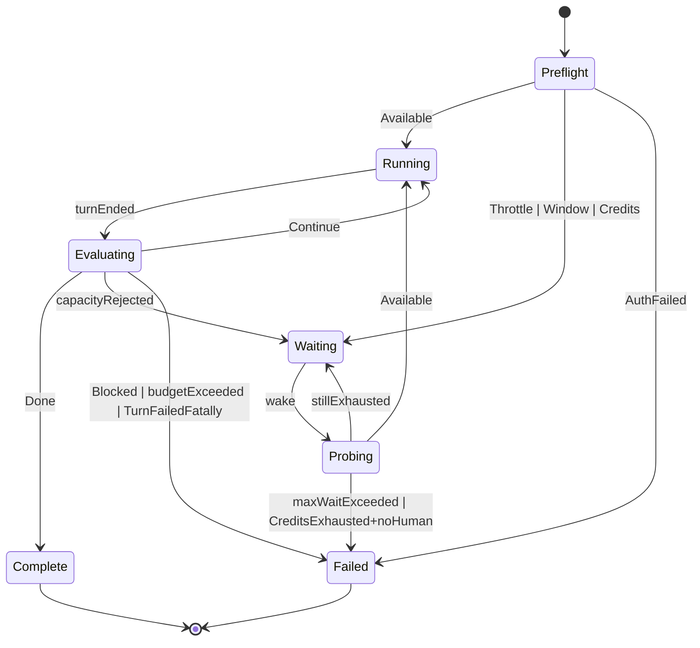

# Plan: codexloop — autonomous Codex / GPT session runner + full OpenAI SDK CLI

> **Status.** Design plan for a full fork of the **claudeloop 0.5.4** blueprint
> onto **OpenAI Codex** (`codex exec --json` as the primary transport, the
> app-server JSON-RPC surface as an optional second adapter) plus a **generated
> OpenAI REST CLI** in M4. Nothing here is implemented; `src/codexloop/` does
> not exist. Shared fork rules:
> [`_shared-transplant-outline.md`](_shared-transplant-outline.md). **Every
> non-obvious call below cites a numbered finding in
> [`research-notes.md`](research-notes.md) as R1–R12**, and the confidence
> grading (A documented / B corroborated / C single-source) carries over from
> there. Build sequencing:
> [`../superpowers/plans/2026-08-13-codexloop-implementation.md`](../superpowers/plans/2026-08-13-codexloop-implementation.md).

## Contents

1. [Context](#1-context)
2. [Global Constraints](#2-global-constraints)
3. [Architecture](#3-architecture)
4. [The autonomous run loop](#4-the-autonomous-run-loop)
5. [Capacity: the ADT and the classification table](#5-capacity-the-adt-and-the-classification-table)
6. [Classification order and the unrecognised-429 default](#6-classification-order-and-the-unrecognised-429-default)
7. [Waiting and the layered capacity probe](#7-waiting-and-the-layered-capacity-probe)
8. [Never blocking on a human](#8-never-blocking-on-a-human)
9. [Completion detection](#9-completion-detection)
10. [Session continuity and the argv builder](#10-session-continuity-and-the-argv-builder)
11. [Transplant map](#11-transplant-map)
12. [Application ports](#12-application-ports)
13. [CLI keep / remap / drop matrix](#13-cli-keep--remap--drop-matrix)
14. [Packaging and naming](#14-packaging-and-naming)
15. [M4 — the generated OpenAI REST surface (locked in)](#15-m4--the-generated-openai-rest-surface-locked-in)
16. [Logging, security, quality gates](#16-logging-security-quality-gates)
17. [Testing strategy](#17-testing-strategy)
18. [Milestones M1–M5](#18-milestones-m1m5)
19. [Verification](#19-verification)
20. [ADRs this plan commits to](#20-adrs-this-plan-commits-to)
21. [Open risks](#21-open-risks)

---

## 1. Context

`codexloop` drives a Codex session to completion unattended. It is a full fork
of the claudeloop 0.5.4 *design* — onion layering, a pure state machine, the
capacity ADT, the adaptive wait policy, the operator control plane, and a
generated vendor REST surface with a drift gate — retargeted at the OpenAI
stack.

Five research findings reshape the design relative to the blueprint:

1. **HTTP 429 is two different failures sharing one status code (R1,
   confidence A).** OpenAI documents `rate_limit_exceeded` (transient,
   waitable, sometimes carrying `Retry-After`) and `insufficient_quota` /
   `credit_balance_exhausted` (billing, *not* waitable, no reset exists) as
   distinct `error.code` values behind the same status. The rate-limits guide
   says it outright: "Don't retry quota, billing, or other errors that require
   you to take action." This is the same shape as the `credits_required`
   finding that reshaped claudeloop, and it is the reason this product exists.

2. **There is no Python Codex SDK (R9, confidence A).** The official SDK is
   `@openai/codex-sdk`, TypeScript — and it is itself a wrapper that shells out
   to the `codex` binary, passing the key as `CODEX_API_KEY`. So driving
   `codex exec --json` as a subprocess is not a workaround; it is *the same
   integration the official SDK performs*, minus a Node runtime. This inverts
   claudeloop's ADR-0002 ("Agent SDK over subprocess") for a well-understood
   reason, and the inversion earns its own ADR rather than being a silent
   divergence.

3. **The richest capacity signal is exactly the one we cannot count on (R3,
   confidence B/C).** Codex parses `x-codex-*` headers into a `RateLimitSnapshot`
   with a 5-hour `primary` and a weekly `secondary` window — but under
   `codex exec` the payload is reportedly always `null`, because the API does
   not return those headers for non-interactive requests. The design therefore
   models the snapshot as *opportunistic enrichment*, never a requirement, and
   builds a layered probe with a guaranteed floor (R6).

4. **Never-blocking and sandboxing are orthogonal here (R8, confidence A).**
   `approval_policy = never` disables all approval prompts and works with *all*
   sandbox modes. That is strictly better than claudeloop's position, where
   autonomy required `bypassPermissions` wholesale. codexloop's default is
   `approval_policy=never` **plus** `sandbox_mode=workspace-write` — fully
   autonomous *and* confined.

5. **The REST parity milestone transplants almost unchanged (R11, confidence
   A).** claudeloop's introspection technique walks a *class* tree of
   `cached_property` descriptors, which is generic Python reflection, not
   anything Anthropic-specific. Pointing it at `openai.resources` works the same
   way, needs no credentials at import time, and supports the same drift gate.
   **M4 is locked in, not conditional.**

One deliberate hazard is recorded up front: the Codex CLI moves fast. Flags are
added, deprecated, and removed within months — `--full-auto` was deprecated and
then removed (R8, confidence C on exact versions, A on the deprecation itself).
Version drift is therefore treated as a first-class design constraint, not an
operational annoyance: one argv builder, a pinned minimum version, a `doctor`
check that runs the real binary, and `codex --version` recorded into every
audit log.

---

## 2. Global Constraints

Verbatim from [`_shared-transplant-outline.md`](_shared-transplant-outline.md);
no product plan may weaken these.

1. **Never block on a human.**
2. **Credits/billing ≠ rate-limit window** — `CreditsExhausted` has no waitable
   deadline.
3. **A capacity rejection always outranks a completion claim.**
4. **`domain/` stays pure**: stdlib only, no I/O, no async, no third-party
   imports (enforced by `import-linter`).
5. **Every commit follows Conventional Commits.**
6. **Quality gates match claudeloop**: `ruff check`, `ruff format --check`,
   `mypy --strict`, `pytest` (domain + application 100% coverage floors),
   `lint-imports`, `bandit`, `pip-audit`.
7. **No `anthropic` / `claude_agent_sdk` runtime dependencies** — claudeloop is
   cited as a historical blueprint only.

Three codexloop-specific constraints on top, each grounded in research:

8. **Never treat all HTTP 429s as waitable** (R1). Branch on the parsed
   `error.code` / `error.type` first; HTTP status is a fallback only.
9. **A capacity decision never depends on a confidence-C signal alone** (R6).
   Every classification path must terminate in a defensible answer even if
   every optional telemetry source returns nothing.
10. **All policy is expressed via `-c key=value`, on both `exec` and `resume`**
    (R5). Never a bare `--sandbox` flag, never `--full-auto`.

---

## 3. Architecture

Onion, four layers, dependencies strictly inward. The point is not ceremony: it
is that every hard decision — *is this waitable? how long do we wait? is the
work done?* — becomes a pure function over value objects, which is what makes a
100% domain coverage floor honest rather than a mocking exercise.

```
src/codexloop/
├── domain/                   # pure. no I/O, no third-party imports, no async
│   ├── errors.py             # CodexloopError hierarchy
│   ├── plan.py               # WorkPlan, PlanItem (parsed from the md handoff)
│   ├── session.py            # SessionRef (thread_id), SessionSelector
│   ├── capacity.py           # CapacityState ADT, RateLimitWindow, CreditState
│   ├── classify.py           # TurnSignals -> CapacityState  (R1 table, in code)
│   ├── windows.py            # primary/secondary window model, resets_at normalisation (R3)
│   ├── completion.py         # CompletionVerdict ADT, CompletionEvaluator
│   ├── waiting.py            # AdaptiveWaitPolicy -> next probe instant
│   ├── budget.py             # Budget, BudgetLedger (turns, tokens, dollars, wall clock)
│   ├── control.py            # operator control intents (stop / prompt / savepoint)
│   ├── savepoint.py  chatter.py  snapshot.py  stop_summary.py
│   ├── model_policy.py       # GPT/Codex alias resolution + fallback ladder
│   └── loop.py               # RunLoopStateMachine: (RunState, TurnOutcome, now) -> Decision
├── application/              # ports + use cases; depends only on domain
│   ├── ports.py              # Protocols (see §12)
│   ├── dto.py                # TurnOutcome, TurnSignals, ProbeResult, ApiInvocation
│   ├── runner.py             # AutonomousRunner — drives the state machine over the ports
│   └── usecases/             # RunFromPlanFile, ResumeThread, Preflight, ListRuns,
│                             #   Doctor, InvokeApiMethod, control-plane ops
├── infrastructure/           # adapters; the only layer importing `openai` or spawning `codex`
│   ├── agent/
│   │   ├── gateway_exec.py   # `codex exec --json` subprocess transport (default, M2)
│   │   ├── gateway_appsrv.py # `codex app-server` JSON-RPC transport (optional, M5)
│   │   ├── argv.py           # THE argv builder — one module, table-driven tests (R5, R8)
│   │   ├── translate.py      # JSONL events + stderr + exit code -> TurnSignals / TurnOutcome
│   │   ├── autonomy.py       # approval_policy / sandbox_mode / add-dir policy compilation
│   │   ├── catalog.py        # our own run registry, keyed by thread_id
│   │   ├── probe.py          # layered capacity probe: exec floor + app-server + rollout tail
│   │   └── rollout.py        # best-effort rollout-tail telemetry (confidence C, R5)
│   ├── api/                  # introspect, binder, gateway, providers (M4, R11)
│   ├── clock.py  logging.py  audit.py  state.py  lock.py  notify.py  config.py
│   ├── control.py  rundir.py  resources.py  stream_ui.py  git_savepoints.py
│   └── doctor_env.py         # auth mode, `codex --version`, flag presence, login status
├── cli/                      # Typer; hand-written core + operator ops + generated `api`
└── bootstrap.py              # composition root — the one module that knows every layer
```

Enforced in CI by `import-linter` (layered contract: `cli` → `bootstrap` →
`application` → `domain`, `infrastructure` importable only by `bootstrap`), plus
a **forbidden contract** asserting no module anywhere imports `anthropic` or
`claude_agent_sdk`, backed by a grep-based test so a copy-paste from the
blueprint cannot smuggle one in (Constraint 7).

**Async bridge.** Subprocess streaming and the app-server transport are both
async; Typer is sync. One `@async_command` decorator in `cli/asyncio.py` calls
`anyio.run()`, installs SIGINT/SIGTERM handlers that request a graceful drain
(finish the in-flight turn, persist `thread_id` and run state, terminate the
child cleanly), and maps failure classes to Typer exit codes. One bridge point,
not one per command.

**Two transports, one port.** `AgentGateway` has an exec implementation (M2
default, documented and stable) and an app-server implementation (M5, gated by
a capability probe, never required). R10 notes the app-server offers
`turn/interrupt` and `turn/steer` — a *real* mid-turn stop and a genuine
"inject a prompt into a running turn," both strictly better than what a
subprocess transport can do — which is why the second adapter is worth building
even though the first is sufficient. A contract suite runs against both.

---

## 4. The autonomous run loop

`domain/loop.py` is a pure state machine; `application/runner.py` executes its
decisions against the ports. No I/O, no clock reads, no randomness inside the
machine — `now` is a parameter.

| State | Entered when | Decision produced |
|---|---|---|
| `Preflight` | run starts | probe capacity + assert autonomy/flag invariants before spending a real turn |
| `Running` | capacity available | send plan text (first turn) or continuation prompt |
| `Evaluating` | a turn ended | classify signals, then evaluate completion |
| `Waiting` | capacity exhausted | compute next probe instant |
| `Probing` | wake from wait | layered probe; re-classify |
| `Complete` / `Failed` | terminal | exit 0 / non-zero |



**Evaluation order inside `Evaluating` is fixed** (Constraint 3):

```
1. auth failure?            -> Failed (terminal, notify, never retry)   (R7)
2. capacity rejection?      -> Waiting          ← outranks everything below  (R1, R12)
3. completion verdict Done? -> Complete                                  (R12)
4. blocked_on set?          -> Failed
5. budget exhausted?        -> Failed
6. context_length_exceeded? -> Failed (prompt/compaction problem, not capacity)  (R1)
7. otherwise                -> Running (continuation)
```

Step 2 preceding step 3 is not stylistic. A turn truncated by a capacity
rejection can still contain text resembling a completion marker; reading that as
`Done` ends the run with work unfinished and no error. R12 records the rule
verbatim from claudeloop because it was learned the hard way.

---

## 5. Capacity: the ADT and the classification table

```python
# domain/capacity.py — sketch, pure stdlib
@dataclass(frozen=True) class Available:              snapshot: WindowSnapshot | None = None
@dataclass(frozen=True) class ThrottleExhausted:      retry_after: timedelta | None; aggressive: bool = False
@dataclass(frozen=True) class WindowExhausted:        resets_at: datetime | None; window: str  # "five_hour"|"weekly"|"unknown"
@dataclass(frozen=True) class CreditsExhausted:       reason: str  # insufficient_quota | credit_balance | plan_gap
@dataclass(frozen=True) class AuthenticationFailed:   reason: str
@dataclass(frozen=True) class TransientBackendError:  retry_after: timedelta | None

CapacityState = (Available | ThrottleExhausted | WindowExhausted
                 | CreditsExhausted | AuthenticationFailed | TransientBackendError)
```

The classification table, transplanted directly from **R1** into code:

| `error.code` / `error.type` | HTTP | `CapacityState` | Waitable? | Reset source |
|---|---|---|---|---|
| `rate_limit_exceeded` | 429 | `ThrottleExhausted` | yes | `Retry-After`, else `x-ratelimit-reset-*`, else backoff (R2) |
| `usage_limit_reached` | 429 | `WindowExhausted` | yes | plan-window `resets_at` if obtainable, else bounded probe (R3) |
| `insufficient_quota` | 429 | `CreditsExhausted` | **no** | none — notify a human |
| `credit_balance_exhausted` | 429 | `CreditsExhausted` | **no** | none — notify a human |
| `usage_not_included` | 429 / 403 | `CreditsExhausted(plan_gap)` | **no** | none — the plan does not cover this model |
| `server_is_overloaded` | 503 | `TransientBackendError` | yes | short capped backoff |
| `slow_down` | 429 | `ThrottleExhausted(aggressive)` | yes | longer capped backoff |
| `context_length_exceeded` | 400 | *not capacity* → `TurnFailedFatally` | n/a | prompt/compaction problem |
| `invalid_api_key`, `token_expired`, `refresh_token_*` | 401 | `AuthenticationFailed` | **no** | terminal — never retry (R7) |
| any unlisted 5xx | 5xx | `TransientBackendError` | yes | capped backoff |
| **unrecognised 429** | 429 | `WindowExhausted(resets_at=None)` | yes, **bounded** | bounded probe under `--max-wait` |

**Two structural invariants, enforced by the type system and by property
tests:**

- **`CreditsExhausted` has no `resets_at` field.** A billing wall structurally
  cannot carry a fabricated deadline, so no future refactor can quietly attach
  one. (Constraint 2, made mechanical.)
- **No input whose code or type is in the non-waitable set can ever produce a
  waitable state.** This is the R1 property test, stated in exactly those terms.

**One asymmetry worth recording.** Third-party integrations classify
`usage_limit_reached` as *non*-retryable, because they want immediate credential
rotation (R1, confidence B). For codexloop it is **retryable-with-a-deadline** —
it is precisely the waitable plan window — provided a reset instant is
obtainable. If none is, it degrades to a bounded probe loop, never a blind
sleep. Borrowing another project's retry table without understanding *why* each
entry is there is how a waitable window becomes an aborted run.

---

## 6. Classification order and the unrecognised-429 default

`domain/classify.py` consumes a `TurnSignals` bundle and returns a
`CapacityState`. It is pure and exhaustively tested.

**The bundle** (assembled in `infrastructure/agent/translate.py`, never in the
domain), and note that it carries **three independent signals** because relying
on the JSONL alone turns a malformed stream into an unexplained failure (R4):

```python
@dataclass(frozen=True)
class TurnSignals:
    error_code: str | None  # from turn.failed / error events
    error_type: str | None
    error_message: str | None
    http_status: int | None
    retry_after: timedelta | None  # Retry-After header when the path exposes it (R2)
    ratelimit_headers: Mapping[str, str]  # x-ratelimit-* when available (R2)
    window_snapshot: WindowSnapshot | None  # x-codex-* / token_count payload (R3)
    exit_code: int | None  # the process exit code — a second signal (R4)
    stderr_tail: str | None  # human-formatted diagnostics (R4)
    finish_reason: str | None
```

**The ladder**, strict order, each rung tried only if every rung above produced
nothing:

1. **Auth first.** `invalid_api_key`, `token_expired`, `refresh_token_*`, or a
   `401` → `AuthenticationFailed`. Terminal. Never retried, because the remedy
   is a browser OAuth flow that cannot complete unattended (R7).
2. **Billing markers.** `insufficient_quota`, `credit_balance_exhausted`,
   `usage_not_included` → `CreditsExhausted`. **Checked before any throttle
   match**, so a body that mentions both cannot be read as waitable.
3. **Plan-window marker.** `usage_limit_reached` → `WindowExhausted`, with the
   reset instant taken from the window snapshot if one is available.
4. **Throttle markers.** `rate_limit_exceeded` → `ThrottleExhausted`;
   `slow_down` → the aggressive variant.
5. **Backend transients.** `server_is_overloaded`, unlisted 5xx →
   `TransientBackendError`.
6. **Non-capacity fatals.** `context_length_exceeded` and friends → not a
   capacity state; the loop handles the turn failure.
7. **Unrecognised 429** → `WindowExhausted(None, "unknown")`.
8. **Anything else** → not a capacity signal.

**Rung 7 is the safety default and deserves its own justification** (R1). When
a *new* 429 code appears that codexloop has never seen, the conservative choice
is a bounded probe loop — not an unbounded sleep (which would hang for hours on
a billing failure) and not an abort (which would end a legitimate run on an
unknown-but-transient throttle). The bound is `--max-wait`, so the worst case is
a clean, explained failure at a time the operator chose.

**The parser at the edge is deliberately forgiving; the domain type is strict.**
Because the exact nesting of the error object has varied across CLI versions,
`translate.py` searches a small set of candidate paths — `error`,
`payload.error`, `item.error`, `turn.error` — and treats any hit as the error
(R4). Unknown extra fields, renamed windows, and missing keys all degrade to
`None` for that datum only, and never raise (R3).

---

## 7. Waiting and the layered capacity probe

`domain/waiting.py::AdaptiveWaitPolicy` returns *the next instant to probe*,
never a single long sleep.

| State | Cadence | Ceiling | Notify? |
|---|---|---|---|
| `ThrottleExhausted(retry_after)` | `Retry-After` **treated as a minimum, plus jitter** (R2), else exponential backoff | 60 s | no |
| `ThrottleExhausted(aggressive)` | longer capped backoff | 300 s | no |
| `TransientBackendError` | short capped backoff | 120 s | no |
| `WindowExhausted(resets_at)` | wake at `min(resets_at + grace, now + window_probe_interval)` | `--max-wait` | on entry |
| `WindowExhausted(None)` | bounded cadence 120 s → 600 s ceiling | `--max-wait` | on entry |
| `CreditsExhausted` | bounded cadence 120 s → 600 s ceiling, **no deadline** | `--max-wait` | **immediately**, loudly |

The `resets_at` bound is the expected path for a plan window; the interval bound
is what catches an early recovery — a credit top-up, a tier change — *before*
the window rolls over. Every probe result is diffed against the previous state
and the transition is logged explicitly, so recovery is visible in the audit log
rather than inferred from work resuming.

### The layered probe (R6)

claudeloop had one clean probe mechanism. codexloop has three, used in a strict
preference order with a **guaranteed-available floor**:

```
CapacityProbe.probe():
    snapshot = app_server_rate_limits()        # B — skipped if unavailable
    if snapshot is None:
        snapshot = rollout_tail_rate_limits()  # C — skipped if unavailable/stale
    outcome  = exec_probe()                    # A — always runs; authoritative
    return ProbeResult(outcome=outcome, snapshot=snapshot)
```

**Strategy A — exec probe (floor, confidence A).** A minimal invocation using
only documented flags:

```bash
codex exec --json --ephemeral \
  -c approval_policy="never" -c sandbox_mode="read-only" \
  "reply with the single word OK"
```

`--ephemeral` means no session file is written, so the probe leaves no trace in
the working session — the direct analogue of claudeloop's
`no-session-persistence`. `read-only` means a probe can never mutate the
workspace even if the model misbehaves. The signal is binary but sufficient: it
either completes (capacity available) or fails with a classifiable body (still
exhausted), which is the only fact the wait loop actually needs. A *rejected*
probe consumes no model tokens, which is what makes a repeated cadence
affordable; a *successful* probe costs a handful, so the cadence is bounded by
a minimum interval, exponential backoff, and `--max-wait`.

**Strategy B — app-server `account/rateLimits/read` (preferred enrichment,
confidence A on shape, experimental by the vendor's own label).** Returns the
window snapshot without spending a turn, via the mandatory
`initialize` → `initialized` → call handshake with
`capabilities.experimentalApi: true`. Always behind a startup capability probe,
never on the critical path, and covered by a contract test asserting codexloop
still functions when the method is absent, errors, or returns an unparseable
shape.

**Strategy C — rollout tail (last resort, confidence C).** Tail the newest
rollout JSONL under `$CODEX_HOME` and read the most recent
`token_count.rate_limits`. Cheapest and most fragile: a private on-disk format,
possibly stale, and reportedly `null` in exec-only sessions anyway. Included
because it costs nothing to try and because when it *does* yield a `resets_at`,
that instant converts a bounded probe loop into a precisely scheduled wake-up.

**`outcome` answers "can we work right now?" and is always present. `snapshot`
answers "when will we be able to?" and is always optional.** B and C can each be
disabled by flag or env, and `codexloop doctor` reports which strategies are
live on this machine — so an operator sees the degradation instead of guessing
at it.

**Two explicit non-behaviors.** codexloop never consumes banked rate-limit reset
credits (`account/rateLimitResetCredit/consume`) as a side effect of probing —
spending a user's banked credit implicitly would be surprising and irreversible
(R6). And the OpenAI SDK's built-in retry is configured with a small, explicit
`max_retries` rather than left at its default (R2): in-process retry is good for
absorbing sub-minute blips and bad as the outer loop, because it is invisible —
no progress reporting, no audit trail, no `--max-wait`, and no
window-vs-billing discrimination.

**Pre-emptive awareness (M3, behind a flag).** `x-ratelimit-remaining-*` (R2) is
a genuine improvement over anything claudeloop had: the runner can log "72% of
the token window consumed" and, at operator option, pause *before* a turn rather
than after a rejection. Nice-to-have, never a hard gate.

---

## 8. Never blocking on a human

| Stall path | Mitigation |
|---|---|
| Approval prompts | `-c approval_policy="never"` — documented to work with all sandbox modes (R8) |
| Sandbox escalation prompts | `-c sandbox_mode="workspace-write"` keeps writes inside the workspace so escalation never arises on the normal path (R8) |
| Extra directories needed | `--add-folder` → the CLI's `--add-dir`, which the vendor explicitly prefers over dropping to `danger-full-access` (R8) |
| Interactive TUI | Never invoked. The runner uses `codex exec` only; `codex` with no subcommand is forbidden in the argv builder |
| Model asks in prose | No tool call, so no interception point. Handled by an autonomy fragment in the prompt preamble and by the evaluator treating `complete: false` with no `blocked_on` as a continuation, never a stop (R12) |
| stdin / TTY | Never inherit a TTY; the child is spawned with stdin closed. Safe under `nohup`, `systemd`, and CI |
| Browser OAuth mid-run | Cannot complete unattended. Auth failure is **reported, never triggered** — terminal exit with a notification, never a retry loop that would spin forever (R7) |
| MCP OAuth | `doctor` enumerates configured MCP servers up front and fails fast with the servers named |
| Missing credentials at start | `codex login status` exits 0 when credentials are present — a documented, non-interactive precheck (R7) |

**The autonomy default, stated once:**

```
approval_policy = "never"            # never wait for a human
sandbox_mode    = "workspace-write"  # but stay inside the workspace
```

This is strictly better than claudeloop's `bypassPermissions`, because the two
settings are orthogonal (R8) — codexloop is simultaneously non-blocking *and*
confined. `danger-full-access` / `--yolo` remains reachable only behind an
explicit, loudly-audited opt-in that refuses to run as root and refuses outside
a git repository or allowlisted directory — the container/VM case the vendor
docs themselves carve out.

**`--full-auto` is never emitted** (R8). It was deprecated and subsequently
removed; scripts still passing it now error. codexloop emits `-c
approval_policy=…` and `-c sandbox_mode=…`, which work on both `codex exec` and
`codex exec resume`. This conclusion is version-independent, which is why it is
a hard rule rather than a version check.

---

## 9. Completion detection

**Primary: a structured verdict.** `codex exec --output-schema <path>` accepts a
JSON Schema constraining the model's response shape (R12) — the direct analogue
of `ClaudeAgentOptions.output_format`. Paired with `--output-last-message PATH`,
which the vendor reference explicitly recommends combining with `--json` in CI
(R4), the verdict is read from a clean file rather than scraped from stdout:

```json
{
  "complete": true,
  "remaining_work": [],
  "blocked_on": null,
  "summary": "Implemented and tested the parser; all gates green."
}
```

`domain/completion.py` maps that to `Done` / `Continue(remaining)` /
`Blocked(reason)`, with `blocked_on` outranking `complete`.

**Three-layer fallback, because a schema is a request and not a guarantee
(R12):**

1. **Structured output** — parse the schema-shaped object from
   `--output-last-message`.
2. **Done marker** — `CODEXLOOP_TASK_FULLY_COMPLETE`, appended as a prompt
   instruction and matched in the final message. Inherited from claudeloop and
   kept for exactly the case where the model ignores the schema.
3. **No signal** — treat as `Continue`. A missing verdict is **never** read as
   completion; the run continues until a budget, an explicit verdict, or an
   operator stop ends it.

**And the inviolable ordering rule:** a capacity rejection always outranks a
completion claim. If a turn both claims completion and was rejected for
capacity, it is a rejection (R12, Constraint 3).

**Plan reconciliation.** When the input is an md plan, `WorkPlan` parses it into
items and `remaining_work` is tracked per item, so the log shows what is
actually left rather than one boolean. Turn-level `usage` from `turn.completed`
(R4) feeds the budget ledger.

---

## 10. Session continuity and the argv builder

**Resume by explicit `thread_id`, not `--last`** (R5). `thread.started` gives us
the id on the very first turn, so codexloop records it immediately, persists it,
and resumes by id for the rest of the run:

```bash
codex exec --json "…"                       # turn 1 — emits thread.started
codex exec resume <THREAD_ID> --json "…"    # every subsequent turn
```

`--last` ("most recent session for this cwd") is exactly the fragile heuristic
claudeloop replaced with a supported API; it remains only as the `resume`
command's convenience path when no explicit id is supplied.

**One argv builder, one code path** (R5, R8). `infrastructure/agent/argv.py` is
the only module that constructs a `codex` command line, and it exists because of
a reported production break: **`codex exec resume` does not accept `--sandbox`,
only `codex exec` does.** The class of bug where turn 1 is sandboxed correctly
and turn 2 silently fails is eliminated by expressing *every* policy setting as
`-c key=value` on *both* paths, since both accept `-c`. Three tests hold the
line:

- the resume argv never contains a bare `--sandbox`;
- no argv ever contains `--full-auto`;
- no argv ever invokes the interactive TUI (i.e. `exec` or `app-server` is
  always present).

**Flags codexloop depends on** (R4), each asserted present by `doctor` against
the real binary:

| Flag | Role |
|---|---|
| `--json` | The machine-readable contract. Non-negotiable. |
| `--output-last-message` / `-o` | Clean completion-marker source |
| `--output-schema` | Typed completion verdicts (R12) |
| `--ephemeral` | Probe isolation — no session pollution (R6) |
| `-c key=value` | Universal policy escape hatch (R5, R8) |
| `--model` | Per-invocation model override |
| `--add-dir` | Workspace scoping without dropping the sandbox (R8) |
| `--skip-git-repo-check` | Opt-in only; codexloop refuses non-git working directories by default |

**Rollout files are best-effort telemetry only** (R5). Codex persists per-session
rollout JSONL under `$CODEX_HOME`, and it carries useful `token_count` events —
but it is a private on-disk format the vendor does not document as an API.
codexloop never treats it as session state, never as the source of truth for
completion, and never as a required input to a capacity decision. This mirrors
the claudeloop lesson that globbing `~/.claude/projects/` was the single most
fragile thing in the legacy script.

---

## 11. Transplant map

### Keep — copy, rename, retest

| claudeloop source | codexloop disposition |
|---|---|
| `domain/loop.py` | Unchanged logic; extra `CapacityState` members in the match |
| `domain/waiting.py` | Extended with `ThrottleExhausted` / `TransientBackendError` cadences |
| `domain/budget.py` | Unchanged shape; fed from `turn.completed.usage` (R4) |
| `domain/capacity.py` | Extended ADT (§5) |
| `domain/control.py`, `plan.py`, `session.py`, `savepoint*.py`, `snapshot.py`, `stop_summary.py`, `chatter.py`, `model_policy.py` | Copy; rename `AutoclaudeError` → `CodexloopError` |
| `domain/completion.py` | Same ADT and rules; new plumbing (R12) |
| `application/ports.py`, `dto.py`, `runner.py`, `usecases/*` | Keep Protocol signatures (§12); rewrite the `AgentGateway` docstring |
| `infrastructure/` minus `agent/` and `api/` | Control plane, rundir, state, lock, audit, logging, notify, clock, resources, stream_ui, git_savepoints — all vendor-agnostic |
| Operator CLI: stop / prompt / logs / status / watch / runs / savepoints / snapshot / unwind / reset / attach | Rebrand only |
| Domain + application test suites and port fakes | Port directly; retarget classify fixtures |
| **The whole M4 introspection + binder + drift-gate mechanism** | Retarget from `anthropic.resources` to `openai.resources` — generic reflection, not vendor-specific (R11) |
| CI workflows, pre-commit, `import-linter` contracts, CODEOWNERS | Rename package paths; add the no-Anthropic forbidden contract |

### Replace — same role, rewritten body

| claudeloop source | codexloop replacement | Why |
|---|---|---|
| `domain/classify.py` | The R1 table, in code, with the ladder of §6 | Different error vocabulary; 429 bifurcation |
| — (new) | `domain/windows.py` | 5-hour primary / weekly secondary model; `resets_at` vs `resets_in_seconds` normalisation (R3) |
| `domain/model_profile.py` | GPT / Codex model pins and aliases | Different model family |
| `domain/permission.py` | `approval_policy` × `sandbox_mode` matrix | Orthogonal settings (R8) |
| `infrastructure/agent/gateway.py` | `gateway_exec.py` (+ `gateway_appsrv.py` in M5) | No Python SDK; subprocess is the official integration (R9, R10) |
| `infrastructure/agent/options.py` | `argv.py` | Argv construction replaces an options object (R5) |
| `infrastructure/agent/translate.py` | JSONL + stderr + exit-code translation | Three signals, forgiving parser (R4) |
| `infrastructure/agent/autonomy.py` | `-c` policy compilation | (R8) |
| `infrastructure/agent/catalog.py` | Run registry keyed by `thread_id` | (R5) |
| `infrastructure/agent/probe.py` | Layered probe with an exec floor | (R6) |
| `infrastructure/api/*` | Same machinery, `openai` surfaces | (R11) |
| `infrastructure/doctor_env.py` | Auth mode, `codex --version`, flag presence, `codex login status` | (R7, R8) |
| Packaging: `pyproject.toml`, entry point, env prefix, state dir | Full rename (§14) | — |

### Drop — no counterpart

| Dropped | Reason |
|---|---|
| `anthropic` and `claude-agent-sdk` dependencies | Constraint 7 |
| Everything reading `~/.claude/**` | Wrong vendor |
| `list_sessions()` / `get_session_info()` vendor session discovery | No equivalent; `codexloop sessions` lists our own registry (R5) |
| The generated Anthropic `api` sub-app (131 endpoints) | Replaced by the OpenAI surface (§15) |
| `--provider bedrock/vertex/foundry` | Replaced by `AzureOpenAI` and other alternate client classes (R11) |
| `CLAUDE_CODE_RETRY_WATCHDOG` / `CLAUDE_CODE_MAX_RETRIES` | No analogue; replaced by explicit SDK `max_retries` + `--max-retries` (R2) |
| `RateLimitEvent` field-comparison classifier | No such typed event; classification is body-driven (R1) |
| `--full-auto` and any bare `--sandbox` in argv | Deprecated/removed, and broken on resume (R5, R8) |
| Auto-consumption of banked reset credits | Deliberate non-behavior (R6) |

---

## 12. Application ports

Preserved verbatim in signature from `claudeloop.application.ports`, so the
runner and every use case port across unchanged:

`Clock`, `Sleeper`, `AgentGateway` (`send_turn`, `close`, `set_profile`,
`set_permission_mode`, `set_cwd`, `set_session_resources`,
`resolve_tool_approval`), `RunResources`, `CapacityProbe`, `SessionCatalog`,
`ProgressReporter`, `AuditLog`, `Notifier`, `Logger`, `RunStateStore`,
`SessionLock`, `ApiGateway`, `RunControl`, `RunEventSink`, `StreamUi`,
`SavePointStore`, `StateBus`, `RunSnapshotSink`.

Three semantic notes:

- `AgentGateway.set_permission_mode` keeps its name; its argument becomes a
  codexloop enum (`autonomous` | `read_only` | `full_access`) that the adapter
  compiles into `approval_policy` / `sandbox_mode` `-c` overrides. The port must
  not leak CLI flag strings.
- `CapacityProbe.probe()` returns `ProbeResult(outcome, snapshot)` where
  `snapshot` is `WindowSnapshot | None` — optional by construction, per §7.
- `SessionCatalog` is narrowed to our own run registry, keyed by `thread_id`.
  This is a deliberate scope reduction from claudeloop and is stated in the CLI
  help, so nobody expects to enumerate sessions created by the Codex TUI.

---

## 13. CLI keep / remap / drop matrix

| Command | Disposition | Notes |
|---|---|---|
| `codexloop run <plan.md>` | **Remap** | Exec gateway; `--model`, `--max-turns`, `--max-wait`, `--max-retries`, `--sandbox-mode`, `--approval-policy`, `--add-folder`, `--no-probe` |
| `codexloop resume [<thread-id> \| --last]` | **Remap** | Resumes by explicit `thread_id` by default (R5) |
| `codexloop sessions` | **Remap, narrowed** | Lists our run registry; help text states the limitation |
| `codexloop doctor` | **Remap, expanded** | `codex --version` + minimum-version gate; `--help` flag-presence assertions; `codex login status`; which auth mode is active; which probe strategies are live; configured MCP servers (R6, R7, R8) |
| `codexloop status` / `watch` / `logs` | **Keep** | Control-plane readers, vendor-agnostic |
| `codexloop stop` / `prompt` | **Keep** | Operator mid-run control. On the app-server transport (M5) these upgrade to `turn/interrupt` and `turn/steer` (R10) |
| `codexloop runs` / `attach` / `reset` | **Keep** | Run registry ops |
| `codexloop savepoints` / `snapshot` / `unwind` | **Keep** | Git-savepoint ops |
| `codexloop model` / `preset` | **Remap** | GPT / Codex aliases and fallback ladder |
| `codexloop config` | **Keep** | Reads `codexloop.toml`, `CODEXLOOP_*` |
| **`codexloop api …`** | **Remap — locked in for M4** | Generated over the full `openai` resource tree with a drift gate (§15) |
| Anthropic-only subcommands and `--provider bedrock/vertex/foundry` | **Drop** | Wrong vendor; replaced by `--client azure` etc. (R11) |
| `--retry-watchdog` | **Drop** | No `CLAUDE_CODE_*` analogue |
| — (new) `--transport exec\|app-server` | **Add** | Selects the gateway; defaults to `exec` (R10) |
| — (new) `--ephemeral-probe/--no-ephemeral-probe` | **Add** | Probe isolation control (R6) |
| — (new) `--no-app-server-probe`, `--no-rollout-probe` | **Add** | Disable enrichment strategies B and C independently (R6) |
| — (new) `--pre-emptive-pause PCT` | **Add (M3, flagged)** | Pause before a turn when `x-ratelimit-remaining-*` drops below a threshold (R2) |
| — (new) `--codex-home PATH` | **Add** | Override `$CODEX_HOME`; used by the probe to guarantee isolation if `--ephemeral` proves leaky (R6, Q7) |

---

## 14. Packaging and naming

| Item | Value |
|---|---|
| PyPI / CLI | `codexloop` |
| Import package | `codexloop` |
| Env prefix | `CODEXLOOP_*` |
| State dir | `.codexloop/` (per-repo), runs under `.codexloop/runs/<run_id>/` |
| Config file | `codexloop.toml` |
| Done marker | `CODEXLOOP_TASK_FULLY_COMPLETE` |
| Auth | `OPENAI_API_KEY` (API-key mode) **or** `codex login` ChatGPT OAuth credentials in `$CODEX_HOME/auth.json` (R7) |
| Runtime requirement | `codex` binary on `PATH`, at or above the pinned minimum version |
| Python dependency | `openai` — the **only** vendor SDK, confined to `infrastructure/` (R11) |
| Forbidden dependencies | `anthropic`, `claude-agent-sdk`, and `codex-sdk` on PyPI (that name is an unrelated project — R9) |
| Python | 3.11+ |

**The two credential paths must never be crossed** (R7). An OAuth access token
from the ChatGPT login flow is *not* a valid API key — an OpenAI maintainer says
so directly, and using one returns 401. `doctor` therefore reports *which* mode
is active and refuses to guess, because the classification table differs between
them: `usage_limit_reached` means "wait for the plan window" on a ChatGPT plan
and would be nonsensical on a raw API key, while `insufficient_quota` means "a
human must pay" on a key.

| Mode | How | Capacity model | Failure when exhausted |
|---|---|---|---|
| API key | `OPENAI_API_KEY`; the CLI receives it as `CODEX_API_KEY` | RPM/TPM tiers + prepaid credit balance | `rate_limit_exceeded` (waitable) or `insufficient_quota` / `credit_balance_exhausted` (**not** waitable) |
| ChatGPT plan | `codex login` → browser OAuth → `$CODEX_HOME/auth.json` | 5-hour primary + weekly secondary windows | `usage_limit_reached` (waitable *if* a reset is obtainable) |

**Run-state durability.** `thread_id` arrives on the very first event
(`thread.started`, R4), so it is persisted to
`.codexloop/runs/<run_id>/meta.json` and `fsync`ed the moment it is parsed —
before the turn even completes. A per-session advisory file lock prevents two
runners from driving one thread concurrently.

---

## 15. M4 — the generated OpenAI REST surface (locked in)

**This milestone is not conditional.** R11 establishes confidence A that the
claudeloop mechanism transplants, because it depends on generic Python
introspection rather than anything Anthropic-specific. `codexloop api …` covers
the full `openai` resource tree without hand-writing any of it.

- **Discovery** walks the *class* tree under `openai.resources` via the
  `cached_property` descriptors — the class tree, not a live client, so **no
  credentials are needed at import time**. Each leaf yields a resource path, a
  method name, and an `inspect.signature`.
- **Binding** maps path and scalar parameters to real typed Typer options;
  request bodies go to `--json` / `--json-file` with `@path` inlining. Mapping
  every nested TypedDict to individual flags is explicitly not worth it, and
  claudeloop reached the same conclusion.
- **Modifiers.** `--raw` / `--stream` select the `with_raw_response` /
  `with_streaming_response` variants; list methods auto-paginate with
  `--max-items`.
- **Alternate clients.** The analogue of claudeloop's `--provider`
  (Bedrock/Vertex/Foundry) is `AzureOpenAI` and any other alternate client
  class. Because those clients do **not** expose the full resource tree, the
  binder reflects the actual surface of the selected client rather than
  offering commands that will fail at call time.
- **The drift gate** is the deliverable that makes "no gaps" real rather than
  aspirational: a test enumerates the SDK surface, asserts every endpoint method
  has a registered command (so an SDK upgrade that adds one fails CI), and
  asserts the discovered count against a **committed baseline** so *removals*
  are caught too. Local helpers (streaming and parsing helpers, webhook
  unwrappers, and anything else that is not a plain endpoint method) are
  individually enumerated as bound-or-exempt — no silent omissions.

Surfaces to cover at pin time: `responses`, `chat.completions`, `embeddings`,
`images`, `audio`, `files`, `batches`, `fine_tuning`, `vector_stores`,
`moderations`, `models`, `uploads`, `containers`, `evals`, `webhooks`, and the
beta namespaces present at pin time.

**The endpoint count is deliberately not written down in this plan.** It is
discovered by the introspector and frozen into a baseline file during M4, which
is the only number that cannot rot. A hardcoded count in prose is wrong after
the next SDK release; a committed baseline that fails CI is not.

---

## 16. Logging, security, quality gates

**Logging.** `structlog`, JSON renderer to file and a human renderer to console.
Every record carries `run_id`, `attempt_no`, `thread_id`, `event_type`, and —
new for this fork — `codex_version`, `auth_mode`, and `probe_strategy`. The full
raw JSONL event stream, plus stderr and the exit code, is preserved to a per-run
audit file (R4), keeping claudeloop's "nothing is lost" property. `-v/-vv`,
`--log-level`, `--log-file`.

**Security.**

- A redaction processor scrubs `api_key`, `authorization`, `access_token`,
  `refresh_token`, `client_secret`, `secret_value`, `Authorization` headers,
  `OPENAI_API_KEY`, `CODEX_API_KEY`, and anything read out of
  `$CODEX_HOME/auth.json`. This matters more than usual because the REST surface
  includes vault-shaped endpoints and because debug logging is a stated
  requirement. A unit test feeds a synthetic credential of each shape through
  the pipeline and asserts it does not appear in the output.
- **Sandboxing is on by default and is not the price of autonomy** (R8).
  `sandbox_mode=workspace-write` with `approval_policy=never`.
  `danger-full-access` requires an explicit opt-in that refuses to run as root
  and refuses outside a git repository or allowlisted directory, and emits a
  `WARNING`-level audit record naming the risk.
- **`--add-folder` is the supported way to widen scope**, never dropping to
  full access (R8).
- **No `shell=True` anywhere.** The gateway spawns `codex` with an argv list
  built by one module. Plan-file, schema-file, and log paths are resolved and
  confined.
- **Version drift is a security-adjacent control** (R8): `codex --version` is
  recorded at run start; a minimum supported version is pinned and enforced;
  versions above a known-good ceiling warn rather than fail; `doctor` runs the
  real binary's `--help` and asserts the depended-on flags exist, converting a
  mid-run surprise into a pre-run failure.
- **Budget guardrails** are a safety control for an unattended multi-hour loop:
  `--max-turns`, `--max-tokens`, `--max-budget-usd`, `--max-wait`,
  `--max-attempts`.
- A per-session advisory file lock prevents concurrent runners on one thread.

**Quality gates** (pre-commit + GitHub Actions), matching claudeloop exactly:
`ruff check`, `ruff format --check`, `mypy --strict`, `pytest` with
`--cov-fail-under` per package (100% domain and application, high floor for
infrastructure), `lint-imports` for the onion contract *and* the no-Anthropic
forbidden contract, the API drift test, `bandit`, `pip-audit`.

---

## 17. Testing strategy

- **Domain — pure unit plus property tests.** Hypothesis properties for
  `AdaptiveWaitPolicy` (never returns a past instant, never exceeds
  `--max-wait`, always converges) and for `classify`: **no input whose code or
  type is in the non-waitable set can ever produce a waitable state** (R1),
  and absence of evidence never yields `Available`.
- **Golden fixtures for both 429 bodies.** `tests/fixtures/errors/` holds a
  captured example of each shape from R1: `rate_limit_exceeded`,
  `insufficient_quota`, `credit_balance_exhausted`, `usage_limit_reached`,
  `usage_not_included`, `slow_down`, `server_is_overloaded`,
  `context_length_exceeded`, an auth failure, and a deliberately unrecognised
  429 asserting the bounded-probe default. Each carries a provenance comment.
  Shapes not yet captured live are marked with the open question they depend on.
- **Window-payload parsing.** Table-driven tests over the R3 variants:
  `resets_in_seconds` (relative), `resets_at` (absolute epoch), both absent,
  `rate_limits: null`, an unknown extra window, and a renamed field — each must
  degrade to `None` for that datum only and must never raise.
- **Argv builder.** Table-driven tests asserting the three invariants of §10
  (no bare `--sandbox` on resume, no `--full-auto` ever, never the interactive
  TUI), plus a golden argv snapshot for the first turn, a resume, and a probe.
- **Application — fakes for every port.** `FakeAgentGateway` replays scripted
  JSONL sequences; `FakeClock` / `FakeSleeper` make a simulated weekly-window
  wait run in microseconds with zero real sleeping. The credit-top-up path is
  tested by scripting a probe sequence that returns `CreditsExhausted` five
  times then `Available`, asserting the runner resumes on probe six.
- **Probe degradation contract.** The same suite runs with strategy B
  unavailable, B erroring, B returning garbage, C unavailable, and C stale —
  asserting the exec floor still produces a correct decision every time (R6,
  Constraint 9).
- **Transport contract tests.** The same behavioral suite runs against the exec
  and app-server gateway fakes, so the two adapters cannot drift.
- **Never-block tests.** A scripted plan instructing the model to ask a
  clarifying question must continue, not hang. A test asserts the child is
  spawned without a TTY.
- **CLI** — Typer's `CliRunner` for every command.
- `# pragma: no cover` is reserved for genuinely unreachable branches (signal
  handlers, `TYPE_CHECKING`) and each use carries a stated reason.

---

## 18. Milestones M1–M5

Each milestone leaves the tree working and green.

| Milestone | Deliverable | Exit criteria |
|---|---|---|
| **M1 — pure core** | Package skeleton, `pyproject.toml`, full `domain/` (capacity, classify, windows, waiting, budget, completion, loop), `application/ports.py`, unit + property suites, CI with all gates | `domain/` imports with **no vendor SDK installed and no `codex` binary present**; 100% coverage on domain and application; `lint-imports` green including the no-Anthropic contract |
| **M2 — exec gateway parity** | `gateway_exec.py`, `argv.py`, `translate.py`, autonomy compilation, run registry, `run` / `resume` / `sessions` / `doctor`. Answers Q1, Q5, Q9, Q10 from the research notes | A real plan runs to completion unattended; captured error fixtures land in `tests/fixtures/errors/`; `doctor` gates on the pinned minimum `codex` version |
| **M3 — resilient waiting** | Layered capacity probe (A + B + C), adaptive wait policy, credit notifier, resumable run state, flagged pre-emptive pause. Answers Q2, Q3, Q4, Q7, Q8 | Simulated 5-hour and weekly waits pass with a fake clock; a live throttle is survived and correctly classified; the probe degradation contract passes with B and C disabled |
| **M4 — OpenAI REST surface** | Introspection, binder, `api` sub-app, alternate-client support, **drift gate with a committed baseline** (§15). **Locked in, not conditional** | Hiding one SDK method from discovery fails CI; the baseline count is committed; `codexloop api --help` renders the full tree |
| **M5 — polish + app-server** | Docs site, security review, packaging verification, system harness, and the optional `gateway_appsrv.py` behind a capability probe (`turn/interrupt`, `turn/steer`) | `pipx install .` resolves `codexloop --help` on macOS and Linux; the app-server adapter passes the transport contract suite *or* is documented as deferred; `mkdocs build --strict` clean |

---

## 19. Verification

- **Unit and property suites** — `pytest --cov`, all gates green, including the
  simulated multi-day wait with no wall-clock sleep.
- **Both 429 kinds, end to end** — a fake gateway scripted to emit a
  `rate_limit_exceeded` body with `Retry-After`, then an `insufficient_quota`
  body, asserting the first schedules a bounded jittered retry and the second
  **never** schedules a deadline and **does** fire the notifier.
- **Ordering invariant** — a scripted turn that both claims completion and
  carries a capacity rejection must be classified as a rejection and must wait.
  Constraint 3, with its own named test.
- **Unrecognised-429 default** — a synthetic body with a never-before-seen code
  must produce a bounded probe under `--max-wait`, not a sleep and not an abort.
- **Argv invariants** — `codexloop` never emits `--full-auto`, never emits a
  bare `--sandbox` on a resume argv, and never invokes the interactive TUI.
- **Probe degradation** — with the app-server and rollout strategies forcibly
  disabled, the runner still makes correct capacity decisions using only the
  exec floor.
- **Drift gate** — deliberately hide one `openai` SDK method from discovery and
  confirm CI fails; that proves the "no gaps" claim is enforced rather than
  asserted. Then remove one from the baseline and confirm the removal is caught
  too.
- **Onion contract** — add an import from `domain` to `infrastructure` and
  confirm `import-linter` rejects it. Add `import anthropic` anywhere and
  confirm both the forbidden contract and the grep test fail.
- **Never-block, live** — run a plan that explicitly instructs the model to ask
  a clarifying question and confirm the runner continues instead of hanging.
- **Credit top-up, live (opportunistic)** — when a real `insufficient_quota`
  rejection occurs, add credits mid-wait and confirm the runner resumes on the
  next probe rather than never. Until then the scripted probe sequence in M3
  covers the logic.
- **Install check** — `pipx install .` on macOS and Linux; confirm the
  `codexloop` entry point resolves and `--help` renders.

---

## 20. ADRs this plan commits to

Carried forward from the research notes' ADR table, with the finding that drives
each.

| # | Decision | Driven by | Risk if wrong |
|---|---|---|---|
| 0001 | Onion architecture enforced by `import-linter` | claudeloop blueprint | Low — proven |
| 0002 | **Subprocess `codex exec --json` over an SDK** | R9 | Medium — inverts claudeloop ADR-0002; mitigated by the abstract `AgentGateway` port |
| 0003 | **`CreditsExhausted` is a distinct, structurally non-waitable state** | R1 | **Critical** — the whole product |
| 0004 | Adaptive probe loop, never a blind sleep | R3, R6 | High — a blind sleep misses a credit top-up |
| 0005 | Layered capacity probe with a guaranteed exec floor | R6 | Medium — experimental sources may vanish |
| 0006 | **Generated OpenAI REST surface, never hand-written; M4 locked in** | R11 | Low — the drift gate enforces it |
| 0007 | `approval_policy=never` + `sandbox_mode=workspace-write` as the default | R8 | Medium — a sandbox escape is real if defaults slip to full-access |
| 0008 | All policy via `-c key=value` on both exec and resume | R5 | Medium — the exact bug this prevents is reported in the wild |
| 0009 | App-server as an optional second transport, never required | R10 | Low — additive |
| 0010 | Rollout-file parsing is best-effort telemetry only | R5 | Low — bounded blast radius by construction |
| 0011 | Never auto-consume banked rate-limit reset credits | R6 | Low — but irreversible if wrong, hence explicit |
| 0012 | Minimum-supported `codex` version, asserted by `doctor` | R8 | Medium — the CLI moves fast |
| 0013 | Resume by explicit `thread_id`, not `--last` | R5 | Low — but `--last` is the exact heuristic claudeloop removed |
| 0014 | API-key and ChatGPT-plan modes are reported, never guessed | R7 | Medium — the classification table differs between them |

---

## 21. Open risks

The research notes carry ten executable open questions (Q1–Q10), each with a
defined fallback so the project is never blocked waiting on an answer. The ones
that carry real design risk, and where they land in the schedule:

| Risk | Breaks | Milestone that closes it | Fallback if the answer is bad |
|---|---|---|---|
| **`turn.failed` carries no machine-readable `error.code` / `error.type`** (Q1) | The structured half of the classifier ladder | M2 | Match on message text and stderr; keep the parser forgiving and the fixtures versioned |
| **`rate_limits` never populates under `codex exec`** (Q2, R3) | Precise wake-up scheduling on plan windows | M3 | Strategies B and C plus the bounded probe cadence — the floor already covers it |
| **`resets_at` encoding differs by version** (Q3, R3) | Window reset normalisation | M2 | The parser accepts epoch, ISO-8601, and `resets_in_seconds`; unknown shape → `None` |
| **`account/rateLimits/read` rejects a plain ChatGPT-plan login** (Q4, R6) | Strategy B | M3 | Capability probe disables it; `doctor` reports it as unavailable |
| **Exit codes do not distinguish capacity from failure** (Q5) | A second independent signal | M2 | Classify on the body only; exit code becomes advisory |
| **`--output-schema` does not reliably constrain the final message** (Q6, R12) | Typed completion verdicts | M2 | The `CODEXLOOP_TASK_FULLY_COMPLETE` marker becomes primary |
| **`--ephemeral` leaves a rollout file behind** (Q7, R6) | Probe isolation | M3 | Probe against a temporary `$CODEX_HOME` via `--codex-home`, then delete it |
| **`usage_limit_reached` carries no reset instant anywhere** (Q8) | Plan-window scheduling | M3 | Bounded probe cadence under `--max-wait`, with the degradation logged explicitly |
| **`codex exec resume` rejects some `-c` keys the first turn accepts** (Q9, R5) | The one-argv-builder design | M2 | Narrow the resume override set and document the difference |
| **CLI version drift removes a depended-on flag** (Q10, R8) | Everything in `infrastructure/agent/` | M2, continuously | Pinned minimum version; `doctor` runs `--help` and fails fast; one-file argv diff |
| **App-server changes without notice** (R10) | The M5 second transport | M5 | It is optional by design; the exec transport is never dependent on it |

**Until Q1–Q10 are answered, the implementation assumes the pessimistic branch
of each.** That is why the wait policy is a bounded probe loop rather than a
scheduled wake-up: the schedule is an optimisation applied when a reset instant
happens to be available, not a precondition for correctness.
