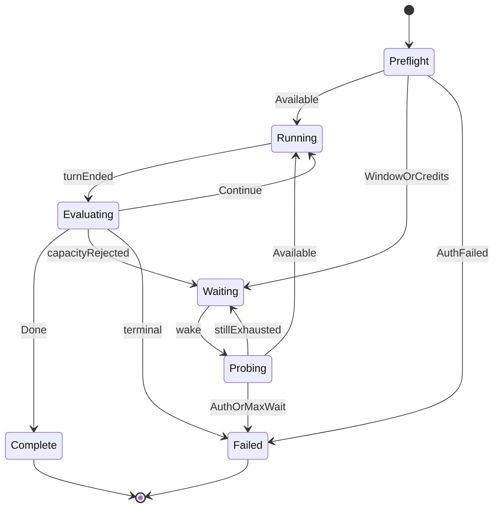

# Plan: cursorloop — autonomous Cursor Agent runner (Composer-first)

> **Status.** Design plan for a full fork of [claudeloop](https://github.com/the-vibey-project/claudeloop) 0.5.4 onto Cursor’s Agent SDK. Nothing in `src/cursorloop/` exists yet; this document is the approved design record that M1 will be built against. Sibling outline: [`_shared-transplant-outline.md`](_shared-transplant-outline.md). Evidence base, with citations and confidence levels: [`research-notes.md`](research-notes.md). Bite-sized build: [`../superpowers/plans/2026-08-13-cursorloop-implementation.md`](../superpowers/plans/2026-08-13-cursorloop-implementation.md).

## Context

`claudeloop` is an onion-architected autonomous Claude Code session runner and Anthropic REST CLI. It never blocks on a human, and it distinguishes waitable rate-limit windows from non-waitable credits. **cursorloop** does the same job for **Cursor Agent + Composer**, with **Grok only as a secondary model profile**.

This is a **full fork**, not a multi-provider shim: copy keepers, replace adapters, rename branding. No `anthropic` / `claude_agent_sdk` dependencies.

The reason a fork beats a plugin is that the two vendors disagree at exactly the layer a plugin would have to abstract over. claudeloop's autonomy story is an in-process `can_use_tool` callback; Cursor has no such callback and instead uses a file-based hooks contract. claudeloop's completion story is a vendor-enforced JSON output schema; Cursor has none and needs a text convention plus reconciliation. claudeloop's capacity story reads a typed `RateLimitEvent` with a documented `credits_required` discriminator; Cursor publishes one `RateLimitError` that covers *both* throttling and exhausted allowance, so the discriminator has to be invented. A shared codebase would have to make all three of those runtime-conditional, which is how you get a system where neither vendor's path is well tested. Two products with one shared *design* is the cheaper correctness trade.

What survives the fork unchanged is everything that is pure arithmetic over value objects: the state machine, the wait policy, the budget ledger, the savepoint/snapshot control plane, and the CLI operator surface. That is roughly two-thirds of the tree, and it is the two-thirds that is expensive to get right.

## Global Constraints

1. Never block on a human.
2. Credits/billing ≠ rate-limit window.
3. A capacity rejection always outranks a completion claim.
4. `domain/` stays pure (stdlib only).
5. Conventional Commits + claudeloop-equivalent quality gates.
6. Composer ≠ Grok; default model profile is Composer.

## Research findings (reshape the design)

Each finding below is a summary; the citation, the confidence level, and the fallback if the finding turns out wrong live in [`research-notes.md`](research-notes.md).

1. **Python Cursor SDK is the `ClaudeSDKClient` analogue.** `Agent.create` + `agent.send` survives across turns; `Agent.prompt` is the cheap probe; `Agent.resume` replaces session reattach. Prefer SDK over scraping `agent -p` streams. This is a *better* starting position than claudeloop had: the surviving-handle shape that claudeloop's ADR-0002 had to argue for is the Cursor SDK's default.
2. **Two failure kinds, and they arrive on different channels.** A thrown `CursorAgentError` (the run never started, or died mid-flight) versus `run.status == "error"` with human text in `run.result` (the run completed the protocol but failed the work). A classifier that only catches exceptions will silently score an errored run as a successful one. Both channels feed one `TurnSignals`.
3. **`RateLimitError` exposes `is_retryable` / `retry_after`, and nothing else.** Map retryable → `WindowExhausted`; non-retryable, or any billing-lexicon hit → `CreditsExhausted`. There is no Anthropic-style `credits_required` field, so the discriminator is a cursorloop invention with a configurable lexicon and captured live fixtures.
4. **Harness parity comes free, autonomy does not.** Skills (`.cursor/skills/`), MCP (`.cursor/mcp.json`), hooks, and codebase indexing all load through `local.setting_sources`. But there is no programmatic permission callback: hooks are **file-based only**. Never-block has to be assembled from a managed `hooks.json` fragment, an autonomy preamble, `local.force`, and a stall watchdog.
5. **Cloud Agents API v1 enables an optional M4 REST surface and a cloud runtime**; local remains the default for parity with claudeloop's on-disk control plane. The API is public beta and warned to change.
6. **`get_usage()` feeds budget ledgers; it is not a substitute for turn classification.** Cost settles late and is `None` until it does — so tokens are the enforceable hard cap and dollars are best-effort.
7. **A run stream is consumable once.** `messages()`, `events()`, and `iter_text()` all advance the same underlying stream. Any adapter that both drives a live UI and re-reads for classification must tee into one buffer on a single pass.

## Architecture

Onion, four layers, dependencies inward only. The point is not ceremony: it is that every hard decision — is this limit waitable, how long do we wait, is the work done — becomes a pure function over value objects, which is what makes near-100% coverage honest rather than a mocking exercise.

```
src/cursorloop/
├── domain/              # pure. no I/O, no third-party, no async
│   ├── errors.py        # CursorloopError hierarchy (rename from AutoclaudeError)
│   ├── plan.py          # WorkPlan, PlanItem
│   ├── session.py       # SessionRef, SessionSelector = PlanFile | MostRecent | Explicit
│   ├── capacity.py      # Available | WindowExhausted | CreditsExhausted | AuthenticationFailed
│   ├── classify.py      # TurnSignals (Cursor-shaped) -> CapacityState
│   ├── completion.py    # Done | Continue | Blocked + verdict-block + marker fallback
│   ├── waiting.py       # AdaptiveWaitPolicy -> next probe instant
│   ├── budget.py        # Budget, BudgetLedger (turns, tokens, dollars, wall clock)
│   ├── loop.py          # RunLoopStateMachine: (RunState, TurnOutcome, now) -> Decision
│   ├── control.py       # mid-run commands (stop / prompt / savepoint / …)
│   ├── model_profile.py # composer default; grok secondary alias
│   ├── model_policy.py  # escalation / de-escalation rules over profiles
│   ├── permission.py    # Cursor permission vocabulary
│   ├── slash.py         # Cursor slash-command vocabulary
│   ├── savepoint.py     # SavePointRef, UnwindResult
│   ├── savepoint_message.py
│   ├── snapshot.py      # SnapshotReason, SnapshotRef
│   ├── stop_summary.py
│   └── chatter.py
├── application/         # ports + use cases; depends only on domain
│   ├── ports.py         # Protocols — see "Ports" below
│   ├── dto.py           # TurnOutcome, ProbeResult, ApiInvocation
│   ├── runner.py        # AutonomousRunner — drives the state machine over the ports
│   └── usecases/        # run_plan, resume_session, list_sessions, doctor, run_control
├── infrastructure/      # adapters; the ONLY layer importing cursor_sdk
│   ├── agent/           # gateway, options, translate, autonomy, catalog, probe, scripted
│   ├── api/             # optional Cloud Agents binder (M4)
│   ├── resources/       # run-scoped attachments / skills / folders / memories
│   ├── stream_ui/       # Textual live view
│   └── clock.py  logging.py  redact.py  audit.py  events.py  state.py  state_bus.py
│       lock.py  notify.py  config.py  control.py  progress.py  rundir.py
│       snapshot.py  git_savepoints.py  doctor_env.py  tool_approval.py
├── cli/                 # Typer; hand-written operator commands + optional `api` sub-app
└── bootstrap.py         # composition root — the one module that knows every layer
```

The dependency rule is enforced in CI by `import-linter` (layered contract `cursorloop.cli` → `cursorloop.bootstrap` → `cursorloop.application` → `cursorloop.domain`, plus a forbidden contract stopping `domain` and `application` from reaching `infrastructure`), not by convention. A second, grep-based test asserts the strings `anthropic`, `claude_agent_sdk`, and `ANTHROPIC_` appear nowhere under `src/` — a copy-paste from the blueprint cannot smuggle a dependency in.



**Async bridge.** The Cursor SDK exposes both sync and async clients, and `AsyncClient` is required for all async operations. Typer is sync. As in claudeloop, wrap async commands in a single `@async_command` decorator in `cli/asyncio.py` that calls `anyio.run()`, installs SIGINT/SIGTERM handlers requesting a graceful drain (finish the in-flight turn, persist state, release the lock, restore the managed hooks file, dispose the agent), and translates `CursorAgentError` subclasses into Typer exit codes. One bridge point, not one per command.

### Ports

`application/ports.py` is transplanted from claudeloop with signatures preserved, so the runner and use cases port unchanged. The full list, with what each means here:

| Port | Methods | cursorloop adapter |
|---|---|---|
| `Clock` | `now()` | `infrastructure/clock.py` — UTC-aware, injectable |
| `Sleeper` | `sleep_until(instant)` | real `anyio.sleep`; `FakeSleeper` in tests |
| `AgentGateway` | `send_turn`, `close`, `set_profile`, `set_permission_mode`, `set_cwd`, `set_session_resources`, `resolve_tool_approval` | wraps a durable `cursor_sdk.Agent`; `send_turn` = one `agent.send()` + single-pass tee + classify |
| `RunResources` | `apply_mutate`, `gateway_payload`, `set_permission_mode`, `set_cwd` | run-scoped folders/skills/memories → `LocalAgentOptions.dirs`, `setting_sources`, MCP |
| `CapacityProbe` | `probe()` | throwaway `Agent.prompt("ok", tools=[])` — see Waiting |
| `SessionCatalog` | `most_recent(cwd)`, `list_all(cwd)` | `client.agents.list(runtime="local", cwd=…)` / `.get(…)` — the supported API, never a directory glob |
| `ProgressReporter` | `turn_sent`, `waiting`, `finished` | Rich console reporter |
| `AuditLog` | `record(event_type, payload)` | per-run JSONL under `.cursorloop/runs/<run_id>/` |
| `Notifier` | `notify(message)` | desktop / webhook / command hook; fired on entry to `CreditsExhausted` |
| `Logger` | `bind`, `debug`, `info`, `warning`, `error` | `structlog`, JSON to file + human to console |
| `RunStateStore` | `save(run_id, state)`, `load(run_id)` | `.cursorloop/state.json`, atomic replace |
| `SessionLock` | `acquire(session_id)`, `release(session_id)` | advisory file lock under `.cursorloop/locks/`, keyed by `agent_id` |
| `ApiGateway` | `invoke(method_path, **kwargs)` | M4 only — Cloud Agents binder, or unimplemented behind the deferral ADR |
| `RunControl` | `poll()` | reads the control mailbox written by `cursorloop stop` / `prompt` / … |
| `RunEventSink` | `emit`, `bind` | structured run events for `watch` / `status` |
| `StreamUi` | `on_delta`, `on_turn_boundary`, `on_prompt`, `on_assistant`, `on_tool`, `on_status`, `close` | fed from `SendOptions.on_delta` / `on_step` |
| `SavePointStore` | `create`, `list_points`, `unwind`, `changes_since` | git-backed savepoints, unchanged from claudeloop |
| `StateBus` | `publish(event_type, state)` | pub/sub for external pollers |
| `RunSnapshotSink` | `emit(reason, context, bundle)` | handoff snapshots + digest on the bus |

Ports are `typing.Protocol`, never ABCs — that is what keeps `application/` from ever importing `infrastructure/` merely to name a type.

## The autonomous run loop

`domain/loop.py` is a pure state machine; `application/runner.py` executes its decisions against the ports. States and the decisions that move between them:

| State | Entered when | Decision produced |
|---|---|---|
| `Preflight` | run starts | probe capacity before spending a real turn |
| `Running` | capacity available | send plan text (first turn) or continuation prompt |
| `Evaluating` | a turn ended | classify signals, evaluate completion, update ledgers |
| `Waiting` | capacity exhausted | compute next probe instant |
| `Probing` | wake from wait | cheap throwaway turn; re-classify |
| `Complete` / `Failed` | terminal | exit 0 / non-zero |

Every transition is an audit event carrying `run_id`, `attempt_no`, `agent_id`, `run_id` (Cursor's), `phase`, and the `CapacityState` name. A postmortem should never require reconstructing what the loop believed from log prose.

## Capacity ADT mapping

| Vendor signal | CapacityState |
|---|---|
| Success / no limit / `run.status == "finished"` | `Available` |
| `RateLimitError`, `is_retryable=True`, `retry_after` set | `WindowExhausted(parse(retry_after), "cursor_rate")` |
| `RateLimitError`, `is_retryable=True`, `retry_after=None` | `WindowExhausted(None, "cursor_rate")` |
| `RateLimitError` / text: spend limit, out of credits, purchase, plan exhausted, `is_retryable=False` | `CreditsExhausted(can_purchase=True/False)` |
| HTTP `402`, or `403` with a billing-lexicon body | `CreditsExhausted` |
| `AuthenticationError` | `AuthenticationFailed` |
| `PermissionDeniedError` | `AuthenticationFailed` (terminal — retrying an authorization failure is a spin loop) |
| `run.status == "error"` + billing lexicon in `run.result` | `CreditsExhausted` |
| `run.status == "error"` + rate-limit lexicon in `run.result` | `WindowExhausted(None, "cursor_rate")` |
| `run.status == "expired"` | `WindowExhausted(None, "run_expired")` |
| `run.status == "cancelled"` | not a capacity state — operator/watchdog event |
| `AgentBusyError` | not a capacity state — `Busy` transient; cancel-or-wait, bounded |
| `NetworkError`, `APITimeoutError`, `InternalServerError` | Gateway-local jittered backoff; **never** `CreditsExhausted` |
| `ConfigurationError`, `BadRequestError`, `IntegrationNotConnectedError` | terminal config failure, exit non-zero |

Ordering mirrors claudeloop and is load-bearing: **auth → billing lexicon → non-retryable rate limit → retryable rate limit → status-channel lexicon → available.** Capacity always outranks completion.

The adversarial test that must exist from day one: a `RateLimitError` carrying **both** `retry_after="60"` **and** `code="usage_limit_reached"` must classify as `CreditsExhausted`. A stray `Retry-After` header must never be able to make a spend cap look waitable.

**The billing lexicon is an invention and is configurable.** Cursor publishes no machine-readable discriminator between "your burst window is full" and "your allowance is spent". cursorloop matches an ordered, case-insensitive substring list (`out_of_credits`, `credits_required`, `insufficient_credits`, `usage_limit*`, `spend_limit`, `hard_limit`, `quota_exceeded`, `plan_limit`, `payment_required`, `upgrade_required`, `add_credits`, `subscription_expired`, …) against `error.code`, `error.proto_error_code`, `error.message`, and `run.result`. It is overridable via `CURSORLOOP_BILLING_LEXICON`, and every unmatched terminal error is captured verbatim into the audit log so real-world wording can be harvested into fixtures.

Misclassification is asymmetric, and the code is biased accordingly. Calling a *window* a *credits* exhaustion costs a slightly more conservative probe cadence and one spurious notification. Calling *credits* a *window* re-creates the exact bug this project exists to delete. **When ambiguous, prefer `CreditsExhausted`** — because `CreditsExhausted` never sleeps blind; it probes and it notifies.

### Waiting

`domain/waiting.py` is transplanted wholesale: the vendor changes, the policy does not, because the policy is pure arithmetic over the ADT. `next_probe_instant(state, *, now, started_waiting_at, probe_count, config) -> datetime` **always returns the next instant to probe, never a duration to sleep.** This is the part that replaces `time.sleep(wait_seconds)` in the legacy lineage, and it is the reason a credit top-up is noticed in minutes rather than at a window boundary hours away.

**`CreditsExhausted` — bounded probe cadence, notify on entry.** No reset time exists; the type literally cannot express one. The only thing that can change is a human topping up credits or raising a spend cap, and a human acts on human time, not on a schedule we can predict. So the policy probes on an exponential cadence from `credits_probe_interval` (default 120 s) backing off to `credits_probe_ceiling` (default 600 s), for as long as `--max-wait` allows, and fires the `Notifier` **on entry to the state** rather than on give-up — the whole point is that the human learns they need to act while there is still a run worth resuming, instead of discovering a stalled terminal the next morning. One implementation hazard is inherited verbatim from claudeloop and must not be re-introduced: compute the backoff in float seconds and clamp to the ceiling *before* constructing a `timedelta`, because `interval * factor**probe_count` unclamped overflows `timedelta`'s magnitude limit at realistic probe counts. A Hypothesis property test caught that in claudeloop; the same property test ships in cursorloop from day one.

**`WindowExhausted(resets_at)` — probe at `min(resets_at + grace, now + window_probe_interval)`.** The `resets_at` bound is the expected path and is what makes a scheduled window wake up exactly once. The interval bound is what catches an *early* lift — a plan upgrade, a spend-cap raise, an admin unblocking the team — before the nominal boundary. Both bounds are then clamped to `started_waiting_at + max_wait`, and `wait_exceeded()` is the paired give-up check that turns an unbounded stall into a clean, explained failure at a time the operator chose.

**`WindowExhausted(None)`** — no reset instant was obtainable, so the configured `window_probe_interval` is the whole policy. This is the degraded path and it is logged as degraded, not silently.

**The probe itself.** claudeloop's probe runs a one-token turn with `max_turns=1`, no tools, no settings sources, and a `no-session-persistence` flag so it leaves no transcript. Cursor has no such flag, but it has something better: `Agent.prompt()` creates an agent, sends one prompt, waits, and **disposes**. So the probe is `Agent.prompt("ok", AgentOptions(model=<probe profile>, tools=[], local=LocalAgentOptions(cwd=<cwd>), name="cursorloop-probe"))` — a throwaway agent that never touches the working agent's conversation, with `tools=[]` documented as "no built-in tools; the model can only respond with text", which minimises both cost and blast radius. A rejected probe is not billed for output, which is what makes a repeated cadence affordable.

Every probe result is diffed against the previous `CapacityState` and the transition is logged explicitly — *"capacity restored at probe #7, 26m into the wait; cause: RateLimitError no longer raised → resuming"* — so recovery is visible in the audit log rather than inferred from a resumed turn.

## Never blocking on a human

The hard requirement is that the run never stalls waiting for an answer. Notifying a human is fine; *waiting* on one is not. Cursor removes claudeloop's primary mechanism (the in-process `can_use_tool` callback) and supplies different ones, so this table is the most Cursor-specific part of the design.

| Stall path | claudeloop mechanism | cursorloop mechanism |
|---|---|---|
| Tool permission prompt | `permission_mode="bypassPermissions"` | Managed `.cursor/hooks.json` fragment: `preToolUse`, `beforeShellExecution`, `beforeMCPExecution`, `beforeReadFile` all return `{"permission": "allow"}` with exit 0. Hooks are **fail-open** on non-0/2 exits, which is the right failure direction here. |
| Belt-and-braces permission | `can_use_tool` returning `PermissionResultAllow` | No programmatic equivalent exists. Substitute: `local.auto_review=False` (Auto-review is an interactive gate), plus `disallowed_tools` — preferred over a positive allowlist because it also blocks tools added to the platform after our SDK version shipped. |
| Model asks a clarifying question mid-turn | intercept `AskUserQuestion`, deny with guidance | Cursor exposes no ask-user interception point. Three layers instead: (a) an **autonomy preamble** appended to every prompt stating that no human is available and instructing the model to choose the option it would recommend, record the assumption inline, and proceed; (b) a `beforeSubmitPrompt` hook that re-injects the preamble if it is missing; (c) the stall watchdog below. |
| Model ends a turn with a question and stops | evaluator treats `complete: false` + no progress as continuation | Identical. A question is just a turn that isn't `Done`; the evaluator returns `Continue` and the runner sends the next continuation prompt. |
| Plan mode parks | `ExitPlanMode` auto-approved | Never create the agent with `mode="plan"` for autonomous runs; `mode="agent"` is set explicitly rather than inherited from a server default. `--plan-first` exists but always issues an explicit `SendOptions(mode="agent")` follow-up. |
| A local run wedges in an active state | n/a | **`SendOptions(local=LocalSendOptions(force=True))`** — documented as expiring a stuck active run before starting the message. Set on every retry send after a busy/timeout, exposed as `--force-stuck-runs/--no-force-stuck-runs`. This is the single most important never-block primitive the Cursor SDK offers. |
| Cloud agent busy | n/a | `AgentBusyError` → poll `Agent.list_runs()`, `run.cancel()` the active run if `status == "running"`, re-send. Handled **before** the generic `is_retryable` check, because `AgentBusyError.is_retryable` is `False` yet the correct action is still a bounded retry. |
| Turn produces no output and never terminates | budget caps + `max_turns` | **Stall watchdog:** a per-turn wall-clock deadline (`--turn-timeout`, default 30 min) and a no-delta deadline (`--stall-timeout`, default 10 min) driven by `on_delta` timestamps and `on_did_change_status`. On breach: `run.cancel()` guarded by `run.status == "running"`, record `turn_stalled`, re-send with `local.force=True`. |
| MCP OAuth login required | `doctor` fails fast, naming servers | Identical, and now vendor-documented: the SDK "cannot open a browser to sign you in". `doctor` enumerates servers from `.cursor/mcp.json` + `~/.cursor/mcp.json` and reports which have no saved login. Service-account keys are additionally flagged, since they cannot fall back to user OAuth. |
| Workspace trust prompt (CLI fallback only) | n/a | `--trust` — "trust the workspace without prompting (headless mode only)". |
| MCP approval prompt (CLI fallback only) | n/a | `--approve-mcps`. |
| stdin | never inherit a TTY | Identical. No code path reads stdin; the runner is safe under `nohup`, `systemd`, and CI. The CLI-fallback adapter always passes `--print`, `--force`, `--trust`. |

### The managed hooks fragment

Because hooks are file-based, autonomy policy has to mutate the user's workspace — which is a materially worse position than claudeloop's in-process callback, and it needs an explicit protocol so a crashed run never leaves a repo altered:

1. Write cursorloop's hook scripts under `.cursorloop/hooks/` — inside the run state dir, git-ignorable, **never** inside `.cursor/`.
2. On run start, read any existing `.cursor/hooks.json`, deep-merge cursorloop's entries by *appending* to each event's array, write the merged file, and record SHA-256 digests of both the original and the merged form in `.cursorloop/state.json`.
3. On run end — including crash recovery via `cursorloop reset` — restore the original file **iff** the on-disk digest still matches what we wrote. If it does not match, leave the file alone and log loudly: the user edited it mid-run and their edit wins.
4. `--no-managed-hooks` disables the whole mechanism for operators whose repos already encode the right policy.

Cloud agents read hooks from the *repository*, so cloud runs need the fragment committed. cursorloop surfaces that as a `doctor` warning rather than committing on the user's behalf.

## Completion detection

The Cursor Python SDK has **no** `output_format` / `response_format` / structured-output schema anywhere in `AgentOptions`, `LocalAgentOptions`, `CloudAgentOptions`, or `SendOptions`. `RunResult` carries `status`, `result` (free text), `model`, `duration_ms`, `usage`, `git` — and nothing schema-shaped. So the typed verdict claudeloop gets for free has to be built out of a convention plus fallbacks.

The target shape is identical to claudeloop's, so `domain/completion.py` ports unchanged:

```json
{
  "complete": false,
  "remaining_work": ["wire the probe into the runner", "add the Hypothesis property test"],
  "blocked_on": null,
  "summary": "Classifier and wait policy are done and green; runner integration is next."
}
```

`domain/completion.py` maps that to `Done` / `Continue(remaining)` / `Blocked(reason)`. Four tiers, in order:

**Tier 1 — a fenced verdict block.** The autonomy preamble instructs the model to end every turn with exactly one ` ```cursorloop-verdict ` fence containing that object. The parser extracts the **last** such fence (a model quoting the instruction earlier in its own output must not be mistaken for the verdict), `json.loads` it, and validates it into a `StructuredVerdict`. Malformed JSON, a missing `complete` key, or a wrong type is treated as **absent** and falls through — never as a crash, because a bad brace must not kill a multi-hour run. The block is stripped from any text shown to the user.

**Tier 2 — the sentinel marker.** Substring-match `CURSORLOOP_TASK_FULLY_COMPLETE` in the raw output, the direct analogue of claudeloop's marker fallback, with the same two known failure modes (collision with the user's own prompt text; truncation inside a limit message coincidentally producing marker-like text) and the same mitigation: capacity is evaluated first and always outranks a completion claim.

**Tier 3 — the empty-turn soft failure.** An empty, zero-cost turn with no verdict becomes `Continue(("Waiting for a non-empty model response",))`; after `empty_turn_limit` consecutive empties it becomes `Blocked("repeated empty model responses")`. Without this, a model returning nothing forever is indistinguishable from progress.

**Tier 4 — plan reconciliation.** When the input is a markdown plan, `WorkPlan` parses it into items and unchecked checkboxes are authoritative evidence that work remains, regardless of what a turn claims. `remaining_work` is tracked per item so the log shows what is actually left rather than one boolean.

`blocked_on` remains terminal and outranks `complete`; it is reserved for true external/human blockers, while waitable self-startable work belongs in `remaining_work` with `blocked_on: null`.

**Stated plainly, because it matters:** cursorloop's completion detection is *strictly weaker* than claudeloop's, because it depends on model compliance with a text convention rather than a vendor-enforced schema. That justifies two safeguards claudeloop does not need — a `--require-verdict` mode that treats N consecutive verdict-less turns as `Blocked`, and the plan reconciliation above — and it is the first thing to revisit if Cursor ships structured output.

## Transplant map (module by module)

### Keep — copy, rename `claudeloop` → `cursorloop`, no logic change

| Module | Why it survives untouched |
|---|---|
| `domain/loop.py` | Pure state machine over `(RunState, TurnOutcome, now)`. Vendor-agnostic by construction. |
| `domain/waiting.py` | `AdaptiveWaitPolicy` is arithmetic over the ADT. Including the `timedelta` overflow clamp. |
| `domain/budget.py` | `Budget` / `BudgetLedger`. Emphasis shifts to tokens (see below) but the type is unchanged. |
| `domain/capacity.py` | `Available` / `WindowExhausted(resets_at, rate_limit_type)` / `CreditsExhausted(can_purchase)` / `AuthenticationFailed`. `CreditsExhausted` still has **no** reset field. |
| `domain/control.py` | Mid-run command ADT for stop/prompt/savepoint/etc. |
| `domain/plan.py` | `WorkPlan`, `PlanItem`, markdown checkbox parsing. |
| `domain/session.py` | `SessionRef`, `SessionSelector = PlanFile \| MostRecent \| Explicit`. |
| `domain/savepoint.py`, `savepoint_message.py` | Git-backed savepoint refs and messages. |
| `domain/snapshot.py` | `SnapshotReason`, `SnapshotRef`. |
| `domain/stop_summary.py` | Stop-reason rendering. |
| `domain/errors.py` | Hierarchy shape kept; root renamed `AutoclaudeError` → `CursorloopError`. |
| `domain/chatter.py` | Narration policy. |
| `domain/model_policy.py` | Escalation/de-escalation rules over profiles; profile *contents* change, the policy does not. |
| `application/ports.py`, `dto.py`, `runner.py` | Protocols and the runner. Only the `AgentGateway` docstring changes. |
| `application/usecases/{run_plan,resume_session,list_sessions,run_control,doctor}.py` | Orchestration only; they talk to ports. |
| `infrastructure/{clock,logging,redact,audit,events,state,state_bus,lock,notify,config,control,progress,rundir,snapshot,git_savepoints}.py` | The control plane. State dir becomes `.cursorloop/`. |
| `infrastructure/resources/` | Run-scoped attachments store + adapter. |
| `infrastructure/stream_ui/` | Textual live view; fed by `on_delta` instead of SDK message objects. |
| `infrastructure/chat_meta.py`, `chatter_log.py` | Chat metadata and narration log. |
| `cli/{app,asyncio,render,man_page}.py` | Typer wiring, async bridge, rendering. |
| Operator commands (see the CLI table) | Branding strings only. |
| CI, pre-commit, `import-linter` contracts, CODEOWNERS | Package-path rename. |
| Tests for `domain/{loop,waiting,budget}` + application runner fakes | Port directly; retarget classify fixtures. |

### Replace — same responsibility, new implementation

| Module | What replaces it |
|---|---|
| `infrastructure/agent/gateway.py` | Wraps a durable `cursor_sdk.Agent`; `send_turn` = `agent.send()` → single-pass tee → `TurnSignals`. Re-asserts the active model profile every send (overrides are sticky). |
| `infrastructure/agent/options.py` | **One** `build_agent_options()` used by *both* create and resume, because `tools`, `disallowed_tools`, `custom_tools`, and inline `mcp_servers` do **not** persist across resume, and `agent.model` is `None` on resume unless re-passed. A checklist here is a bug waiting to happen. |
| `infrastructure/agent/translate.py` | `SDKMessage` / `RunStreamEvent` → domain DTOs. Owns the single canonical stream consumption: tee once, serve both the UI and the classifier. |
| `infrastructure/agent/autonomy.py` | Managed `hooks.json` merge/restore + autonomy preamble + stall watchdog. Replaces `can_use_tool` entirely. |
| `infrastructure/agent/catalog.py` | `client.agents.list(runtime="local", cwd=…)` / `.get(…, cwd=…)` via `CursorClient.launch_bridge(workspace=…)`. Never a directory glob. |
| `infrastructure/agent/probe.py` | Throwaway `Agent.prompt("ok", tools=[])`. New file — claudeloop's probe lived in the gateway module. |
| `infrastructure/agent/scripted.py` | Scripted fake gateway for the system harness; scripts Cursor-shaped signals instead of Anthropic ones. |
| `infrastructure/api/*` | Cloud Agents binder generated from the vendored OpenAPI document, **or** omitted behind ADR `0006-defer-cloud-agents-rest.md`. The Anthropic introspection machinery (`introspect.py`, `providers.py`, `surface_baseline.json`) has no analogue — there is no Python REST client class tree to walk. |
| `domain/classify.py` | Same shape, Cursor-shaped `TurnSignals`: exception class, `code`, `proto_error_code`, `status_code`, `is_retryable`, `retry_after`, plus `run.status` and `run.result`. |
| `domain/completion.py` | Same verdict ADT, four-tier parser (fence → marker → empty-turn → plan reconciliation) instead of `structured_output`. |
| `domain/model_profile.py` | `composer-2.5` default; `grok` alias secondary; effort levels only where the model exposes them. |
| `domain/permission.py` | Cursor permission vocabulary (`allow` / `deny` / hook exit codes) instead of Anthropic permission modes. |
| `domain/slash.py` | Cursor slash-command vocabulary. |
| `infrastructure/doctor_env.py` | `CURSOR_API_KEY`, `Cursor.me()`, `cursor-sdk-bridge --help`, MCP OAuth enumeration, `Cursor.models.list()`. |
| `infrastructure/tool_approval.py` | Hook-mediated rather than callback-mediated; `resolve_tool_approval` becomes a no-op that records the decision, since hooks decide out-of-process. |
| `infrastructure/github_import.py` | Retarget at Cursor's repository listing / cloud repo config. |
| Packaging, docs, `.claude`/`.cursor`/`.agents` skill trees | Full rebrand. |

### Drop

- The generated Anthropic REST surface (131 endpoints, `introspect`/`binder`/`providers`/drift baseline) — no equivalent source to introspect.
- All `ANTHROPIC_*` auth handling.
- `~/.claude/projects/` session reads, `CLAUDE.md` loading, the `claude` CLI subprocess.
- `claude-agent-sdk` and `anthropic` as dependencies, permanently.
- Anthropic-only research helpers (`research`, `web-search`) unless reimplemented against Cursor's own tools.

### Where the budget emphasis inverts

claudeloop's `ResultMessage.total_cost_usd` is immediate and exact, so dollars were the natural hard cap. Cursor's `agent.get_usage()` returns `cost: UsageCost | None` where `cost` is `None` until billing settles and `charged_cents` is `0.0` for plan-included, BYOK, and credit-grant usage. An unattended loop that reads a settling `None` as `$0.00` will happily run forever under a `--max-cost` cap it has already blown through. So: **`cost is None` means unknown, never zero**, tokens are the authoritative hard cap, dollars are a best-effort secondary cap, and the ledger records `cost_pending` and reconciles once more after the run.

## Packaging rename matrix

| Item | Value |
|---|---|
| PyPI / entry point | `cursorloop` |
| Env prefix | `CURSORLOOP_*` |
| State dir | `<cwd>/.cursorloop/` |
| Config | `cursorloop.toml`, `~/.config/cursorloop/config.toml` |
| Done marker | `CURSORLOOP_TASK_FULLY_COMPLETE` |
| Verdict fence | ` ```cursorloop-verdict ` |
| Auth | `CURSOR_API_KEY` (format `crsr_…`) |
| Runtime dep | `cursor-sdk` (pinned; `>=` floor + tested ceiling) |
| Python | 3.12+ |
| Agent name tag | `cursorloop/<run_id>` — so runs are identifiable in the Cursor dashboard under **Filter → Source → SDK** |

## CLI command matrix

Every command in claudeloop 0.5.4, with its disposition. "Keep" means branding strings only; "remap" means the command survives with a new adapter underneath; "drop" means it leaves the tree with an ADR if the omission is user-visible.

| Command | Disposition | Notes |
|---|---|---|
| `run` | remap | Cursor gateway + `Agent.create`; plan-file or inline prompt. |
| `resume` | remap | `Agent.resume(agent_id)`; must re-send the full resolved options (model, tools, MCP). |
| `sessions` | remap | `client.agents.list(runtime="local", cwd=…)`. Sub-app: `list`, `show`. |
| `doctor` | remap | `CURSOR_API_KEY` + `Cursor.me()`, `cursor-sdk-bridge --help`, MCP OAuth enumeration, `Cursor.models.list()`, git/root/cwd checks, managed-hooks writability. |
| `stop` | keep | Graceful drain via the control mailbox. |
| `prompt` | keep | Inject an operator prompt at the next turn boundary. |
| `logs` | keep | Tail the per-run JSONL audit log. |
| `status` | keep | Current phase, capacity state, budget ledger, next probe instant. |
| `watch` | keep | Live view; fed by `RunEventSink` + `on_delta`. |
| `runs` | keep | Sub-app over `.cursorloop/runs/`. |
| `savepoints` | keep | Git-backed savepoint list/create. |
| `snapshot` | keep | Handoff snapshot + digest. |
| `unwind` | keep | Restore to a savepoint, with backup. |
| `reset` | keep | Crash recovery — releases locks **and restores the managed `hooks.json`**, which is new work specific to cursorloop. |
| `attach` / `unattach` | keep | Attach files/context to the run. |
| `folder` | remap | → `LocalAgentOptions.dirs` (the `add_dirs` allowlist analogue). |
| `skill` | remap | → `.cursor/skills/` discovery, gated by `setting_sources`. Also reads `.agents/skills/` and the `.claude/skills/` compatibility path. |
| `plugin` | remap | → `setting_sources` including `"plugins"`. |
| `connector` | remap | → MCP servers: `.cursor/mcp.json`, `~/.cursor/mcp.json`, and inline `mcp_servers`. Prints names and transports only, never env or headers. |
| `github` | remap | → Cursor repository listing / `CloudRepository` config for cloud runs. |
| `memory` | keep | Run-scoped memories via `RunResources`. |
| `artifact` | remap | Local artifacts kept; cloud artifacts via the Cloud Agents artifact endpoints at M4. |
| `chat` | keep | Chat metadata ops over the local run store. |
| `response` | remap | Response actions retargeted at `Run` / `RunResult`; anything Anthropic-message-shaped is rewritten. |
| `voice` / `speak` | keep | Vendor-independent — local TTS over the narration log. |
| `model` | remap | Presets: `composer` (**default**), `composer-fast`, `grok` (→ `cursor-grok-4.6`, effort `high`), `grok-xhigh`, `grok-4.5`, `router-balanced`. `--list` queries `Cursor.models.list()` — ids are validated against the live catalog, never a stale constant. |
| `effort` | remap | Only meaningful for models exposing effort params (`xhigh`/`high`/`medium`/`low` on Grok). Composer's effort calibration is internal, so the command reports that rather than silently accepting a no-op. |
| `preset` | remap | Named `(model, params, effort, fast)` bundles from the table above. |
| `permission-mode` | remap | Cursor vocabulary; drives which hook fragment is materialised. |
| `cwd` | keep | Mid-run working-directory change; must also re-verify the workspace-scoped bridge state (see risk R12). |
| `tool` | remap | Sub-app over `tools` / `disallowed_tools`. Deny wins; `disallowed_tools` preferred because it also blocks post-SDK-release tools. |
| `slash` | remap | Cursor slash-command vocabulary. |
| `research` | drop | Anthropic-specific helper. Reimplement against Cursor's own web-search tool only if there is demand; otherwise ADR. |
| `web-search` | drop | Same. The agent's own `webSearch` tool covers the use case in-run. |
| `api` | remap or drop | Cloud Agents subset at M4, or absent behind the deferral ADR. Never a hand-written partial snapshot pretending to be complete. |

## REST surface (M4)

claudeloop generates a CLI over 131 Anthropic endpoints by walking `anthropic.resources` class trees via `cached_property` descriptors, with a **drift gate** test that fails CI when an SDK upgrade adds or removes an endpoint. That mechanism does not transplant, for three reasons: Cursor's Cloud Agents API v1 is roughly twenty endpoints rather than 131, so the economic argument for generation is much weaker; `cursor-sdk` is an *agent* SDK with no REST class tree to introspect (`client.agents`, `client.models`, `client.repositories` and nothing more); and the API is public beta with an explicit warning that it may change before GA.

**The decision, recorded as an ADR either way:** generate `cursorloop api …` from the **published OpenAPI document**, vendored into the repo at a pinned digest, with a CI job that re-fetches the spec and fails on drift. That preserves claudeloop's "no silent gaps" property with a mechanism suited to the different source. If the spec proves too unstable during M4, the fallback is ADR `0006-defer-cloud-agents-rest.md` and shipping only the handful of endpoints the runner itself needs (`/v1/me`, `/v1/models`, agent create/get/cancel) as explicitly, loudly partial commands. "We shipped a partial CLI" must be a recorded choice, not an accident.

Note that most of what an operator wants is already on the SDK client (`client.agents.list/get/list_runs/get_run/cancel_run`, `client.models.list`, `client.repositories.list`, `Cursor.me()`), so M4's real user value is concentrated in the fleet/worker/artifact endpoints the SDK does not wrap.

## Logging, security, quality gates

**Logging.** `structlog` with a JSON renderer to file and a human renderer to console. Every record carries `run_id`, `attempt_no`, `agent_id`, `cursor_run_id`, and `event_type`. The full raw event stream is preserved to a per-run JSONL audit file under `.cursorloop/runs/<run_id>/`, keeping claudeloop's "nothing is lost" property — which matters more here than there, because the billing lexicon is inferred and the audit log is where real-world error wording gets harvested from. `-v/-vv`, `--log-level`, `--log-file`. `CURSOR_SDK_LOG=debug|info` is documented as the supported way to get vendor-side traces; the SDK configures only its own `cursor_sdk` logger, so it will not fight our configuration.

**Security.** A redaction processor in the structlog pipeline scrubs `api_key`, `CURSOR_API_KEY`, `Authorization`, `authorization_token`, `access_token`, `refresh_token`, `client_secret`, and any literal matching `crsr_[A-Za-z0-9]{16,}` — Cursor's key format makes a regex scrub genuinely effective, which is a small but real improvement over the blueprint. MCP configuration is never logged resolved: `StdioMcpServerConfig.env` values are passed into the cloud VM and `HttpMcpServerConfig.headers`/`auth` are backend-handled, so `doctor` prints server *names and transports* only. Cloud `env_vars` are passed through but never persisted to `.cursorloop/state.json`.

Autonomy is a *chosen posture*, not a default. Auto-allowing every tool via hooks is the functional equivalent of `bypassPermissions` and gets the same guardrails: explicit opt-in flag, refuse to run as root, refuse outside a git repository or an allowlisted directory unless overridden, and prefer `disallowed_tools` over a positive allowlist for anything security-sensitive. `LocalAgentOptions.sandbox_options` is surfaced, and the docs say plainly that sandboxing *plus* auto-allow is materially safer than auto-allow alone.

Budget guardrails are a safety control, not a nicety, for an unattended multi-hour loop: `--max-turns`, `--max-tokens`, `--max-cost`, `--max-wait`, `--max-attempts`, `--turn-timeout`, `--stall-timeout`. Tokens are the enforceable cap because cost settles late. No `shell=True` anywhere — the CLI-fallback adapter builds an argv list. Plan-file and log paths are resolved and confined. A per-agent advisory file lock under `.cursorloop/locks/` prevents two runners from driving one agent concurrently, which on Cursor would surface as `AgentBusyError` storms rather than silent interleaving. `.cursorloop/` is git-ignored by default and `cursorloop init` offers to add it, because run state contains prompts, transcripts, and potentially secrets echoed by tools.

**Quality gates** (pre-commit + GitHub Actions, in the order CI runs them): `ruff check src tests`, `ruff format --check src tests`, `mypy src/cursorloop` (`strict = true` repo-wide), `pytest` with `--cov-fail-under` set per-package (100% for `domain` and `application`, a high floor for `infrastructure`), `lint-imports` for the onion contract, `bandit -q -r src/cursorloop`, and `pip-audit`. Plus two cursorloop-specific gates: the **no-Anthropic grep test**, and the **OpenAPI drift job** if M4 generates the REST surface. `# nosec` is reserved for verified false positives and must carry an inline reason.

## Testing to ~100%

**Domain — pure unit tests, no mocking.** Every domain test is `assert f(SomeDataclass(...)) == Expected(...)`. Plus Hypothesis property tests for the two functions where an edge case is expensive to discover in production:

- `AdaptiveWaitPolicy` — never returns an instant in the past, never exceeds `started_waiting_at + max_wait`, always converges, and never overflows `timedelta` at any reachable `probe_count`. That last property is the one that caught a real bug in claudeloop.
- `classify` — **no input carrying a billing-lexicon hit can ever produce a waitable `CapacityState`.** This is the invariant the product exists to protect, so it is asserted as a property rather than a handful of examples.
- `retry_after` parsing — accepts integer-seconds and HTTP-date forms, tolerates `None`, and degrades to `WindowExhausted(None)` on anything unparseable rather than raising.

**Application — fakes for every port.** `FakeAgentGateway` replays scripted signal sequences; `FakeClock` / `FakeSleeper` make a simulated multi-day wait run in microseconds with zero real sleeping. The credit-top-up path is tested by scripting a probe sequence returning `CreditsExhausted` five times then `Available`, and asserting the runner resumes on probe six and logs the transition.

**Infrastructure — contract tests against `cursor_sdk` fakes.** The same suite runs against both the fake and the real adapter where feasible, which is what makes the port abstraction real rather than aspirational. Two contract tests are cursorloop-specific and non-negotiable: (a) a run can be **both** UI-streamed and classified from a **single** stream pass; (b) `build_agent_options()` re-applies the complete option set on resume, asserted by resuming and diffing.

**System harness.** A `pytest -m system` suite driving the scripted gateway end-to-end with no tokens and no network, mirroring claudeloop's harness. Live tests are marked and excluded from the default run.

**Fixtures.** Live `RateLimitError` bodies and errored `run.result` strings are captured as golden fixtures as they are encountered, and the classifier is not considered complete until at least one real window rejection and one real billing rejection are in the fixture set. Until then the scripted sequences cover the logic and the lexicon is treated as provisional.

**CLI** — Typer's `CliRunner`. `# pragma: no cover` is reserved for genuinely unreachable branches (signal handlers, `TYPE_CHECKING` blocks) and each use carries a reason.

## Build order (milestones)

Each milestone leaves the tree working and shippable.

1. **M1 — pure core.** Package skeleton, `pyproject.toml`, the full `domain/` layer, `application/ports.py`, the complete unit + property suite, CI with every gate. **No `cursor-sdk` dependency required to import `domain`** — that is the milestone's acceptance test.
2. **M2 — runner parity.** Cursor gateway, options builder, translate, catalog, autonomy (managed hooks + preamble), `run` / `resume` / `sessions` / `doctor`. Reaches parity with a hand-driven Cursor session.
3. **M3 — resilient waiting.** Capacity probe, adaptive wait policy, credit-top-up detection, notifier, stall watchdog, resumable run state, budget ledger against `get_usage()`.
4. **M4 — REST / ops.** Cloud Agents API CLI generated from the vendored OpenAPI spec, **or** the deferral ADR. Mid-run operator ops polish (savepoints, snapshot, unwind, watch).
5. **M5 — polish.** Docs, security review, packaging verification, live fixtures, and the `agent -p` CLI-fallback adapter as a second implementation of `AgentGateway` — which both hardens the product against a bridge failure and proves the port abstraction.

## Verification

- **Unit and property suites** — `pytest --cov`, all gates green, including the simulated multi-day wait that completes with zero wall-clock sleep.
- **Onion contract** — add an import from `domain` to `infrastructure` and confirm `lint-imports` rejects it by name.
- **No-Anthropic gate** — add `import anthropic` to a module under `src/` and confirm the grep test fails CI.
- **Classifier ordering** — a `RateLimitError` carrying both `retry_after="60"` and a billing-lexicon `code` classifies as `CreditsExhausted`, asserted as a test, not a comment.
- **Window vs credits, scripted** — a fake gateway emits a retryable `RateLimitError` with a `retry_after`, then a non-retryable one; assert the first schedules a bounded wake at `min(resets_at+grace, now+interval)` and the second never schedules a blind sleep and fires the notifier on entry.
- **Credit top-up, simulated then live** — the scripted five-then-available probe sequence covers the logic; the honest live test is opportunistic, when a real exhaustion occurs, adding credits mid-wait and confirming resumption on the next probe rather than at a window boundary.
- **Never-block, end to end** — run a plan that explicitly instructs the model to ask a clarifying question, and confirm the runner continues via the autonomy preamble + `Continue` verdict instead of hanging.
- **Stall watchdog** — script a run that emits no deltas past `--stall-timeout` and confirm cancel → `turn_stalled` audit event → re-send with `local.force=True`.
- **Managed hooks round-trip** — start a run in a repo with a pre-existing `.cursor/hooks.json`, kill the process mid-turn, run `cursorloop reset`, and confirm the original file is byte-identical. Then repeat with a mid-run user edit and confirm the file is left alone and the divergence is logged.
- **Resume completeness** — resume an agent and assert `model`, `tools`, `disallowed_tools`, `custom_tools`, and inline `mcp_servers` were all re-applied.
- **Single-pass stream** — assert a run can be UI-streamed and classified from one consumption.
- **Sticky model override** — escalate a profile for one send, then assert the next send re-asserts the base profile and the audit log records the effective `run.model` per turn.
- **End-to-end, plan-file mode** — run against a small markdown plan in a scratch git repo; confirm exit 0 and a structured verdict in the audit log.
- **Install check** — `pipx install .` on macOS and Linux; confirm the `cursorloop` entry point resolves and `--help` renders.

## Open risks

The full risk register with impacts and triggers lives in [`research-notes.md`](research-notes.md) §11. The four that gate the design:

1. **The billing lexicon is inferred, not documented.** Mitigated by ambiguity-biasing toward `CreditsExhausted`, a configurable lexicon, verbatim capture of unmatched errors, and an offline `doctor --explain-error <file>` classifier.
2. **No structured output**, so completion depends on model text compliance. Mitigated by the four-tier evaluator and `--require-verdict`. Revisit immediately if Cursor ships structured output.
3. **Hooks are file-based**, so autonomy mutates the user's workspace. Mitigated by the hash-verified merge/restore protocol, `cursorloop reset`, and `--no-managed-hooks`.
4. **Cloud Agents API v1 is beta and warned to change.** Mitigated by keeping M1–M3 entirely free of any REST dependency, and by the vendored-pinned-spec-plus-drift-job design at M4.

Pin `cursor-sdk` to a tested range, record the resolved version in the audit log at run start, and capture live `RateLimitError` bodies as fixtures before declaring the classifier complete.
